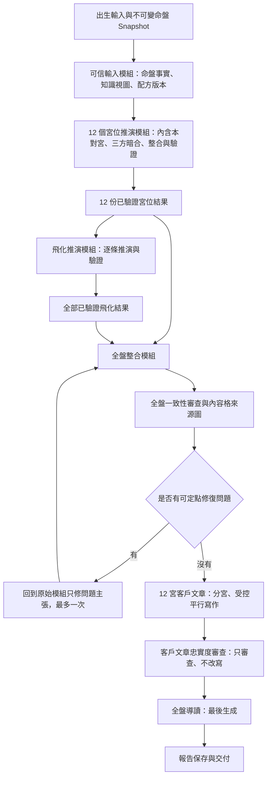

# AI 命盤本命人格分析架構 v2

## 文件狀態

這是架構討論文件，不是正式程式規格，也尚未授權實作。

先前的討論檔位於已被系統清理的 `/private/tmp` worktree，且當時尚未加入 Git，因此本文件依目前對話中已確認的決策重新整理。它保留已確認的方向；無法由對話可靠重建的細項會明確標示待核對，不自行補猜。

## 產品大方向

完整產品最終分成三個階段：

1. 先交付一份獨立命盤報告，建立客人對分析的信任。
2. 報告未來包含本命人格、十年大限與年度流年。
3. 客人信任後，才進入付費 AI 論命聊天室。

現階段只設計第一層的「本命人格分析引擎」。大限、流年與聊天室先保留銜接位置，不在本階段實作。

## 核心原則

1. 老師講義與核准卡片負責命理規則。
2. 程式負責排盤、選卡、固定事實與可機械驗證的關係。
3. 模型負責在底層核心沒有改變的前提下，推導自然、生活化的可能表現。
4. 模型不能把「可能」寫成「客人一定如此」，也不能替客人決定真實人生。
5. 一個宮位是基本分析單位；十二宮完成後才做全盤整合。
6. 保留不同面向、矛盾與多種合理可能，讓客人對照自己的人生。
7. 客人看到的是直接人格分析，不是命理教學文章。
8. 每個生活例子都要保留「星曜核心 → 宮位分面 → 現實表現」的生活推演鏈。

## 規則確認流程

每次向老師提出下一個命理問題前，必須先核對：

1. 老師原始講義與逐字稿。
2. 已整理的核心卡及推理小卡。
3. 舊 SOP 中對應的完整規則。
4. 本輪已確認並記錄的最新決策。

先整理「資料已經明確說了什麼」「不同版本哪裡矛盾」「真正缺少哪一個決策」，只把最後一類問題交給老師確認。小卡已有明確答案時，應直接整理並指出來源，不重複詢問老師。

## 主星核心卡與宮位落點卡

主星核心卡只保存不隨宮位改變的星曜本質。以紫微為例，可以包含：

- 皇帝、帝星、化氣為尊等固定定位。
- 尊重、名聲、面子、形象、領導、被看見、被認可與格局等核心。
- 需要團隊、資源與左右手的成立條件。
- 正常狀態與狀態不好時的差異。
- 有煞忌、沒有煞忌時的使用條件。
- 不可過度簡化或誤解成什麼。

主星核心卡不能直接包含：

- 買名牌。
- 挑品種貓。
- 喜歡高樓或漂亮住家。
- 紫微在福德宮時意志力相對較弱。

這些內容必須放入宮位落點卡、身體對應卡、住家對應卡，或由模型依「主星核心＋宮位分面」產生的可驗證生活推演。老師已明確確認的宮位結果可以成為固定落點規則；模型臨時產生的生活例子不能反過來污染主星核心卡。

十四主星十二宮的一般生成公式固定為：

`主星固定核心 × 已核准宮位分面 → 目的／想法／行為／可能生活表現`

既有 168 筆 A2 單星十二宮資料用來提供金標案例、校準合理範圍與標示禁止延伸，不是要求模型只能照抄。模型可以產生 A2 未逐字列出的現代例子，但必須完整回推到該主星核心與宮位分面；講義明確指定的特殊落點才升格為固定卡片。

講義明確記載的特殊星宮規則優先於通用公式，必須進入該宮主張。模型仍可從主星核心與宮位分面補充不衝突的其他面向，但不能覆蓋或反駁特例。兩者看似不同但可同時成立時各自保留；只有真正邏輯互斥時才停止並交由人工確認。例如紫微在福德宮的精神享受與品味可由通用公式推演，而講義確認的意志力相對較弱屬於必須另外保留的特殊落點。

### A2 推演示範卡

A2 原文完整保留並保存來源關係，不在整理時覆寫。另將 168 筆轉為統一格式的衍生示範卡，至少拆開：

- `starCoreRefs`：使用哪些固定主星核心。
- `palaceFacet`：落到哪一個已核准宮位分面。
- `derivationMode`：通用公式推演、講義固定特例或老師確認案例。
- `mechanismSummary`：核心如何作用到分面的簡短可檢查連接，不要求模型輸出隱藏思考過程。
- `allowedExpressions`：可接受的生活表現與代表例子。
- `forbiddenClaims`：不能跨出的語意與事件邊界。
- `resultBoundary`：只能描述傾向，還是講義已確認特定落點；不得把傾向寫成已發生結果。
- `sourceRefs` 與 `approvalStatus`：來源與確認狀態。

模型每次只取得當次需要的主星核心卡、宮位分面卡、相關 A2 示範、講義特殊規則與已驗證命盤資料，不載入全部 168 筆。為避免只模仿表面句型，相關示範可包含同星不同宮與同宮不同星的少量對照；模型輸出結論、簡短機制、例子與來源 ID，程式及語意審查再檢查是否忠於來源。

同一 A2 段落中的每項獨立結論必須拆成原子主張，各自標示來源、可信層級與規則身分。例如講義固定的紫微田宅住家落點、A2 整理出的關係表現、老師確認的財庫推演，以及禁止斷言的結果邊界不能因為寫在同一段就視為同一權威層級。實際欄位、批次轉換方式與人工驗證流程留到後續素材工程，不阻擋目前高階架構。

## 輔星的處理

主星先建立該宮的主要方向；每一顆適用輔星再分別產生補充主張，通過驗證後才與主星整合。不得因為最後需要一篇順暢文章，就在分析階段跳過某顆輔星。

地空、地劫是目前額外指定要保留的觀察星，必須進入 P1 的宮位結構輸入；本命人格層只保存落點與來源，不要求模型主動展開。老師補充兩顆主要在大限盤與流年盤依事件使用；正式架構只保留同宮與對宮的完整作用，不採用講義原列的夾與三合拱半力規則。其底層作用是讓原本的事件結果減弱、取消或無法留下，而不是固定製造壞事。它們不改變既有空宮借星六個阻擋星，也暫不改變本命煞忌集中度計分。其他未建模小星仍留在底層排除紀錄；同名重複只要 placement ID 不同就合法，不能因此拒絕整張命盤。

輔星不能只解讀成外界憑空給命主的結果，也要依卡片判斷命主自己可能先展現的行為，以及這種行為如何形成別人的回應。

D1 本命盤的主要輸出仍是命主自己的主動行為與特質。別人的回應只在固定規則或清楚因果支持時，作為第二層延伸：

1. 先說明命主具備什麼特質、怎麼想及主動怎麼做。
2. 再視需要補充這種行為可能如何影響別人或形成環境回應。
3. 不強迫每一顆輔星、每個宮位都產生他人回應。
4. 他人回應必須使用可能性語言，不能寫成已發生事實。

父母宮與兄弟宮是已確認的例外：這兩宮可以先讀成早於命主存在的父親、母親或家庭關係現象，如同先觀察一個已存在的狀態，再另外分析命主自己的感受與互動。因此同一顆輔星可以保留兩種不同主體的可能，但必須拆成兩項主張：

- `關係人物`：星曜描述父親、母親或該宮對應人物本身的特質與行為。
- `命主`：星曜描述命主在這段關係裡的特質、主動行為與可能回應。

兩項主張不能混成一句，也不能因為兩種都成立就強迫客戶文章全部寫滿。這個例外目前只確認到父母宮與兄弟宮，不自動擴張到其他關係宮位。

父母宮與兄弟宮的單主星採用「既存人物關係影響鏈」：

1. 星曜先描述父親、母親或該宮既存人物本身。
2. 再由這個人物特質推導命主可能形成的主觀感受、應對方式與關係距離。
3. 第二層是對方特質造成的關係影響，不代表同一顆星也直接成為命主自己的個性。
4. 兩層都要保留底層機制與不同 Actor，不能只剩模糊的相處結論。

夫妻宮、子女宮與交友宮採用另一條規則：

1. 先分析命主自己的態度、期待、選擇與互動方式。
2. 伴侶、孩子／寵物、朋友／同事等另一方，只能建立為命主可能期待、遇到或感受到的「關係對象可能」。
3. 關係對象可能必須使用條件語氣，不得寫成對方已存在、已發生或一定具有該特質。
4. 命主主張與關係對象可能仍須分開標示主體，不可混成一句。

例如紫微加左輔：

- 紫微提供重視身分、面子、領導及需要團隊的主要方向。
- 左輔可以表示命主願意站在對方這邊、表態支持、做事夠義氣或主動幫忙。
- 是否進一步出錢、提供資源或實際代為處理事情，不能只憑左輔決定，必須再看主星、宮位與其他星曜。
- 因為命主平常願意幫人，別人也可能更願意在需要時回頭幫助命主。
- 最後整合為紫微的領導與格局，較有機會透過互相幫忙的團隊關係真正運作。

這是「命主行為 → 關係回應」的可能因果，不可簡化成「有左輔，所以一定有貴人」，也不能把左輔寫成一定出錢出力，或讓左輔取代紫微的主要方向。

右弼與左輔使用不同的主動支持機制：

- 右弼偏向透過細膩說話、安慰、提醒、圓場與協調來幫助別人。
- 左輔偏向站在對方這邊、表態支持與講義氣；兩者不能合併成同一種模糊的「有貴人」。
- 命主平常照顧別人情緒，可能使別人日後願意回頭相助，但仍是第二層可能，不是保證。
- 右弼遇煞忌時，可能替錯誤或不適合的事情圓場、安慰或協調，形成幫錯方向。

天魁保留雙向的正式實質助力：

- 命主可能遇到檯面上、身分明確、有能力的人，正式提供意見、專業、資源或實際協助。
- 命主自己也可能利用能力、專業、身分或資源，公開、正式地成為別人的貴人。
- 天魁的重點是具備實際能力、專業或資源，不能和左右的表態、安慰、圓場或人情支持混成同一種助力。
- 兩個方向都屬合理可能；仍須依宮位主體分開，不能假設貴人已經出現或幫助已經發生。

天鉞保留雙向的幕後實質助力：

- 命主可能被人私下提醒、暗中安排、牽線，或在對方不公開出面的情況下得到能力與資源協助。
- 命主自己也可能在幕後提醒、安排資源、牽線或替別人處理問題，不一定讓其他人知道。
- 天鉞與天魁都具有較實際的能力、專業、資源或安排效果；差別是天魁偏檯面上正式出面，天鉞偏檯面下運作。
- 天鉞不能與右弼的安慰、圓場及溝通支持混成同一種助力，也不能斷言幕後幫助已經發生。

文昌主要描述命主自己的理性處理能力與行為：

- 包含理性、邏輯、條理、規則、文字說明、資料整理、讀書、考試、制度內學習與正式認可方向。
- 生活行為可表現為先問清楚、查資料、列清單、整理文字或按規則處理。
- 能力與認可仍須使用可能性語言，不能直接斷言命主已取得成就。
- 文昌本身不強制產生他人回應；只有適合的關係宮位與因果支持時，才可補充別人可能覺得命主說得清楚、做事有條理或值得信任。

文曲主要描述命主自己的感性接收與表達方式：

- 包含感受、情緒、美感、創作、表演、非傳統發展方向，以及對氣氛與他人感受的敏銳度。
- 可透過說話、文字、打扮、創作或表演呈現自己，但不能直接斷言命主已取得創作或表演成就。
- 文曲本身不強制產生他人回應；只有宮位與因果適合時，才可補充別人可能覺得命主有美感、會表達、較有魅力或能理解氣氛。
- 狀態不好時，可能因感受與情緒太多，反而不容易把真正想法說清楚；不可把文曲簡化成單純情緒化。

昌曲的固定對照是「文昌偏理性、文曲偏感性」。兩者同時存在時也要保留不同機制，不能合併成模糊的「有才華」。

## 祿存的處理

祿存小卡已明確定義：

- 與化祿相似，是已存在的助力。
- 有主星時，幫助主星核心產生更多效果，讓該主星較容易因自身特質得到好處。
- 資源保留、安全感、累積與不敢亂投入，是祿存帶來的補充修正。
- 祿存不能取代主星，也不能寫成主導整宮的主軸。
- 獨坐時才另外標記該宮位較有不安全感；空宮借星則先借對宮主星，再看祿存如何幫助借入主星。

因此祿存與化祿的共通處是「增加助力與好處」，差別是祿存以同宮主星的增益修正運作，並額外帶有資源保存與安全感。祿存本身不是另一個人物；產生的主張仍跟著同宮主星、宮位與當下 Actor。不能把祿存主要縮成保守或沒有安全感。

## 權責分層

| 層次 | 責任 | 不可做的事 |
|---|---|---|
| 命理權威素材 | 定義星曜、宮位、四化、煞忌、身宮、飛化等底層規則 | 放入客戶個資或模型自由推論 |
| 程式 | 排盤、建立命盤 Snapshot、選擇適用卡片、確認星宮與正式關係 | 自行生成命理語意 |
| 模型分析 | 依固定資料產生結構化宮位主張與現實可能表現 | 發明星曜、飛化、宮位或必然事件 |
| 驗證層 | 驗證來源、主體、覆蓋、可能性邊界、重複與矛盾 | 改寫新的命理結論 |
| 客戶寫作 | 把核准主張轉成當地可理解的直接人格分析 | 新增分析階段沒有的命理結論 |

## 高階模組與最小介面

整體系統以少量深模組封裝複雜推演。各模組可保存內部中間結果供追查，但下一模組只能接收已驗證結果，不能直接依賴模型原文或未驗證候選。

| 模組 | 最小介面收到什麼 | 只回傳什麼 | 內部隱藏的複雜度 |
|---|---|---|---|
| 可信輸入模組 | 不可變命盤 Snapshot、固定報告配方 | 已驗證命盤事實、適用知識視圖與來源版本 | 排盤事實檢查、卡片選擇、A2 示範取用、特殊規則優先序 |
| 宮位推演模組 | 一個目標宮位的可信輸入 | 一份已驗證宮位結果 | 本宮主軸＋對宮表現、三方四正＋暗合、候選生成、宮位整合、定點修復 |
| 飛化推演模組 | 一條已驗證飛化事實、相關已驗證宮位結果 | 一條已驗證飛化影響鏈 | 宮位因果、四化動作、底色檢查、星曜作用方式與生活橋接 |
| 全盤整合模組 | 十二份已驗證宮位結果、全部已驗證飛化結果 | 全盤關係、跨引擎共同行為及寫作內容格來源圖 | 去重、並存、拉扯、深刻感受與來源合併 |
| 客戶寫作模組 | 單宮內容格、主要生活地區、報告語言 | 該宮客戶文章 | 生活主題編排、例子選擇、自然語言轉譯 |
| 忠實度審查模組 | 內容格與客戶文章 | 固定問題清單或通過狀態 | 來源忠實度、可能性邊界、敏感與越界檢查；不負責改寫 |

最外層報告編排只負責固定配方、執行順序、受控併發、保存、恢復與通知。它不理解星曜語意，也不允許下游繞過模組介面讀取未驗證資料。

## 目前建議流程



## 階段一：程式建立可信任輸入

程式先固定：

- 出生輸入與版本。
- 完整命盤 Snapshot。
- 星曜落宮、四化、煞忌、身宮等客觀事實。
- 每一宮適用的固定規則卡。
- 可由程式判定的正式跨宮關係。
- 每一宮的空宮借星資格、借入主星與隨星生年四化。

空宮借星必須在模型呼叫前由程式固定：

- 本宮有十四主星時，直接以本宮主星為核心。
- 空宮若有擎羊、陀羅、火星、鈴星、文昌或文曲任一顆，不借對宮主星；以宮位分面與本宮原有星曜建立主張。
- 其他空宮只借對宮十四主星及隨該主星的生年四化。
- 只有祿存不阻止借星；祿存留在本宮幫助借入主星，不跟著借入名單搬動。
- 借入主星正式成為本宮核心，代表表裡如一，不視為較弱或隱藏。

全盤預掃描另外標記：

- 本命化忌所在宮位。
- 陀羅所在宮位。
- 煞忌集中處。

這些標記只是「命主可能感受較深」，不能做成宮位重要性或吉凶排名。

## 階段二：每宮分層產生結構化主張

單宮資料是規則選擇與結構化主張的來源，不是完整宮位推演引擎。若只依本宮產生最終解讀，會漏掉對宮、三方四正與暗合共同形成的性格方向。

十二個目標宮位可在 Server 以受控併發方式分別處理，但每個目標宮位內必須依序通過兩個結構引擎。

### 2A｜本宮主軸＋對宮表現推演

第一個引擎同時接收：

- 該宮命盤事實。
- 該宮對宮的必要命盤事實。
- 程式已固定的空宮核心模式、借入主星、阻擋來源與本宮保留星曜。
- 本宮與對宮適用的星曜、生年四化、宮位、煞忌與身宮卡片。
- 程式已確認的本對宮關係。
- 固定的宮位分面與主體規則。

它依程式固定的三種模式建立：

- 一般有主星：本宮主星代表能力、個性、價值與主要方向，對宮主星提供表現通道。
- 可借星空宮：借入主星成為本宮核心，表現為表裡如一，不把同一借入星重複算成另一條表現通道。
- 不可借星空宮：宮位分面與本宮原有星曜形成在地主張；對宮仍可依正式對宮關係提供必要影響，但不能冒充成本宮主星。
- 本宮核心透過對宮方式落到思考、說話、行為與生活場景的推演鏈。
- 生年四化如何跟著被四化星曜與 Actor 改變其表現。
- 固定規則另有支持時，兩邊形成的補充、牽制或反差。

它不是把兩個宮位已完成的文章相加。一般模式下，本宮負責「是什麼」，對宮優先負責「怎麼表現」；只有程式確認可借星的空宮，對宮主星才依固定規則成為本宮核心。

對宮預設只抽取能幫助本宮核心表現的部分：

- 天機對巨門，先取巨門的說話、詢問、解釋與討論，作為天機聰明、邏輯與規畫的表現方式。
- 不因對宮有巨門，就自動把不安全感、爭論或口舌全部搬進本宮。
- 只有固定對拱規則、生年四化或煞忌有明確依據時，才另外產生對宮壓力、矛盾或其他修飾主張。

例如本宮天機：

- 天機先提供聰明、邏輯、研究、規畫、反應與變動等核心。
- 對宮巨門時，天機較可能透過說話、詢問、說明、討論與辯論展現。
- 對宮太陰時，天機較可能透過生活細節、照顧家人、居家安排、情緒觀察與細膩處理展現。

同一對宮軸在分析相反方向的宮位時不是重複結果：目標宮位改變後，本宮主軸與對宮表現通道也跟著對調。

### 2B｜三方四正＋暗合影響推演

第二個引擎接收：

- 已通過驗證的本宮主軸與對宮表現結果。
- 三方四正中尚未於第一階段處理的其他宮位資料。
- 暗合資料與固定暗合規則。
- 必要且已由程式確認的全盤背景。

它不改變本宮主軸，也不重寫本對宮結果。它只另外建立「哪一個相關宮位，透過哪一項條件，如何影響本宮決定或狀況」的影響鏈。

三方四正負責較明確的影響：

- 祿、權、科可帶來能力、資源、助力或其他偏正向條件。
- 化忌與煞星可帶來不順、壓力、干擾或讓本宮決定受阻。
- 客戶可以知道自己原本哪裡不順，以及可能受到哪個生活領域影響。

暗合使用同樣的正負影響來源，但責任不同：

- 它描述不容易直接看見的背景。
- 影響方式偏向潛移默化、長期形成或本人未必立刻察覺。
- 客戶文章不能把暗合寫成明確、直接、唯一的原因。

因為對宮已在第一個引擎完成，第二個引擎只能引用核准的對宮結果，不得把對宮當成新資料重新推演一次。

所有影響都作為獨立主張保存：

- 本宮原始結論永久保留。
- 三方四正與暗合不能取消或改寫本宮結論。
- 正向與負向影響可以同時存在，各自保留來源及作用方向。
- 不把多項影響加總成單一吉凶分數。

### 2C｜宮位整合

程式最後把兩個引擎通過驗證的主張組成完整宮位索引。整合只新增來源關係、明顯／潛在影響類型與結構標記，不刪除、改寫或摘要取代原始主張。

每項主張至少要能表示：

- 宮位。
- 單一宮位分面。
- 主體。
- 來源星曜、煞忌、四化、規則卡與命盤事實。
- 底層機制。
- 一個或多個可能表現。
- 每個可能表現的簡短機制連結。
- 適用限制。
- 可選的、與機制直接相連的提醒。

生活推演鏈是硬性要求：

- 不可只列出品種貓、名牌、工作選擇等生活答案，卻說不出它來自哪個星曜核心與宮位分面。
- 不可把「愛面子」柔化成一般性的「重視品質」，導致真正命理機制消失。
- 不可把品種貓等例子反過來當成星曜固定定義。
- 客戶文章不必顯示技術欄位，但必須能用一兩句白話說清楚這項生活表現為何會出現。

推理候選池中的一般主張可參考 1–3 個例子；有煞忌的主張可探索 3–5 個不同面向。這是內部推理與覆蓋檢查的參考範圍，不是客戶文章必須刊登的例子數，也不是硬性填滿要求。模型不得為湊數製造空洞內容。硬性要求是：

- 至少一個有效表現。
- 不超過固定上限。
- 例子彼此有實質差異。
- 每個例子都能回到固定底層核心。

內部候選池保存所有彼此不同且通過驗證的核心結論、作用機制與例子。正式客戶文章保留所有不同核心結論與作用機制，但同一機制只挑一至兩個最容易理解、最符合主要生活地區的代表例子。可以省略同義或重複的例子，不能因篇幅刪掉不同結論；未刊登的合法例子繼續保留給大限、流年與後續聊天室。

每張規則卡與每項宮位主張都要保留。任何宮位摘要都只能是索引，不能取代原始主張。

## 十二宮的報告順序

客戶報告固定依下列順序，不因煞忌或「重要程度」改排：

1. 命宮
2. 兄弟
3. 夫妻
4. 子女
5. 財帛
6. 疾厄
7. 遷移
8. 交友
9. 官祿
10. 田宅
11. 福德
12. 父母

## 已確認的宮位邊界

### 命宮

- 代表整體人生方向、核心價值與人格基調。
- 可談性格、思考、行為、優點、盲點與能力傾向。
- 能力只能寫潛在傾向，不能寫成實際成就。
- 外貌若正式講義有依據，可低比重、選擇性提及，不強調。
- 命宮像公司的老闆，提供整體方向；其他宮位平常仍各自運作。

### 兄弟宮

- 媽媽。
- 同性別兄弟姊妹。
- 新認識的朋友。
- 一般同事與團隊相處不放在兄弟宮，改由交友宮處理。
- 本命盤可以把兄弟宮當成既存關係現象觀察，尤其媽媽本來就早於命主存在；因此可分別保留「媽媽／該宮人物本身的特質」與「命主如何感受及互動」兩種主張。
- 兩種主張必須分開標示主體，不可把媽媽的行為與命主的行為混成同一句。
- 單主星先描述媽媽／該宮人物，再由該人物特質推導命主的關係感受；不得因此把對方的星曜直接算成命主自己的個性。
- 雙主星時，媽媽本身使用完整雙星組合；媽媽與命主互動時，前星偏媽媽、後星偏命主。
- 命主面對同性別兄弟姊妹或新認識的朋友時，使用完整雙星組合描述整體態度；分析雙方如何相處時，也可用前星代表對方、後星代表命主。

### 夫妻宮

目前本命人格報告全部以感情為主，固定分析：

- 命主看待感情的態度。
- 命主容易喜歡或期待的對象類型。
- 伴侶可能呈現的特質。
- 兩人在關係中的相處與對待方式。

講義中的「工作在外的狀況／合作狀況」保留為可選延伸資料，不放入一般本命人格報告；未來只有客人明確詢問工作或進入相應分析情境時才啟用，避免與官祿宮混在一起。

夫妻宮單主星要分成兩個不同主體來轉譯：

- **命主**：同一星曜核心如何形成命主看待感情、表達需求與相處的方式。
- **伴侶可能性**：命主容易欣賞、期待、吸引或在關係中感受到的對象特質。

伴侶層只能寫成「容易被這類特質吸引」「關係中可能感受到這類型的人」，不能斷言現任或未來伴侶一定如此。

伴侶可能性屬於「關係對象可能」，不是像父親／母親一樣可直接視為本命盤中的既存人物現象；即使命主目前有伴侶，也不能只憑本命盤把對方特質寫成已確認事實。

夫妻宮預設使用中性關係語言：

- 不預設客人目前有伴侶或已婚。
- 不預設對象性別。
- 使用「你在感情關係中」「你容易被這類型的人吸引」「如果進入一段關係」等寫法。
- 未來若客人自願提供關係狀態或慣用稱呼，只調整文字稱呼，不改變底層命理解讀。

本命夫妻宮只分析長期感情底層：

- 感情需求與態度。
- 容易欣賞的對象特質。
- 關係中的互動、優點與盲點。

不預測結婚、交往、分手、離婚、感情次數或事件發生年份；事件與時間必須等大限及流年疊加後再分析。性生活與親密需求也不納入目前本命人格報告。

夫妻宮雙主星沿用人際宮位規則：

- 前星偏向伴侶或關係中的他人。
- 後星偏向命主在關係中的態度。
- 另保留兩顆星彼此配合、拉扯或互補的關係層。

### 財帛宮

- 金錢觀。
- 如何賺錢、靠什麼能力或方式賺錢。
- 花錢方式。
- 理財方式。
- 實際使用金錢的方式。
- 不處理存錢方式；存錢與財庫回到田宅宮。

### 子女宮

已確認的第一個分面是「教養與照顧方式」：

- 底層描述命主如何照顧、教導與管理需要自己負責的生命。
- 客戶文章可分別提供小孩與寵物的生活例子。
- 不預設客人一定有小孩或寵物，使用「如果你有照顧小孩或寵物」等條件式語言。
- 不延伸成主管管理員工；工作管理仍回到適用的工作宮位。

老師補充的典型推演：紫微在子女宮，紫微「愛面子」的核心會投射到寵物選擇。寵物可能被視為自己形象的一部分，因此若養貓，較容易挑看起來高貴、有身價、能讓命主覺得有面子的品種貓。因果鏈是「愛面子 → 寵物代表自身形象 → 選擇能彰顯身價的品種貓」，不能用模糊的「對品質或整體質感有標準」取代，也不能把「品種貓」本身反寫成紫微的固定核心。

子女宮也可以分析吃、玩樂與旅遊，但責任只放在命主實際怎麼選、怎麼安排與怎麼行動，屬於外在生活方式。它不能取代福德宮對內在享受、精神滿足與品味來源的分析。

子女、寵物等另一方屬於「關係對象可能」；報告先分析命主如何看待、選擇、照顧與互動，再以條件語氣補充可能遇到或感受到的對象特質，不假設命主已經有孩子或寵物。

雙主星分析寵物相處時，也可以拆前後角色：

- 完整雙星描述命主養寵物、選擇寵物及相處的整體方式。
- 前星可表示寵物在互動中呈現的那一側。
- 後星表示命主對待寵物的那一側。

寵物仍屬條件式關係對象，不因可以拆前後星就假設命主已經有寵物，或斷言寵物一定具有該特質。

子女宮保留「所有物」分面，分析命主偏好擁有什麼，以及如何看待已經屬於自己的物品。它與財帛宮的分工是：

- 財帛宮分析怎麼花錢、購買與理財。
- 子女宮分析東西成為所有物之後，命主希望它呈現什麼形象與價值。

例如紫微在財帛宮，可以表現為花錢不手軟、可能願意購買知名品牌；紫微在子女宮的所有物分面，則可能表現為希望自己的物品看起來高貴、有身價，能替自己帶來面子。兩者可以同時存在，但不能寫成同一段重複內容。

### 疾厄宮

- 身體較弱或需要保養的方向，只能做保養提醒，不能醫療診斷。
- 父母宮所呈現的遺傳相關訊號，詳細說明放在疾厄宮，不在父母宮重複展開。
- 命宮、遷移宮、疾厄宮與父母宮的身體保養方向先由命理規則層合併、去重；沒有明確煞忌、祿權科、事件狀態或可說清楚的作用機制時，不得為了湊齊三方或暗合而新增健康方向。
- 通過命理規則層的 canonical 身體方向，只能由 deterministic 程式選擇固定健康提醒卡。OpenAI 不選卡、不改寫醫療提醒，也不得自行增加症狀；無法解析的方向必須 fail-closed。
- 固定健康提醒只附加在疾厄宮。其他十一宮不得重複輸出身體弱項；卡片文字使用生活可觀察狀態、一般就醫門檻與必要急症提醒，並明確聲明不是疾病診斷。
- Runtime 只掃描 N0 的 `sourceMajorStars`，固定順序為命宮、遷移宮、疾厄宮、父母宮；不掃描 `borrowedMajorStars`，也不沿三方、暗合或對宮二次擴張主星身體對應。
- 天機遇天梁同宮或對宮時可另加脊椎方向；這是講義明定的單一條件規則，不是允許掃描器匯入所有對宮身體含義。
- 太陽、太陰只在星曜實際落於午或未時增加眼睛方向；太陰、破軍只在女性條件成立時增加婦科與生殖方向。性別只用來觸發固定條件，不寫入健康掃描結果。
- 同一身體方向由多顆星或多宮觸發時，客戶提醒只需輸出一次，但 Runtime 必須保留每個來源宮位、placement ID、固定 rule ID 與條件軌跡。
- 外貌不是目前強項，只能在正式依據充分時低比重提及。

### 遷移宮

- 命主在外面如何與人相處及呈現自己。
- 外界的人如何看待命主。
- 命主內心真正的想法。

三個分面要分開保存，不能把外在表現直接當成命主全部的內在個性，也不能把別人眼中的形象寫成客觀事實。

### 交友宮

- 異性別兄弟姊妹。
- 朋友。
- 一般同事。
- 團隊裡與人相處的過程、對待方式與價值觀。

不建立「異性別同輩」分面。主管就是主管，不因年齡較小或與命主同齡而成為平輩或一般同事；目前也不建立「工作中的主管溝通」固定分面。

朋友、同事與團隊成員的特質屬於「關係對象可能」；命主自己的交友態度、團隊價值與互動方式是第一層，另一方只能作條件式補充，不當成已存在事實。

### 官祿宮

- 專注於工作本身、工作價值與職涯傾向。
- 不把「與主管溝通」硬塞成固定分面。

### 田宅宮

- 居家環境。
- 住家附近的環境特徵。
- 財庫與存錢方式：如何存錢、累積及保留資產，存錢時重視什麼，以及哪些個性會幫助或干擾這些行為。
- 風水暫不處理。

本命田宅宮只描述上述方式與傾向，不能據此斷言命主實際存了多少錢、一定擁有房產、一定有錢或沒錢，也不能預測最後必然守得住或失去財富。實際結果要等大限、流年與事件推演。

老師確認的財庫推演範例：紫微的面子、身分、尊重與價值感核心落入田宅財庫時，命主累積資產可能不是單純為了節省小錢，而是希望最後擁有拿得出手、看起來有價值的資產；例如願意為好地段、好房子或較有身價感的目標存錢。這只說明存錢目的與偏好，不代表一定存得到或一定買房。

田宅財庫的一般規則不人工寫死十四顆主星的唯一答案。模型依「主星固定核心 × 田宅財庫分面」推演存錢目的、方式、重視條件與可能干擾；上述紫微案例作為金標與邊界測試。只有講義明確指定的特殊規則另建固定卡片。

### 福德宮

- 精神享受。
- 社會價值。
- 福分與運氣。
- 潛意識。
- 品味。
- 吃、玩樂與旅遊。

老師補充的典型推演：紫微在福德宮時，也可以表示意志力或長期硬撐能力相對較弱。底層原因不是泛稱命主懶惰，而是紫微的皇帝核心：皇帝通常在較好的環境中成長，不是靠底層艱苦生活磨練出來的角色；高難度運動、長期吃苦或必須依靠強大意志力支撐的活動，也不是紫微自然會選擇的生活方式。這個核心落到福德宮的內在驅動與精神狀態後，才形成「意志力與內在續航相對較弱」的可能表現。

福德宮談吃、玩樂與旅遊時，責任是分析命主為什麼喜歡這類享受、什麼能帶來精神滿足、背後的品味與內在價值。它不重複子女宮對實際選擇、安排與行動方式的分析。

### 父母宮

- 父親的特質與命主對父親的主觀感受。
- 命主與父親的相處關係。
- 對長輩的對待，可涵蓋沒有父親或不以父親為主要照顧者的情境。
- 命主面對主管階層、上位者與政府機關的態度；這是對權威與階層的對待方式，不等同於官祿宮的工作內容或固定的主管溝通分析。
- 遺傳與身體弱項的詳細提醒移到疾厄宮。
- 本命盤可以把父母宮當成既存關係現象觀察，因為父親／長輩早於命主存在；同一組星曜可分別產生「父親／長輩本身」與「命主在這段關係裡」的合理可能。
- 例如紫微加左輔，可以分開保留「父親重視面子且可能願意幫助別人」與「命主面對父親／長輩時可能較願意主動幫忙」；兩者不可混成同一項主張。
- 單星紫微在父母宮時，第一層是「爸爸可能重視面子、尊重與身分」；第二層才是「命主可能因而覺得相處需要講禮數、顧及爸爸面子，或彼此帶有距離感」。
- 第二層來自爸爸特質造成的關係影響，不代表命主自己也具有紫微或一定愛面子。

父母宮有雙主星時分成三層：

1. **爸爸／父親人物**：爸爸本身使用完整雙星組合解讀。例如紫微天府在父母宮，爸爸是「紫微天府」的整體狀態，不只等於前星紫微。
2. **爸爸與命主的雙方對待**：只有在拆解雙方互動角色時，前星偏爸爸，後星偏命主。
3. **命主對權威的態度**：命主面對長輩、主管階層、上位者或政府機關時，仍使用完整雙星組合解讀，不只取後星。

三層可以同時成立，但必須使用不同用途與主體欄位，不能把「爸爸的完整人格」「雙方互動角色」與「命主對權威的態度」混成一條主張。

政府機關、制度與抽象權威不視為一個有星曜人格的前星對象：

- 命主面對機關或制度時，以完整雙星分析其態度與處理方式。
- 不把機關本身直接套成前星。
- 只有分析命主與具體官員、承辦人或其他代表人的互動時，才以前星看對方、後星看命主。

## 雙主星的處理

內部分析必須保留：

- 第一顆主星的底層核心。
- 第二顆主星的底層核心。
- 兩顆星合在一起的互動。

涉及「人與人的關係」時，可依老師規則讓前星代表該宮對應的他人、後星代表命主在關係中的一側；仍須由正式卡片確認適用範圍。

前星他人／後星命主只負責拆解「雙方對待關係」，不能取代完整雙星組合：

- 描述關係人物本身時，使用完整雙星組合。
- 描述雙方互動角色時，才以前星代表他人、後星代表命主。
- 描述命主面對該類人物或關係領域的整體態度時，也使用完整雙星組合。

老師確認這不是父母宮專用規則。只要是在分析命主與具體對象的相處，都可以同時使用；對象可以是真人，也可以是寵物：

1. **完整雙星組合**：命主面對這類關係的整體態度與處理方式。
2. **前後角色切分**：前星代表關係中的對方，後星代表命主。

例如紫微天府在兄弟宮，命主面對同性別兄弟姊妹或新朋友時，整體使用紫微天府；若分析雙方對待，紫微偏對方、天府偏命主。兩種讀法並存，不互相取代。

寵物相處也可使用相同角色切分：完整雙星描述命主養寵物與相處的整體方式；前星可看寵物的互動側，後星看命主的互動側。

抽象制度不使用前後角色切分：政府機關、規章或權威制度本身以完整雙星分析命主的應對態度；只有出現具體官員或承辦人時，才把該人物放入前星對方的位置。

客戶文章不做四段式星曜教學，而是直接寫這段關係或人格可能如何呈現，自然帶出兩顆星的作用。

## 身宮

身宮不是第十三個主分析單位，也不是全盤第一優先。它是附加在所落宮位的補充：

- 命主長大後可能更重視該宮位。
- 該宮位的價值可能隨年齡更明顯。
- 例如身宮在命宮，可能更追求自己的價值與方向；達成時做事較順，但也可能顯得固執。

## 煞忌

煞忌有兩個分開的責任：

1. 在所在宮位內，必須解釋它如何影響該宮的性格、選擇或事件傾向。
2. 只有程式確認正式跨宮關係時，才能再建立跨宮影響。

例：陀羅在財帛宮，可依正式卡片描述反覆比較後仍挑錯、買到不實用物品或選錯投資標的的傾向。報告要解釋機制與可能表現，不能只標註「有陀羅」。

四煞必須像主星一樣標明作用主體，不是沒有主體的負面濾鏡：

1. **關係人物**：四煞可描述父親、母親或其他適用關係人物本身的反應方式。
2. **命主**：四煞可描述命主在該宮位或關係中的態度與行為。
3. **雙方關係**：由人物與命主的反應機制，推導雙方互動可能受到的影響。

例如擎羊在父母宮，可以分別保留「爸爸遇衝突時可能較直接、硬碰硬」「命主可能感覺彼此容易直接衝突」「命主面對長輩或具體權威人物時也可能直接面對、不願退讓」。三種是不同主體的合理可能，不強迫全部寫滿，也不能混成一句。

資料上應分開保存：

- 宮內作用。
- 作用主體。
- 是否具備跨宮資格。
- 已驗證的跨宮結果。

## 生年四化

四化必須「隨星、隨主體」：

1. 先確認被四化的星曜及該項主張正在描述誰。
2. 再以四化修飾該星曜核心如何在這個主體身上運作。
3. 若要描述另一個人的感受，必須另外建立關係影響主張。
4. 不可把四化單獨抽出，任意換到命主、關係人物或另一顆星上。

生年四化不另設模型推演引擎。它跟著被四化的星曜放入本宮＋對宮基礎推演，讓星曜核心、Actor、宮位分面與四化作用在同一階段綁定。飛化因為需要處理出發宮與落入宮的跨宮關係，才保留為後面的獨立引擎。

化祿的共通作用不只包括機會、資源與好處，也包括好感、緣分增加，以及關係較容易靠近。這些仍不是脫離星曜的固定結果，而要由「被化祿星曜的核心 × 宮位分面 × 作用主體」決定增加的具體形式。

化祿作用在父母宮的父親／長輩關係時，老師確認通常可以保留：

- **關係緣分**：命主與爸爸或長輩較有緣、較容易靠近或互動增加。
- **可能好處**：爸爸或長輩可能替命主帶來資源、機會或其他好處。
- **形成方式**：必須再回到被化祿星曜，說明這份緣分或好處是透過哪一種星曜核心形成，不能只停在「父母宮化祿所以有緣」。

這是一項有固定四化依據的關係效果，不等於要求所有星曜都硬寫「別人如何回應」。資料上仍要把父親／長輩人物狀態、命主感受到的關係緣分，以及實際可能得到的好處分成不同主張；「容易」也不能改寫成一定發生。

化科的共通作用是讓被化科星曜的核心較容易被看見、被注意，並牽動名聲、形象、曝光、修飾或被說明清楚。化科不保證一定出名，也不自動代表實際能力、權力或財富；必須先看是哪顆星、在描述誰。

例如紫微化科在父母宮：

- **爸爸／父親人物**：紫微本來就重視尊重、體面與身分，化科又把名聲、形象及他人眼光凸顯出來。因此爸爸可能因身分、領導樣貌或代表性而被看見，也可能本人很愛面子、很在意別人怎麼看他。
- **命主主觀感受**：命主可能覺得爸爸重名聲、重體面或很在意外界評價。
- 「很愛面子」是紫微核心與化科彰顯共同形成的可能，不是所有化科都固定等於愛面子；命主的感受也不代表命主自己擁有紫微化科。

化忌的共通作用是讓主體在被化忌星曜的核心上感到空缺、不滿足、放不下或壓力集中，因此可能持續追求、反覆在意；程度較重時才可能形成執著、卡住或困擾。化忌不等於直接發生壞事，也不能脫離星曜與宮位預言具體事件。

落在關係宮位時，仍要先確定被化忌星曜正在描述誰：

- 若描述父親／長輩，缺口、期待與反覆在意先屬於父親／長輩。
- 命主因此感受到的壓力、距離或相處困擾，另外建立關係影響主張。
- 不能因為化忌在父母宮，就把父親的缺口直接改寫成命主自己的執著。

四化的正式知識層不需要人工寫完每一種「星曜×四化×宮位」答案。固定層只保存：

1. 星曜不變的核心。
2. 化祿、化權、化科、化忌的共通作用。
3. 宮位分面。
4. 本次主張的作用主體。
5. 禁止越界與來源追蹤規則。

模型再依這些元件推演自然語言、性格表現與生活可能。程式必須驗證模型使用的是既有星曜、四化、宮位與主體，且每項結論可追溯到底層來源；模型可以推演表達，但不能發明新的底層命理。

例如紫微化權在父母宮：

- **爸爸／父親人物**：紫微本來重視面子、尊重與主導；化權使爸爸更能掌握權力與別人的尊重，因此可能更重面子、控制欲較強，也可能因為有能力實際掌握這些要求而顯得能力不差。
- **命主主觀感受**：命主可能覺得爸爸控制欲較強、要求尊重，同時也可能認為爸爸是較有能力的人。
- 命主的感受是由爸爸的紫微化權形成的關係影響，不代表命主也直接擁有紫微化權。

化權的共通作用是讓主體更能掌握、執行、控制或承擔該星曜原本的核心，因此可以形成相關領域的能力；但能力內容必須由星曜決定，不能全部套成紫微式的領導能力：

- 紫微化權偏向掌握權威、主導、團隊資源與別人的尊重。
- 天機化權偏向掌握思考、方法、規畫、分析與變動。
- 其他星曜也要依各自核心建立不同的掌握能力，不可只寫泛稱「有能力」。

## 階段三：宮位品質審查與定點修復

每一個宮位完成 2A、2B、2C 與硬性驗證後，對該宮完整結果進行一次語意品質審查，檢查：

- 底層機制是否真的支持生活例子。
- 是否只是換句話說的重複例子。
- 是否把可能性寫成事實。
- 是否越界、矛盾或使用社會刻板印象。

審查只能回傳主張 ID、固定問題種類與安全理由；不能直接改寫、刪除或新增命理。

有問題時只修復指定主張，最多自動修復一次。修復後：

1. 重跑硬性驗證。
2. 語意審查可看該宮完整上下文，但只能審被修復的主張、同宮一致性與正式跨宮關係。
3. 其他已核准主張保持不可變。
4. 重算該宮覆蓋並重新產生已驗證宮位結果。

十二宮不必等全部完成才共用一次大型審查。每宮通過後即可成為飛化推演的可信輸入；全盤跨宮一致性另在階段五處理。

### 交付阻擋問題

包括：

- 星曜、宮位、主體或命盤事實錯誤。
- 必要覆蓋缺失。
- 把可能寫成必然。
- 全盤關係錯誤。
- 一項主張已沒有任何有效生活例子。

這類問題暫停發布，但保留其他已通過的宮位與主張，後續只修問題內容。

### 非阻擋呈現問題

單一可選例子、在地化或文字表達問題，只有在：

- 該主張仍有至少一個有效例子。
- 必要覆蓋沒有破壞。
- 排除行為留下稽核紀錄。

才可排除問題內容後繼續交付。

## 階段四：飛化獨立分析

飛化不要混在每個宮位第一次分析裡。原因是飛化需要綜合多宮關係，如果和基本星曜解釋混在一起，容易讓模型遺漏基本人格或重複推論。

飛化階段：

1. 讀取已通過的相關宮位主張。
2. 依程式確認的飛化資料與固定卡片推論。
3. 驗證命盤事實：出發宮的宮干使落入宮原本存在的指定星曜產生祿、權、科或忌；不可把飛化誤解成新增或搬動星曜。
4. 把每項飛化建立成有方向的分層影響鏈：
   `出發宮人物／事情 → 落入宮受影響面向 → 四化基本動作 → 被飛化星曜的發生方式 → 可觀察生活連接`。
5. 每條影響鏈只產生一份權威飛化結論，不在兩個宮位各自重新推演。
6. 通過命盤事實、來源、結構與可能性邊界的程式驗證。
7. 通過只回報固定問題、不直接改寫的飛化語意審查；若可修復，只定點修復該條影響鏈一次並重新驗證。
8. 形成已驗證飛化結果後，才能進入全盤整合。
9. 客戶文章只收到自然語言結論，不收到複雜技術路徑。

飛化不會改寫出發宮或落入宮原有的星曜結論，只會在原始主張旁新增一條有來源的跨宮影響。報告以落入宮位作主要呈現位置，句子必須明確指出影響來自哪一個人物、關係或生活領域；出發宮位若需要交代，只提供簡短跨宮提示，不重複完整飛化段落。

同一落入宮收到兩條以上飛化時，所有合法作用同時存在。內部逐條保存，不因一條偏幫助、另一條偏困擾就互相抵銷，也不計算總分或挑選單一「主導」飛化。客戶文章可在落入宮的同一生活主題下依序呈現，但每一段都要保留自己的出發來源、四化作用與星曜表現，不能混成無法追溯的綜合結論。

若兩條以上飛化最後推導出同一項可觀察行為，內部仍保存所有獨立影響鏈。客戶文章只描述一次該行為，並在同一段中交代它同時由哪些來源形成；不得為去除重複文字而刪掉任一來源或作用機制。

同一出發宮含有多個合法人物或經驗來源、但尚未取得客人真實背景時，本命報告不替客人選定唯一答案。以父母宮為例，可以使用「爸爸、重要長輩的教育方式，或成長中的家庭經驗」等包容描述；相同作用機制只寫一次，不按每個可能角色重複成文。這些是命盤支持的來源可能性，只有未來聊天室取得客人回饋後才能進一步確認。

每條飛化的推演順序固定為：

1. **出發宮含義**：確認影響來自哪些人物、關係、動機、資源、環境、壓力或生活領域。
2. **落入宮含義**：確認哪一項價值、決定、規劃、人際關係或生活狀況受到影響。
3. **宮位因果**：暫時不看星曜，先回答出發宮憑什麼能使落入宮產生變化。
4. **四化動作**：
   - 祿：增加緣分、機會、好感、資源或好處。
   - 權：增加責任、掌握、決定權、主導權或壓力。
   - 科：使該面向被看見、整理、說明、修飾或緩和。
   - 忌：使該面向卡住、不滿、放不下、形成空缺，或觸發原本問題。
5. **直接因果檢查**：本宮原因已能解通就不拉對宮；只有生活邏輯不成立時，才用對宮補充「為什麼」。
6. **本命底色檢查**：若落入宮原本已有相同生年四化，只能說出發宮觸發、加重、引動或帶出，不得說它新造成該底色。
7. **星曜修飾**：最後才使用落入宮內被飛化星曜的核心，說明這件事透過什麼方式發生。合法雙星中只有被指定的星曜承受該次四化，另一顆保持原狀。
8. **生活橋接**：把完整因果轉成「來源人物或經驗 → 內在感受或價值 → 反覆選擇與行為 → 可能結果或困擾」；本命階段保留合理可能，不斷定事件已發生。

生活橋接允許模型做可追溯的語意延伸。例子不需要在固定卡片中逐字出現，但每個新增的人物、心理感受、行為與結果，都要同時能回到：

- 出發宮已核准的含義或人物。
- 落入宮已核准的分面。
- 該次祿、權、科或忌的固定動作。
- 落入宮內被飛化星曜的正式核心。

四項證據少一項，就不能把該生活例子寫入候選。模型可以運用一般知識，把這四項底層映射成臺灣社會中合理的副業、投資、消費、家庭或人際情境，但必須同時輸出可驗證的推演鏈；不能只因生活中常見就加入，也不能把同一組例子套到不同星曜。

例如：

- **父母宮飛天機忌至財帛宮**：父親、長輩的教育模式或過去金錢經驗，可能使命主逐漸形成「錢總是不夠」的感受。這會讓命主更想多賺錢、研究很多方向並持續尋找賺錢方法，但天機化忌也表示反覆尋找後，仍不容易找到真正好的方法或可能選錯方向。
- **父母宮飛太陰忌至財帛宮**：同樣可能由父親、長輩的教育模式或金錢經驗形成不足感，但太陰核心會把這種感受帶向居家環境、布置、吃喝或生活細節的花費與滿足；命主可能在這些地方花了錢，仍覺得不夠或還想繼續補足。
- **父母宮飛化至命宮**：先建立父親、長輩或父母宮其他人事物為何會影響命主的人生價值、人生規劃與整體自我狀態；套用四化基本動作後，再以命宮內被飛化星曜說明影響方式。

客戶版不能只寫「理財規劃受到影響」「金錢價值觀受影響」等分類摘要。這些詞可以作為內部目標分面，但正式文字必須交代：

1. 什麼人物、教育或生活經驗形成來源。
2. 命主內心因此形成什麼感受、期待或缺口。
3. 命主接下來容易怎麼選、怎麼做、怎麼反覆處理。
4. 在不斷定具體事件的前提下，這種做法可能形成什麼生活狀態。

資料 Contract 至少必須保存：

- 出發宮位 ID。
- 出發宮位在本項主張中的 Actor 或生活領域。
- 落入宮位 ID。
- 被影響的落入宮分面。
- 四化類型及其固定動作。
- 直接宮位因果。
- 是否啟用對宮補因，以及補入的固定來源。
- 落入宮是否已有同類生年四化底色。
- 落入宮原本存在的被飛化星曜 ID。
- 被飛化星曜所修飾的發生方式。
- 命主形成的內在感受、價值或缺口。
- 可觀察的生活行為橋接。
- 可能結果或持續困擾。
- 所引用的命盤事實與規則卡 ID。

## 階段五：全盤關係整合

全盤整合只新增關係，不壓縮或替代原始宮位主張。

內部可保存四類關係：

- **整體方向**：至少引用一項命宮主張，這是唯一必須存在的類型。
- **重複模式**：至少由兩個不同宮位的主張共同支持。
- **內在拉扯**：至少由兩個不同宮位的主張支持；同一宮的雙主星拉扯留在該宮。
- **深刻感受主題**：要同時有全盤預掃描標記與該宮煞忌主張，不強迫湊第二宮。

同一項可觀察行為也可能同時受到本對宮、三方暗合與飛化等不同引擎支持。全盤整合必須保留每一層的完整證據與作用機制；客戶文章只描述一次該行為，並可自然說明命盤中有不只一個因素加強這種傾向。只有行為與語意真正相同時才做文字去重；不同特質、不同機制或互相矛盾的面向仍各自保留。

後三類沒有資料就保持空白，不為了版型硬生內容。完整全盤關係永久保存，供後續大限、流年與聊天室使用。

全盤整合完成後才執行跨宮一致性審查，檢查去重是否誤刪來源、同時存在的正負作用是否被抵銷、不同機制是否被錯誤合併，以及全盤關係是否真的受已驗證主張支持。審查不產生新命理，也不直接改寫；若發現問題，回到產生該主張的原始模組定點修復並重新驗證，再重跑受影響的飛化與全盤整合。

通過後，全盤整合模組建立寫作內容格來源圖：每個生活主題、核心結論、作用機制、代表例子與其全部來源都有固定關係。客戶寫作只能使用這張來源圖，不能重新掃描完整命盤自行挑選內容。

目前工程會在全盤關係之前先建立一層「未合併寫作來源格」：把十二宮 Axis、Structural 與 Flying 的每筆核准來源依宮位及分面分開索引。它只保證來源零遺漏、矛盾並存與跨 identity 綁定，明確不做語意合併，也不允許客戶寫作或 OpenAI 呼叫。這能先固定完整來源邊界，又不會在缺少全盤關係時過早判斷兩項表現是否相同。真正的寫作內容格仍必須等本階段完成後才建立。

工程上的全盤關係 Contract 已補上來源綁定邊界：整體方向至少綁一個命宮 Axis 來源；重複模式與內在拉扯各自至少綁兩個不同宮位；深刻感受主題必須同時綁該宮相關的 N0 全盤掃描訊號，以及含有對應星曜 placement 的 Palace Axis 證據鏈。程式會重建來源格、核對 chart／run identity，並由實際關係重算 coverage；不能接受未知、重複或偽造 Ref。

這不代表程式能 deterministic 判斷兩段語意是否真的相同或互相拉扯。未來語意候選仍由全盤整合模型提出，但只能使用固定四類關係及既有 Ref；通過 source binding 後仍標示需要語意審查，客戶寫作繼續阻擋。這一層不計分、不選主導關係、不刪除任何原始來源，也不保存 `majorStarsConsidered` 或客戶摘要。

工程上的語意審查交接也已固定。每一項 source-bound relation 必須依原順序得到一次 `APPROVED` 或 `REPAIR_REQUIRED`，不能漏掉、重複、重排或審查不存在的關係。問題只可使用固定代碼，包含關係種類錯誤、整體方向不受支持、重複模式其實不等義、拉扯不成立、深刻感受被誇大、來源語境讀錯、不同機制被混合、矛盾被刪除、生活表現不受支持及越過 D1 邊界。

審查只指出問題，不提供自由文字理由、不產生改寫後 relation，也不直接修復。只要一項需要修復，完整內容格交接就保持阻擋；已核准的其他關係仍保留。所有關係核准後只代表可以進入下一層建立內容格，`customerWritingStatus` 仍是 `blocked`，不能跳過內容格與文章忠實度審查。

工程上的逐宮內容格也已固定。`d1PalaceContentGridContracts.ts` 會重驗未合併來源格、全盤關係、語意審查及其上游 Palace／Flying／N0 來源鏈；只有全部關係核准，才依 canonical 十二宮與 Registry 分面順序建立十二宮內容格。沒有來源的分面不建空格，每筆 Axis、Structural 或 Flying 來源恰好進入一格，已核准的全盤關係則附在它引用的每個來源格。

第一版刻意採一來源一內容格，不做自動語意合併。現有來源格可以證明宮位、分面、來源種類與證據，但還不足以 deterministic 證明兩筆來源具有同一主體及相同底層機制；此時合併反而可能刪掉矛盾或混合不同原因。關係層已核准的「重複模式」或「內在拉扯」會作為格子的關聯上下文保留，後續逐宮寫作 Prompt Package 才能在不遺漏來源的前提下決定如何共同表達。內容格完成後仍是 `customerWritingStatus=blocked`、`openAiCallable=false`，尚未生成任何客戶文章。

工程上的逐宮寫作 Prompt Package 也已固定。`d1PalaceWritingPromptPackageContracts.ts` 依 canonical 十二宮順序建立十二個 Package；每宮封套只投影該宮 Content Grid、每格實際對應的 Axis／Structural／Flying 來源內容，以及該宮格子引用的已核准 relation。這解決了 Content Grid 只有 Ref、不足以讓模型理解底層機制的問題，同時避免把其他宮位報告或整份命盤重複塞入每次寫作。

每個 Package 使用固定 Instructions、canonical JSON、來源 trace、SHA-256、UTF-8 預算與 package fingerprint。`primaryLifeRegion` 與 `reportLanguage` 分開：生活地區只能影響社會語境、生活用語與代表例子，報告語言只決定輸出語言，兩者都不能改寫星曜、宮位、Actor、分面或作用機制。例子依資料量選擇；一般面向可有一至三個，煞忌或深刻面向可有三至五個不同生活角度，但不硬湊、不換句話重複。

Prompt Package 本身仍不是可執行的 OpenAI request。單宮 Result Contract 已可用，所以固定標示 `writingOutputContractStatus=available`；Package 仍是 `adapterStatus=bridge_required`、`customerWritingStatus=not_generated`、`openAiCallable=false`，只有通過純資料 Writing Adapter bridge 才會綁定 Strict Schema 與 source-bound parser。

工程上的單宮 Result Contract 與忠實度 Review Contract 也已固定：

- `d1PalaceWritingResultContracts.ts` 只允許模型依 Package 既有 Content Cell 順序回傳 `customerText`，並重驗 chart、run、call、宮位、Package fingerprint、Content Cell 與 facet binding。
- 覆蓋由程式直接比對 Package 與實際 sections，不接受 `majorStarsConsidered` 或其他模型自填覆蓋清單。
- Result 完成不代表可交付；它固定為 `fidelityReviewStatus=required`、`customerDeliveryStatus=blocked`。
- `d1PalaceWritingFidelityReviewContracts.ts` 逐格回傳 `APPROVED` 或 `REPAIR_REQUIRED`、固定問題碼及固定修補範圍。
- Review 不含改寫文字或自由文字理由。問題碼本身就是安全、可追查的理由；需要修復時只能標記 `CONTENT_CELL_ONLY`。
- Review 必須與同一 Prompt Package fingerprint 及 Writing Result SHA-256 綁定，且完整覆蓋所有 Content Cell。
- 全部格子通過時才可把該宮交付狀態改為 `ready`；任一格失敗時只阻擋並修復該格，其他格不重寫。

Fidelity Review Prompt Package 會把原 Writing Prompt Input 與已驗證 Writing Result 一起交給審查，而不是讓 Review 只看成品。它綁定原 Package fingerprint、Writing Result SHA-256、固定 review-only policy、來源 trace、內容雜湊、預算與 package fingerprint。Writing 與 Fidelity Review 各有自己的純資料 Adapter；兩者分別綁定自己的 Instructions、Strict Schema、source-bound parser、reasoning、timeout 及 token policy。

此時仍沒有實體 OpenAI request、Server Adapter、批次、資料庫保存或客戶交付。兩個 descriptor 都固定 `runtimeStatus=runtime_wiring_required` 與 `openAiCallable=false`。

第一份脫敏單宮寫作金標已由 `d1PalaceWritingGoldenCaseContracts.ts` 固定。它使用紫微命宮的 `life.core_personality` 與 `life.values_direction` 兩格，保存老師討論後核准的直接客戶文字、可重算的 Fidelity Review、兩個 Adapter fingerprint 及固定品質面向。案例只含 synthetic identity，不含姓名、出生資料、完整命盤或秘密；`approved_reference` 只表示人工參考答案已核准，不表示模型已跑過或品質已實測。

同一 Contract 另保存兩階段循序 Benchmark Plan：先 Writing、再 Fidelity Review，固定 `gpt-5.6-sol`、既有 reasoning／timeout／token policy、最多兩個請求且不重試。現階段仍是 `openAiCallable=false`、`executionStatus=not_executed`、`measurementStatus=not_measured`，duration 與 safe usage 都是 `null`。

`d1PalaceWritingPreviewContracts.ts` 已補上受控 Preview Plan 與安全 Evidence Summary 邊界，但仍沒有 Runtime。Plan 綁定 Golden Case 與兩個 Adapter fingerprint，固定循序兩階段、`maxRequests=2`、`fetchHardLimit=2`、不重試、未授權且不可呼叫。Evidence 只允許 trusted Server Runner 保存階段狀態、duration、safe usage、結果 fingerprint 與四個固定失敗碼；模型文章、Prompt、request body、命盤與出生資料都不進摘要。

`d1PalaceWritingPreviewGateContracts.ts` 已再補上純資料的 pre-request Gate Plan、exact 一次性授權與 claim observation。授權及 plan 通過時仍不會開放 fetch；claim 不存在只代表 `READY_FOR_ATOMIC_CLAIM`，必須由未來 server-only adapter 先 exclusive create `request-started.json`。claim 已存在就視為授權已消耗並停止。Contract 中的 authority 字串不能證明呼叫者可信，真正安全邊界必須由 module-private atomic storage adapter 建立；目前沒有建立 claim、Server Runtime 或 OpenAI request。

`d1PalaceWritingPreviewAtomicClaim.server.ts` 已建立這個 server-only 安全邊界。它以固定 temporary root、Gate fingerprint 分區、私有 `0700` 目錄及 `open("wx", 0600)` 建立一次性 sentinel；呼叫者不能另選 storage root。並行競爭只允許一個 claimant 成功，既有或異常 claim 一律阻擋，且沒有覆寫、刪除或重試路徑。Claim 成功後仍停在 `fetchAllowed=false`，尚未接 Writing 或 Fidelity Review request。

`d1PalaceWritingPreviewPreRequestCoordinator.server.ts` 再把 Gate／授權驗證、trusted observation、Gate decision 與 exclusive claim 依固定順序串起來。呼叫者只能得到本次 `CLAIMED_STOPPED` 或已存在 `BLOCKED_ALREADY_CONSUMED`；並行競態落敗者不會重試 claim，而是在 trusted observation 證明 claim 已存在後回傳相同阻擋狀態。Coordinator 不含 fetch、OpenAI Adapter、秘密、retry、fallback 或刪除路徑，所有計數仍為零。

`d1PalaceWritingPreviewRuntimeHandoff.server.ts` 接著在同一 Server 程序內建立不可仿造的單次交接。只有 coordinator 真正回傳 `CLAIMED_STOPPED` 時，模組才建立 frozen handoff，並以 module-private `WeakMap` 記住原物件 identity；公開欄位只供安全診斷，不是權限。欄位相同的 copy、clone、JSON 往返或另一程序自行重建都不能通過。合法 handoff 只能消耗一次，第二個同步或並行 consumer 固定被拒絕。Atomic Claim 仍是跨程序的一次性事實來源；程序消失時 handoff 一併失效，但 persistent claim 保持已消耗，因此不會因重啟而重跑。

這一層只把「已建立 claim」安全交給未來 production Runtime Adapter，沒有實作 Adapter 本身。成功消耗仍回傳 `CONSUMED_STOPPED`、`runtimeAdapterStatus=not_implemented`、`fetchAllowed=false` 與零 request／fetch／OpenAI 計數。

`d1PalaceWritingPreviewMockRuntimeContracts.ts` 已在不接網路的條件下固定兩階段 Runtime 行為。Writing 必須先通過原本的 source-bound Result parser，才會用這份實際結果建立 Fidelity Prompt Package 與第二階段 Adapter；第二階段 fingerprint 因此標示為 `DERIVED_FROM_VALIDATED_WRITING_RESULT`，不能拿人工金標預算的 reference fingerprint 冒充實際 binding。四種 request／output failure 各自保留，Writing 失敗不啟動 Review，任何失敗都不 retry。Mock Evidence 不保存模擬文章，request／fetch／OpenAI 計數皆為零，客戶交付固定阻擋。

`d1PalaceWritingPreviewRuntimePort.server.ts` 再把這套兩階段行為包成 server-only port probe。Port 只能依序收到 Writing 與 Fidelity Review 的 bridge fingerprint 及既有 validated request，不取得 API Key、Authorization、model override、fetch 或 endpoint；Writing output 通過同一個 source-bound parser 後才可能建立第二個 request。這是用完全離線 injected adapter 驗證介面及失敗語意的 contract，不接 Runtime handoff，也沒有 production adapter consumer；結果固定為 `INJECTED_PORT_PROBE_ONLY`，request／fetch／OpenAI 計數皆為零。

`d1PalaceWritingPreviewProductionAdapter.server.ts` 接著只用一個型別與既有 OpenAI server adapter 完全相容的 fake requester，驗證 Port request 可以原樣委派給同一 seam。這個 probe 不重建 Prompt、Schema、parser 或模型政策；只接受 exact `data + safe usage`，缺少 usage、usage 算術錯誤、malformed result 或 exception 都 fail closed。它只可在 canonical test environment 執行，真正 `requestAiChartOpenAiStructuredResponse()` 會在 invocation 前被拒絕，Repository 也沒有 production consumer。因此這一步只證明 binding 形狀，不代表正式 adapter 已接線；handoff、Evidence、API Key 與 fetch 仍全部未連接。

`d1PalaceWritingPreviewRuntimeBinding.server.ts` 再用一個介面固定 handoff 與離線 Adapter 的安全順序。Plan、Golden Case、handoff 公開 binding、test environment 與 fake requester 身分必須全部先通過，原始 handoff 才會被同步消耗；之後才執行 Writing→Fidelity Review 的離線 Adapter probe。錯誤輸入與真正 requester 不會浪費 handoff，copy 不能取得能力；一旦 probe 開始，即使 fake 失敗也不能重用同一 handoff，並行呼叫最多只有一個成功。這個結果仍明確標示 Production Adapter 未實作、客戶交付阻擋且所有 request／fetch／OpenAI 計數為零。

`d1PalaceWritingPreviewExecutionLedgerContracts.ts` 接著把未來 Runtime 需要記錄的狀態拆成 request attempt、fetch dispatch 與 validated stage success 三件事。每個事件只能沿固定順序前進；Writing 成功後才綁定動態 Fidelity bridge。Pre-fetch failure、post-fetch failure、Writing 成功、Fidelity 失敗與兩階段完整成功都有不同且可重算的計數，任何 terminal 狀態都固定停止且不重試。Ledger 只含 allowlisted failure code、safe usage、duration 與 fingerprint，不含模型文字，也不具 handoff 權限；本層沒有 Adapter、fetch、Evidence 檔案或 OpenAI request。Final Evidence parser 現已能忠實接受 Writing `1/0/0` 與 Fidelity `2/1/1` 的 pre-fetch failure，並強制 request failure code 與 `usage=null`。

`d1PalaceWritingPreviewEvidenceProjectionContracts.ts` 已把 Ledger 與 final Evidence 接成純資料投影。只有 Writing／Fidelity 的 pre-fetch、post-fetch failure 與兩階段完整成功五種 terminal 狀態能通過；投影器會以同一狀態機重建並逐位比對，拒絕 non-terminal、計數、bridge、stage 或額外欄位竄改。Ledger 的 `gateFingerprint`、`failurePhase` 與 persistence control 不會進摘要；Review 尚未開始時，Evidence 的 bridge 只是 Plan reference，而不是已執行的動態 binding。技術成功仍保持人工審查與客戶交付阻擋。本層尚未建立 Evidence writer 或 restricted result artifact persistence。

`d1PalaceWritingPreviewEvidencePersistenceContracts.ts` 再把 final Evidence 包成純資料 write-once 保存封套。Preview Plan、Gate Plan 與 Ledger 的 Gate fingerprint 必須完全一致；成功與失敗各有固定檔名，Evidence canonical SHA-256、Gate scope、private permissions、exclusive create、禁止覆寫／重試及 restricted artifact 分離都是 module-owned 固定政策。封套仍是 `NOT_PERSISTED`，不接受 caller-selected storage root，也沒有實際檔案寫入。

`d1PalaceWritingPreviewEvidenceWriter.server.ts` 已把 safe Evidence 的實際保存邊界補齊。它先重驗 Plan、Gate、Envelope 與 Evidence canonical SHA，再在系統 temporary root 的固定私有目錄，以 Gate 目錄 claim 保證同一 Gate 只有一個成功或失敗終態，並用 `open("wx", 0600)` 寫入 canonical Evidence。Writer 不接受 storage root、不回傳實體路徑、不覆寫或刪除既有／partial 狀態，也不保存 restricted model output；因此技術成功仍不能直接交付客戶。

`d1PalaceWritingPreviewEvidencePersistenceCoordinator.server.ts` 已把 terminal Ledger 到 writer 的流程固定成單一 server-only 入口。呼叫端不能自行提供 Evidence、Envelope、檔名或 storage root；Coordinator 先完成既有純資料 projection 與 Envelope 驗證，才委派 write-once writer。失敗、成功、Gate drift、non-terminal、敏感額外欄位與重複保存都沿用同一 fail-closed 邊界，回傳仍不含路徑；restricted model output 與人工審查狀態不變。

`d1PalaceWritingPreviewEvidenceReadback.server.ts` 已補上人工審查前的只讀完整性驗證。它從固定私有位置讀回 writer receipt 指定的唯一 safe Evidence，檢查 `0700` root／Gate、`0600` regular file、ownership、symlink、128 KiB 上限、canonical JSON、Evidence parser、狀態／檔名與 SHA。驗證結果 frozen 且不含路徑；任何漂移都 fail closed，restricted model output 固定不讀，客戶交付狀態也不改變。

`d1PalaceWritingPreviewRestrictedArtifactContracts.server.ts` 已把成功 safe Evidence 對應的模型正文收斂成另一個受限純資料 artifact。Writing Result 與 Fidelity Review 會以原 Prompt Package、動態 bridge 與 canonical SHA 重新綁回 Evidence；失敗 Evidence、repair-required、內容／指紋漂移及額外儲存控制均拒絕。Artifact 包含模型正文，因此固定標記 `RESTRICTED_MODEL_OUTPUT`，但不含 Prompt、request body、秘密、命盤 snapshot 或出生資料；它尚未持久化、尚未人工審查，也不能交付客戶。本層沒有檔案或資料庫 I/O、Runtime、fetch 或 OpenAI。

`d1PalaceWritingPreviewRestrictedArtifactPersistenceContracts.server.ts` 已進一步固定受限正文的私有 write-once persistence envelope。它不接受 caller 路徑、檔名或寫入開關，而是重新驗證 nested artifact 與所有權威來源，固定 `restricted-result.json`、完整 payload SHA、Gate scope、私有權限、exclusive create、禁止 overwrite／retry，以及 safe Evidence 分離。Envelope 仍是純資料與 `NOT_PERSISTED`，沒有實際儲存、人工核准、交付或 OpenAI 能力。

`d1PalaceWritingPreviewRestrictedArtifactWriter.server.ts` 已補上受限正文的實際 server-only 保存邊界。它只接受重驗後的 persistence envelope，使用固定 temporary storage root、Gate-scoped `0700` 目錄與 `open("wx", 0600)` 單次寫入 canonical `restricted-result.json`。同 Gate 並行只有一個成功；既有目錄、symlink、寬鬆權限、caller-selected root、竄改 SHA 或 nested output 都拒絕，且 receipt 不揭露路徑與正文。此層目前只有 synthetic fixture 驗證，仍未提供 readback、人工核准、客戶交付、Production Runtime 或 OpenAI request。

`d1PalaceWritingPreviewRestrictedArtifactReadback.server.ts` 已把受限正文的讀取也收進 server-only 信任邊界。它依 persisted receipt 與 Gate 固定定位唯一 artifact，以 `O_RDONLY | O_NOFOLLOW` bounded read 檢查 private root／Gate／file、唯一 entry、256 KiB 上限、canonical bytes、雙 SHA 與完整 source-bound parser。Verified readback 不含 filesystem path，且仍維持 `NOT_REVIEWED`、`BLOCKED_PENDING_HUMAN_REVIEW`；任何讀回成功都不能被解讀為老師核准或客戶可領取。

`d1PalaceWritingPreviewHumanReviewDecisionContracts.server.ts` 已把人工看到正文後的選擇收斂為安全 proposal。人可以選核准、退回修正或拒絕，問題只可勾選白話清晰度、可能性邊界、社會語境、來源忠實、內部 metadata 或不安全／不受支持內容六類固定代碼；不能輸入自由文字、reviewer 身分或權限。這份 proposal 尚未驗證操作者、尚未保存，也不會放行報告；核准後仍必須交給可信任的 reviewer adapter 驗證登入與權限。

`d1PalaceWritingPreviewHumanReviewAuthorizationHandoff.server.ts` 已先把未來 reviewer adapter 的交接做成離線安全探針。探針只讀 proposal 與固定 fingerprints，fake adapter 也只能回傳固定 session／permission 結果；通過後的 handoff 依同程序原物件 identity 綁定，複製或重建都不能使用，且最多只能消耗一次。這只是 synthetic test boundary，不代表真實帳號已登入或有審查權；消耗後仍不建立正式紀錄、不放行客戶報告，也沒有資料庫或 Production 能力。

`d1PalaceWritingPreviewHumanReviewRecordPersistenceProbe.server.ts` 已再固定未來人工審查紀錄的 write-once 外形：同一 Gate 只會使用固定檔名、canonical JSON、私有權限及 exclusive create，不能覆寫或重試。它必須消耗上一層同一個原始 handoff，複製品不能用；但目前只會產生 `TEMPLATE_NOT_FORMAL_RECORD`，不含 reviewer ID 或時間，也不寫入任何地方。真正登入、審查權限、Server 時間與正式 writer 都接好前，報告仍不能交付。

`d1PalaceWritingPreviewHumanReviewProductionPortContracts.server.ts` 已把正式人工審核接線所需的三個介面固定下來：先以 request-bound Server session 驗證 reviewer 與唯一審查權限，再由 trusted Server clock 產生 UTC 時間，最後才由 module-owned storage adapter exclusive-create canonical `human-review-record.json`。Contract 只列出介面、固定輸入輸出責任與 allowlisted 失敗碼；它不接受 caller 提供 reviewer、時間、路徑或 adapter，也不實際呼叫任何系統。上一層 exact template 只能單次交接，copy／clone 不具能力。現階段三個 port 都是 `NOT_IMPLEMENTED`，沒有正式紀錄、沒有交付權，也沒有資料庫、登入或 OpenAI 操作。

`d1PalaceWritingPreviewReportArtifactBindingContracts.server.ts` 已補上正式 Report 身分不能只靠 Gate fingerprint 的缺口。它以 ADR 0055 原始 Production Port Contract 作單次能力，只把既有四個安全 source fingerprints 交給離線 fake adapter；Report UUID、已付款、owner 綁定、canonical Snapshot SHA 與 Artifact source match 必須由 adapter outcome 完整回傳。通過後只建立 frozen synthetic binding，保留原決策、issue codes 與 delivery 阻擋，不保存 owner、出生資料、命盤 Snapshot、Report 正文或模型正文。現階段仍未查詢 Supabase、未持久化、不可 Production，也不能解除客戶交付。

`d1PalaceWritingHumanReviewRequestAuthorization.server.ts` 已把第一個正式 human-review port 接到專案既有 Server admin auth seam。它從原始 Request 交給 `requireAdminUser`，以 Supabase Auth `getUser()` 驗證 session，再由 Server-only admin allowlist 決定唯一審查 permission；Client 不能傳 reviewer ID 或權限。輸出只保存 reviewer UUID 與固定、frozen metadata，email、Bearer token、Session、Supabase client 與任意 provider message都不會留下。Capability 只接受原物件並單次消耗；但它尚未接 route、未查 Report、未取得 Server time、未建立正式 review record，也沒有交付權。

`d1PalaceWritingHumanReviewReportSubject.server.ts` 已把正式 Report read seam 接到既有 Server Supabase repository。Repository 只查 `id`、`user_id`、`payment_status` 與 `chart_snapshot`；adapter 會驗證 Report UUID、owner UUID、`paid` 狀態及完整 canonical Snapshot，再只輸出 Report UUID、Snapshot SHA-256 與固定安全狀態。Owner、出生資料、完整 Snapshot、Report 正文及 provider message 都不進 capability。Report subject 單獨存在時仍誠實標示 `PENDING_ARTIFACT_SNAPSHOT_PROOF`；只有下一層另行消耗 Report subject 與 restricted Artifact 並驗證同源，才能宣稱 source matched。

N0 現在會在 canonical Snapshot 通過完整驗證後產生唯一 `sourceSnapshotSha256`。此值由程式沿 Content Grid、Writing Prompt Package／source trace 傳到 Restricted Artifact，並受既有 fingerprint 保護；模型與 Client 都不能決定。Server-only source binding 只有在原始 paid Report subject 與原始 Restricted Artifact 的 Snapshot SHA 完全相等時，才會建立單次 `SERVER_VERIFIED_EXACT_SNAPSHOT_MATCH` capability。這只證明 Report 與寫作來源是同一盤，不代表內容已經人工核准，也不會自動建立正式紀錄或交付報告。

Server-only human-review command 現在會再合併原始 reviewer authorization、上述同源 capability 與人工 decision proposal。Decision proposal 的 Gate、Artifact fingerprint、payload SHA 必須與同源 capability 完全相同，才能產生一次性的 `AUTHORIZED_SOURCE_BOUND_AWAITING_SERVER_CLOCK_AND_WRITE_ONCE_RECORD` command。這個 command 仍不含模型正文或完整命盤，也沒有 Server timestamp、正式 writer 或交付權。

Server-only human-review record envelope 現在會以 module-owned trusted clock 為該 command 加上 RFC 3339 UTC 時間，再產生 canonical、frozen、單次交接的正式紀錄候選。Caller 不能提供時間；只有測試環境可注入固定 clock，而且 clock 必須先通過驗證才會消耗 command。紀錄會綁定 Report、reviewer、decision、Snapshot、Artifact、Gate 與整條授權／來源 fingerprint；封套固定 `human-review-record.json`、payload SHA、Gate scope、exclusive create、私有權限與禁止覆寫／重試政策。這仍只是 `CANONICAL_RECORD_READY_NOT_PERSISTED`：尚未接 filesystem／Supabase writer，`formalReviewRecordAllowed` 與 `customerDeliveryAllowed` 仍為 false。

Server-only human-review record writer 現在會消耗該原始封套，在固定 private temporary storage 以 Gate directory claim 與 `open("wx")` 保存唯一 canonical record。Caller 不能提供 root、路徑或 writer policy；copy／clone 封套無效，同 Gate 的兩份合法封套並行時也只有一份能成功。Path-free receipt 只保留 Gate、record／payload／envelope fingerprints 與固定保存政策，不含 Report ID、reviewer ID 或正文。保存後仍是 `PERSISTED_AWAITING_VERIFIED_READBACK`，沒有 verified readback、Supabase durable persistence、route 或 customer delivery。

Server-only human-review record readback 現在會再消耗 writer 原始 receipt；receipt 的 copy／clone／JSON 重建或第二次使用都沒有能力。Verifier 只讀固定 private root 下同一 Gate 的唯一 `human-review-record.json`，以 `O_NOFOLLOW` 和 32 KiB 上限重驗目錄／檔案 ownership、`0700`／`0600`、realpath、symlink、Strict record parser、canonical bytes、payload SHA、record fingerprint 與 exact receipt binding。成功輸出 deep-frozen verified record；核准只前進到 `VERIFIED_APPROVAL_AWAITING_DELIVERY_COORDINATOR`，修正與拒絕仍維持各自阻擋，所有狀態的 `customerDeliveryAllowed` 都是 false。這一層沒有 Report mutation、Supabase durable ledger、API route、customer delivery 或 OpenAI request。

`d1PalaceWritingCustomerDeliveryCoordinator.server.ts` 現在只接受上述 readback module 親自建立、尚未消耗且決策為 `APPROVED` 的 exact verified record。它在 canonical test seam 只把 Report UUID、Snapshot SHA、Gate 與 record fingerprint 交給一次 injected latest-state probe，並要求回傳同一 Report／Snapshot、有效 owner、`PAID`、`PENDING`、正文 `ABSENT` 及 source match。Copy／clone、重複使用、修正／拒絕、Report／Snapshot 漂移、owner 缺失、未付款、終止狀態、已有正文、額外欄位或 adapter exception 都 fail closed。成功也只建立 frozen、單次 `READY_STOPPED` handoff，固定 `BLOCKED_PENDING_TRUSTED_DELIVERY_ADAPTER`、`customerDeliveryAllowed=false`、零 Report mutation／storage write／OpenAI request；真正 Supabase read adapter、durable ledger、Report update、API route 與客戶交付都尚未實作。

`d1PalaceWritingTrustedDeliveryAdapterContracts.server.ts` 再只消耗上述原始 coordination capability，並從 Report／Snapshot／Gate／review record／coordination bindings deterministic 推導單一 idempotency key。Contract 固定未來 Adapter 的三段責任順序：先 exclusive-create 或精確比對 durable review ledger，再以 owner verified、paid、pending、content absent 及 exact Snapshot 做原子 Report delivery claim，最後才可從 verified restricted artifact 發布正文。Exact replay 只能回傳相同既有結果；partial failure 必須依 idempotency key reconciliation，不能盲目 retry。既有 `markAiChartReportCompleted()` 的 read-then-write gate 被明確標成不足以證明原子交付。本層仍只有 `PORTS_DECLARED_NOT_IMPLEMENTED`，不讀 Artifact、不寫 ledger／Report、不接 Supabase／route／Production，`customerDeliveryAllowed` 與 `reportMutationAllowed` 都是 false。

`d1PalaceWritingTrustedDeliveryRepositoryAdapter.server.ts` 現再補上 Server-only 離線 repository 映射。它只接受原始 trusted-delivery capability、canonical approved review record 與被該 record 完整 SHA 綁定的 restricted artifact；owner 不在 input，而由只取得已綁定 Report UUID 的 injected Server lookup 解出。正文也不接受 caller 值，只能依已驗證 Writing Result section 順序以空白行連接。Adapter 會重驗 review／artifact／Writing／Fidelity／Snapshot／Gate 的全部 bindings，再建立 Migration 宣告的固定 17 欄 command；owner lookup 與 atomic RPC fake 各一次、零 retry，RPC 回傳只接受逐位相同的五欄 receipt。Known conflict 只映射成固定安全 code，未知 provider message 不會保存。這仍只在 `NODE_ENV=test` 可用，結果固定 `OFFLINE_ATOMIC_RPC_MAPPING_VERIFIED`、`customerDeliveryAllowed=false`、`productionCallable=false`；沒有 Supabase、Migration、route、真實 Report mutation 或客戶交付。

`d1PalaceWritingTrustedDeliverySupabaseRepository.server.ts` 再把上述任意 RPC fake 收斂成 Supabase JavaScript 的正式 source shape。它只在 test mode 建立 frozen invoker，固定呼叫一次 `.rpc('deliver_ai_chart_report_after_review', exact17FieldCommand)`；command 必須 frozen、UUID／SHA／review record／正文邊界完整，額外 owner 或 caller 欄位會在 RPC 前拒絕。成功只接受 `{ data, error, count, status, statusText }` 的單列五欄結果；空列、多列、加料 row 與 transport exception 都 fail closed 且不重試。PostgREST error 的 code／details／hint／status 不保存，message 只有 Migration 的固定 allowlist 可供上一層分類。這仍沒有建立 Supabase client、正式 connection、Migration、route 或客戶交付，Production factory 會在任何 call 前拒絕。

`d1PalaceWritingTrustedDeliverySupabaseAdminClientFactory.server.ts` 接著把 owner lookup 與上述 atomic RPC invoker 收斂成同一個 test-only admin client bundle。Factory 精確取得一次 injected client；owner query 固定只讀 `ai_chart_reports` 的 `id,user_id`，以 Report UUID filter、`.retry(false)` 與 `maybeSingle()` 取得零或一列，再輸出 frozen 三欄 owner binding。Provider error、not found、加料 row、ID drift 或 transport exception 都在 RPC 前停止，且不保存 provider 診斷或 owner。成功時才由同一 client 執行一次 RPC；沒有第二個 client、transport／application retry 或 fallback。Production 在 client factory 呼叫前 fail closed，因此這仍不是正式 Supabase binding，也不會讀環境變數、連線資料庫、套用 Migration、建立 route 或交付客戶。

`d1PalaceWritingTrustedDeliveryProductionBindingReadiness.server.ts` 再把正式 binding 前置條件固定成 Migration readiness → Runtime activation → existing `getSupabaseAdmin` binding。Migration command 鎖定 Repository Draft Migration 的 version、path、SHA 與唯一 RPC；runtime activation 又必須回綁 Migration readiness fingerprint。兩段都只接受 exact、allowlisted injected outcome，任何 not-ready、inactive、漂移、provider payload 或 exception 都在 client factory 前停止。既有 admin module 只有 type-only import，Production 在第一段前 fail closed；所以本層仍沒有讀取環境變數、建立正式 client、連線 Supabase、套用 Migration、建立 route 或交付客戶。

`d1PalaceWritingTrustedDeliveryProductionReadinessAdapters.server.ts` 現再把兩個 readiness source 收斂成離線單次 Adapter。Migration readiness 只能來自 `APPROVED_PSQL_EXACT_FILE_RUNNER` 的 exact attestation，必須綁定合法 commit SHA、固定 Migration identity，以及 source validation／preflight／Migration／postflight、Schema 與 service-role-only grant 的完整成功狀態；任意 provider 訊息、額外 payload 或不完整結果都 fail closed。Runtime activation 則由 module-owned static policy 固定為 `BLOCKED_PENDING_EXPLICIT_PRODUCTION_AUTHORIZATION`，不接受 caller 或 environment override。完整 attestation 通過後，既有 readiness 仍會在 `RUNTIME_NOT_ACTIVE` 停止，admin client 為零；本層不讀 GitHub Environment／Secret、不連線 Supabase、不套用 Migration、不寫 Report，也不發 OpenAI request。

`d1PalaceWritingTrustedDeliveryRuntimeActivationAuthorizationHandoff.server.ts` 再把「另行取得授權」收斂成精確 Release 的離線交接。Caller target 只能包含 lowercase commit SHA 與既有 Migration readiness fingerprint；feature、Migration identity、Runtime policy version 及 authorization scope 都由 module 固定。Injected boundary 必須逐欄回綁同一 Release，拒絕 drift、未授權、加料 payload 與 exception，且不保存 authorizer 身分或訊息。通過後的 frozen handoff 只依 module-private 原物件 identity 生效，copy／clone 無權限，原物件最多消耗一次。消耗結果仍明確 `runtimeActivationAllowed=false`、`productionCallable=false`、`customerDeliveryAllowed=false`，所以沒有 Runtime activation、admin client、Supabase、route、Report mutation 或 OpenAI request。

ADR 0075 現再把這份原始 handoff 接進既有 Production readiness order。Controlled deployment attestation 先固定出 Release commit 與 canonical Migration readiness fingerprint；Runtime verifier 之後才可單次消耗 handoff，並逐項重驗 Release、fingerprint、feature、Migration 與 policy identity。Release／fingerprint drift 會在 admin binding 前固定拒絕；Migration failure 與 sequence error 則不會先消耗授權。完整綁定仍只回傳 `INACTIVE`，所以既有 readiness 仍停在 `RUNTIME_NOT_ACTIVE`，`getSupabaseAdmin`、資料庫、Report 與 OpenAI 全部是零。Blocked policy 已移到獨立 server-only module 以避免循環 import，政策內容沒有放寬。

`d1PalaceWritingTrustedDeliveryRuntimeActivationAuthorizationPortContracts.server.ts` 現只把未來正式授權 Adapter 的 seam 宣告成一個小 Interface：輸入是 module-owned exact Release／Migration／policy command，輸出只能是逐欄回綁的 `AUTHORIZED` 或 `DENIED` safe decision。Authorizer 身分、proof、provider message、自由文字、caller boolean、可重用 token 與 environment override 都不能穿過 Interface；五個 failure code 也由 module 固定。Contract 明確標示正式 authorization source 尚未選擇、Port 尚未實作、Environment／Secret read 與 Adapter invocation 都是零，因此不會建立 handoff、啟用 Runtime、取得 admin client、連線 Supabase、交付 Report 或發送 OpenAI request。下一步必須先由老師選擇並另行授權正式受控來源。

`d1PalaceWritingTrustedDeliveryRuntimeActivationGitHubEnvironmentSourceContracts.server.ts` 現已依老師決策，把正式來源固定為 `tsaititsu/tsu-waterbottle-site` 的專用 `ai-chart-production-runtime` GitHub Environment required-reviewer 人工核准。未來核准必須同時綁定 main ref、exact Release commit、Migration identity／readiness fingerprint、Runtime policy 與既有 authorization Port fingerprint，且不能跨 Release 或跨 readiness 重用。這仍只是 source selection metadata：序列化 Contract 沒有授權效力，GitHub Environment／Workflow／required reviewer／Secret／Adapter／attestation transport／durable activation state 都未建立或實作，GitHub API、Environment／Secret read、Runtime、Supabase、Report mutation、customer delivery 與 OpenAI request 仍為零。下一步是先設計可信任 approval attestation transport，不能直接把 GitHub 核准文字或 JSON 當成 Runtime 權限。

`d1PalaceWritingTrustedDeliveryRuntimeActivationGitHubOidcAttestationTransportContracts.server.ts` 現再把 transport 固定為 GitHub Actions OIDC authenticated Server POST。Environment 必須 prevent self-review、禁止 administrator bypass 並只允許 main；受保護 job 開始後取得短效 signed token，以固定 audience 將 strict authorization envelope 送入未來 Server verifier。Verifier 必須驗證簽章、時間、`jti`、Repository name／ID、owner ID、Environment、main ref、Release SHA、Workflow identity／source SHA，再重驗 exact Migration／readiness／policy command 與兩份 Contract fingerprint。Raw token、reviewer、proof、provider claims／message、自由文字與長期 shared Secret 全部禁止保存或輸出；`jti + repository_id + run_id + run_attempt + sha + command fingerprint` 必須 durable atomic exact-once。這仍只是 declaration：OIDC request、endpoint、verifier、replay store、authorization receipt、Runtime、Supabase、Report mutation、customer delivery 與 OpenAI request 都是零。下一步是先設計 durable atomic authorization receipt。

`d1PalaceWritingTrustedDeliveryRuntimeActivationDurableAuthorizationReceiptContracts.server.ts` 現再固定 durable authorization state。未來 repository 只提供 `createOrReadExact` 與 `readExact` 兩個小 Interface：前者必須在單一原子操作中同時維護 replay fingerprint 與 exact authorization command fingerprint 的唯一性；後者只為目前 Release／Migration／policy 讀取並逐欄重驗 immutable receipt。只有兩鍵共同指向同一份 exact receipt 才可 idempotent replay；單鍵存在、兩鍵分岔、binding drift 或不確定寫入都不能重送，必須唯讀 reconciliation 或 fail closed。收據不保存原始 OIDC claims、token、reviewer、proof、provider payload／message或自由文字，Release／policy drift 也不修改歷史 receipt。正式 storage Schema、repository adapter、Runtime reader、database connection、Report mutation、customer delivery 與 OpenAI request 全部仍是零。

`d1PalaceWritingTrustedDeliveryRuntimeActivationDurableAuthorizationReceiptAdapterProbe.server.ts` 已把 durable receipt 語意放入 canonical test-only public seam。並行 fresh create 只能有一個 winner，另一個只取得同一 exact receipt；replay key、command key 與 cross-key 衝突都拒絕。Commit 後回應遺失的 fault 只回 reconciliation-required，後續可用 `readExact` 找回收據但 Probe 不會自行 retry。Read 會重驗目前 Release／Migration／policy 與 source／Port／transport fingerprints，版本漂移不會誤用舊授權。所有輸出 frozen 且不含 raw token、claims、reviewer、proof 或 provider 文字，Runtime 與客戶交付固定關閉。這是離線行為證據，不是正式 durable storage；Storage／Adapter Mapping 已由下一層 Contract 固定。

`d1PalaceWritingTrustedDeliveryRuntimeActivationDurableAuthorizationReceiptStorageContracts.server.ts` 現再把未來 storage 與 Production Adapter mapping 固定成不可執行 Contract。收據只可放在 `ai_chart_private.runtime_activation_authorization_receipts`，以 21 個 non-null scalar columns 展開既有 receipt 與 command，禁止 JSONB、額外時間或 caller metadata；command fingerprint 是 primary key，replay fingerprint 另有 unique constraint。外部 Repository 仍只有 `createOrReadExact`／`readExact`，內部則分成原子 create-or-exact-existing、未知寫入後的一次雙鍵唯讀 reconciliation、Runtime exact read 三個 service-role-only RPC。Table 不給任何直接 DML，RPC 必須由 non-login owner 以空 search path、完整 schema qualification 執行，且沒有 UPDATE／DELETE。這仍沒有 SQL、Migration、Supabase client、RPC implementation、database connection 或 Runtime；下一步先以 offline RPC Probe 驗證 mapping，不能直接建立 Migration。

`d1PalaceWritingTrustedDeliveryRuntimeActivationDurableAuthorizationReceiptRpcAdapterProbe.server.ts` 現已在 test-only injected RPC seam 驗證這個 mapping。Create 將 exact receipt 正規化成 21 個固定 `p_*` scalar parameters，Runtime read 只帶 command fingerprint；只有 write outcome unknown 才能再做一次 command／replay 雙鍵 reconciliation read，沒有 write retry。四種成功 result code 都須經 strict 22 欄 row parser 重建 command／receipt、重算雙 fingerprint 並重驗 current Release／Migration／policy 與三層 Contract。Storage failure 只映射既有固定錯誤，provider message、加料 outcome、caller 選 RPC 與 Production mode 都 fail closed。這仍沒有 Supabase、Migration、database connection、Runtime 或 OpenAI。

`d1PalaceWritingTrustedDeliveryAdapterProbe.server.ts` 已把這三段責任放進 test-only injected Port seam。Probe 先消耗 exact Contract，再依序要求 ledger receipt、atomic claim receipt 與 delivery receipt；後一段一定綁定前段 fingerprint。全新三段成功、三段 exact replay，以及兩種前段已完成的 partial-failure recovery 都有封閉結果；不可能的狀態組合、binding drift、加料 response 或 exception 都會停止且不自動 retry。結果仍固定封鎖客戶交付並誠實回報所有實際寫入與 OpenAI request 為零，所以這只能驗證未來 Adapter 的介面，不能當成 Supabase 或 Production 已接線。

Repository 現在另有一份可信交付 Draft Migration、source-contract tests 與隔離 PostgreSQL 17 integration tests。它保留 durable review ledger → atomic Report claim／正文發布 → immutable delivery receipt 的邏輯順序，但把三段持久化收斂到單一 Server-only PostgreSQL RPC transaction，避免三次獨立 Supabase 寫入留下 partial state。Report 會新增 nullable `chart_snapshot_sha256`；未來 Server 建立 Report 時必須與 Snapshot 一起保存，舊資料缺少 digest 時可信交付 fail closed。Review ledger 只接受不超過 32 KiB、SHA 與實際 canonical JSON 文字相符的固定 23 欄核准 payload；delivery receipt 只保存 idempotency、來源 bindings 與正文 SHA，不重複保存正文。兩張表拒絕 UPDATE／DELETE、撤銷 Data API 權限，RPC 只授權 `service_role`，並在 Report mutation 前鎖定 Report、驗證 owner／paid／pending／content absent／持久化 Snapshot SHA、審查 bindings 與正文 digest。Local PostgreSQL 已驗證首次發布、exact replay、binding conflicts、rollback、immutability、RLS 與直接權限拒絕。這仍只是 Repository Draft：尚未套用 Supabase／Production，沒有正式 Adapter／route／worker、沒有修改 read gate、沒有真實 Artifact／Report 寫入，`customerDeliveryAllowed` 仍為 false。

技術成功不等於客戶可讀。來源忠實度、內容格覆蓋與禁止內部 metadata 可由既有 Contract 技術驗證；白話表達、可能性邊界與臺灣語境仍須查看分開保存的受限結果 artifact 後人工判斷。在人工檢查完成前，`customerDeliveryStatus` 固定為 `BLOCKED_PENDING_HUMAN_REVIEW`。後續取得另行授權並實測品質、token 與耗時後，才能決定 Runtime、定點修補及十二宮併發。

## 階段六：分宮客戶寫作

客戶文章不是一次把十二宮全部交給模型寫。十二宮分析、驗證、飛化與全盤整合完成後：

1. 每個宮位各自啟動一個寫作工作。
2. Server 以受控併發執行，不同時無限制呼叫。
3. 程式先依已核准主張建立該宮的「寫作內容格」。
4. 每個內容格已由程式綁定一項或一組明確來源主張，不由模型事後自行宣稱引用來源。
5. 每個寫作工作只收到：
   - 該宮所有已核准主張。
   - 程式為該宮建立的必要寫作內容格。
   - 與該宮有關的自然語言飛化結論。
   - 程式已確認與該宮直接相連的全盤關係。
   - 已驗證會影響該宮的命宮方向或煞忌關係。
   - 客人的主要生活地區、報告語言與寫作規則。
6. 一個宮位的全部內容格由同一次正式寫作呼叫共同完成，不為每一格各發一次模型請求。
7. 模型依固定順序逐格產生白話內容；客人不會看到內容格編號或內部來源 ID。
8. 程式依內容格直接推導必要星曜、規則與主張的實際覆蓋，不再要求模型另外手填 `majorStarsConsidered`。
9. 寫作只能整理與轉譯，不能增加新命理。
10. 客戶文章依該宮的生活分面與實際問題排列，不依本對宮、輔煞、三方暗合或飛化等內部引擎分章。
11. 寫作必須保留每一項不同的核心結論與作用機制；一般面向可從候選池挑一至三個容易理解的代表例子，煞忌或深刻面向可挑三至五個彼此不同的生活角度，但資料不足時不得硬湊，也不把同義例子重複塞入客戶文章。
12. 不同推演引擎形成同一可觀察行為時，文章只寫一次，但該內容格必須綁定所有支持它的引擎證據；不同或矛盾的機制不得合併。
13. 未選入文章的合法例子仍保留在內部候選池，供大限、流年與後續聊天室使用。
14. 缺少必要內容格時，直接指出缺少的格子並定點修復，不重跑其他已完成內容。
15. 某一格不合格時，只修復該格，不重寫整篇宮位文章。
16. 某宮整體失敗，只重試該宮，不重跑其他十一宮。
17. 十二宮文章都完成後，才生成全盤導讀。

這樣做可降低單次輸入過大、漏宮、前後污染與整份失敗重跑的風險，同時保留全盤一致性。

分宮寫作採用「關聯式上下文」：

- 不把另外十一宮的完整主張全部送入。
- 只有已由程式或全盤整合階段確認與該宮直接相關的資料，才能進入該宮寫作輸入。
- 模型不能自行從完整命盤挑選想引用的跨宮內容。
- 沒有正式關係的父母、夫妻、工作或其他宮位內容，不得混入當前宮位文章。

內容覆蓋採用「先建立、後填寫」：

- 前面真的產生多少項已核准內容，程式才建立相對應的必要內容格；不得為了版型建立沒有依據的空格。
- 內容格與星曜、規則卡、宮位分面及來源主張的關係由程式固定。
- 模型只回傳各內容格的客戶文字，不負責自我申報「考慮過哪些主星」。
- 程式從已完成的內容格直接計算覆蓋狀態，避免文章與模型自填清單互相矛盾。
- 內容格雖能證明文章處理過哪項來源，語意審查仍要確認文字沒有曲解該來源。

多項主張只有同時符合以下條件，才可合併成同一個內容格：

- 同一宮位。
- 同一主體。
- 同一宮位分面。
- 底層機制相近，能在同一段自然說明。

不同分面不能只為了縮短文章而合併。重要煞忌的盲點原則上保持獨立，避免被優點或其他敘述蓋掉。

內容格完成後，不再使用第二次模型呼叫重寫整篇宮位文章：

- 同一次宮位寫作就必須讓各內容格依固定順序自然銜接。
- 程式只負責依順序組合段落，不自行改寫命理內容。
- 第二次全篇潤飾可能刪除已驗證內容、混合不同分面或增加無來源句子，因此禁止。
- 定點修復某一格時，可提供相鄰段落作為唯讀語氣參考，但模型只能回傳被指定的內容格。

每宮客戶文章完成後，必須經過一次只審查、不改寫的忠實度關卡，檢查：

- 每個內容格的文字是否忠於其已核准主張。
- 是否把「可能」寫成「一定」。
- 是否新增未經分析與驗證的命理結論。
- 是否出現恐嚇、醫療診斷或社會刻板印象。
- 是否因白話轉譯而改變主體、分面或底層機制。

忠實度審查只回傳內容格 ID、固定問題碼與固定修補範圍；問題碼本身就是安全理由，不另收自由文字，也不能直接改寫。發現問題時只修復指定內容格，修復後重跑該格的硬性驗證與忠實度審查。

忠實度審查採逐宮執行：

- 每次只檢查一個宮位的內容格、白話文章、相關飛化與全盤關係。
- 十二宮可由 Server 受控平行審查，不需依序等待。
- 某宮不合格，只修復並重新審查該宮。
- 不把完整十二宮文章塞入一次大型驗稿，避免漏檢與整份重跑。

## 客戶呈現方式

報告結構：

1. 全盤導讀。
2. 十二宮直接人格分析。

### 全盤導讀

- 目標 250–400 個中文字。
- 硬上限 500 個中文字。
- 約 45–75 秒可讀完。
- 可用 3–5 個短重點。
- 資料太多時選少一點，不把內容硬壓成模糊標籤。

### 十二宮文章

- 直接告訴客人這個人在該生活領域可能怎麼想、怎麼做、有哪些優點、盲點與現實例子。
- 宮內依生活主題排列，例如財帛宮可依看待金錢、賺錢、花錢、理財、實際用錢與外部影響組織內容；存錢與財庫放在田宅宮。
- 每個生活主題先說本宮星曜形成的原始想法與行為，再加入輔星、祿權科的助力，以及煞忌、三方暗合或飛化帶來的加成、壓力與干擾。
- 煞忌即使是命主感受較深的地方，也不能取代或改寫主星原本的人格結論。
- 不建立「星曜說明」「規則教學」「飛化教學」等固定章節。
- 星曜可自然出現一兩句，例如「因為命宮有紫微，所以……」。
- 飛化只寫自然語言影響。
- 不同合理可能都保留，讓客人自行比對。
- 所有不同核心結論與作用機制都要保留；同一機制只呈現一至兩個代表例子。
- 未呈現的合法例子保留在內部，不因客戶文章精簡而消失。
- 不強迫每個分面、每個例子都寫滿。
- 十二宮文章不強迫等長，依該宮實際通過驗證的內容量浮動。
- 資料單純的宮位可以較短；有雙主星、煞忌或較多有效關係的宮位可以較長。
- 文章較長不代表該宮比較重要，只表示有更多有根據的內容需要說明。
- 禁止為了湊成相同長度而重複敘述、製造空洞例子或硬填沒有依據的分面。

第一版暫定字數：

- 資料單純：350–550 個中文字。
- 一般宮位：550–850 個中文字。
- 雙主星、煞忌或有效內容較多：850–1,200 個中文字。
- 每宮硬上限：1,200 個中文字。

以上是寫作目標，不是最低字數。內容不足可以更短，不得硬湊。整份十二宮預估多數落在約 6,000–9,000 個中文字，再加 250–400 字全盤導讀。後續應依實際報告品質、閱讀時間與生成速度調整。

## 社會脈絡與語言

- 命理底層不因國家改變。
- 公式先產生可追溯的命理因果，不能直接拿公式文字當客戶文章。
- 語意層先依星曜、宮位與四化共同形成的機制，推演命主可能形成的心理感受、價值、選擇與反覆行為。
- 社會脈絡層再依同一機制，使用一般知識映射成主要生活國家或地區自然的用詞與例子。
- 臺灣社會中常見的情境不會自動成為合法例子；只有既有證據鏈已支持相同人物、行為與結果時，才能用臺灣的自然說法呈現。
- 第一版只收集主要生活國家或地區，不收城市、地址或 IP。
- 報告語言與生活地區分開處理。
- 不使用國籍刻板印象；只調整例子、制度與日常語境。
- 在地化例子沒有足夠依據時可以省略，不得為了「生活化」強迫捏造事件。

因此客戶文章的固定轉換順序是：

```text
固定命理公式
→ 經驗證的因果主張
→ 心理感受與價值
→ 可觀察的選擇與行為
→ 主要生活地區可理解的例子
→ 指定報告語言的自然文章
```

社會脈絡可以把已核准機制推成當地合理的現代表現，但每項延伸都要保留星曜專屬的推演鏈。它不能自行決定命理上「為什麼會出現」，也不能讓天機、太陰或其他星曜最後產生同一套通用文字。

## 效能與交付

- 每個宮位與每個階段完成後都保存，可中斷後續跑。
- 客戶曾提出希望正常情況約三分鐘內取得報告，但目前尚未確定這是否能成為合理目標。
- 客戶不想等待時，可離開頁面並等待通知。
- 時間壓力不能成為跳過驗證或刪減命理步驟的理由。
- 先以完整流程做脫敏模型實測，記錄每階段與整份報告所需時間，再回來決定三分鐘目標、實際併發數、逾時與成本預算。
- 在取得實測數據前，不先把三分鐘定義成硬性 SLA，也不為符合未驗證的時間目標改變命理解讀架構。

### 模型請求重試邊界

模型請求依失敗狀態分開處理：

- **確定沒有開始產生**：只有系統能確認不會形成重複請求時，才使用原報告配方自動重試，最多一次。
- **收到結果但內容驗證失敗**：不重跑整個宮位，只依既定規則定點修復問題主張或內容格，最多一次。
- **送出後結果不確定**：例如連線中斷且無法確認模型是否已完成；標記為等待安全處理，不得自動重送。

所有嘗試都要留下安全、可追查的執行狀態，但不得保存 API Key、原始 Prompt、完整命盤或未經核准的模型原文。

當請求送出後結果不確定時，客戶與內部狀態分開處理：

- 客戶只看到「報告產生稍有延遲，完成後會通知」，不顯示 OpenAI、timeout 或技術錯誤。
- 客戶可以離開等待，不提供自行重送按鈕。
- 原付款與報告領取資格保持有效，不要求重新付款。
- 內部標記為需要安全處理，確認結果後再續跑或採取後續處理。
- 完成後通知客戶領取。

## 模型角色與切換原則

架構允許核心命理推論、客戶寫作與忠實度審查分別指定模型，但第一版先全部使用 `gpt-5.6-sol` 建立可比較的品質基準。

這不是把同一場模型對話中途換人。各階段只透過已驗證的結構化資料交接：

1. 命理推論產生並驗證宮位主張。
2. 程式由主張建立固定寫作內容格。
3. 寫作模型只把核准內容格轉成白話。
4. 忠實度模型只比較內容格與客戶文章。

未來只有脫敏金標案例證明較快模型能穩定做到以下要求，才能把寫作或校對角色切換過去：

- 不遺漏必要內容格。
- 不增加未核准命理。
- 不改變「可能性」邊界。
- 不改變主體、分面與底層機制。
- 寫作清楚且符合指定社會脈絡。

沒有測試證據前，不為了省時間或費用直接更換模型。

同一份報告開始時，要固定各階段的模型版本：

- 十二宮在同一階段必須使用同一個已指定模型版本。
- 報告執行途中即使系統更新，也不能讓前後宮位使用不同模型。
- 模型暫時不可用時，保存已完成結果並等待續跑，不得靜默切換其他模型。
- 日後更換模型只影響新建立的報告，不回頭改變進行中或已完成報告。
- 報告要保存實際模型版本，讓每項結論可追查。

### 報告配方版本

除了模型，每份報告建立時要固定完整報告配方：

- 命盤 Snapshot 與其 Schema 版本。
- 知識素材 Manifest 與固定規則卡版本。
- 命盤 SOP 版本。
- 各階段 Prompt 版本。
- 各階段輸入與輸出 JSON Schema 版本。
- 各階段模型與模型政策版本。

進行中的報告、失敗後續跑與定點修復，都必須使用建立時固定的同一份配方。教材、Prompt 或 Schema 更新只影響新報告，不造成同一報告前後宮位使用不同版本。

## 未來時間層與聊天室

未來分析方向：

1. 本命盤提供先天人格與價值底層。
2. 每個十年大限帶來一層十年人格與價值。
3. 不同大限逐段改變命主當時的判斷。
4. 流年再疊加當年想法、選擇與事件觸發。
5. 事件推演需要回到「個性與價值如何導致選擇，選擇如何提高某些事件可能性」。

聊天室要等本命、大限、流年的推演資料都建好後才設計。它可以依客人問題動態計算前後大限與流年，但不是目前本命人格引擎的責任。

## 下一批待確認事項

後續不再從本節臨時產生問題。所有已排除項目、Codex 自行整理工作、真正命理缺口與延後範圍，統一維護於：

- `docs/ai-chart/teacher-confirmation-backlog.md`

提問前必須先更新該清單；只有其中「真正需要老師確認」的項目可以交給老師。

十二宮可用分面、主體及排除範圍的單一架構來源為：

- `docs/ai-chart/twelve-palace-facet-registry-v1.md`

其老師講義、舊 SOP、A2 及本輪決策的來源交叉稽核為：

- `docs/ai-chart/twelve-palace-facet-source-audit.md`

第一份「固定核心 × 十二宮分面」完整驗證案例為：

- `docs/ai-chart/ziwei-star-twelve-palace-validation-case-v1.md`

此案例只驗證紫微單星、無煞忌的核心轉譯與跨宮邊界；它不是完整命盤，也不能取代本對宮、三方暗合、飛化及全盤整合。

各推演模組的最小交接欄位與不變條件為：

- `docs/ai-chart/palace-reasoning-module-contract-v1.md`

本對宮、Actor、生年四化、三方暗合、飛化星曜差異及跨引擎去重的第一組脫敏微型案例為：

- `docs/ai-chart/palace-reasoning-handoff-validation-cases-v1.md`

舊 SOP、舊 Registry 與工作版宮位表只能作來源證據，不得再繞過這份 Registry 直接成為新 Contract 或 Prompt 的宮位分面。
