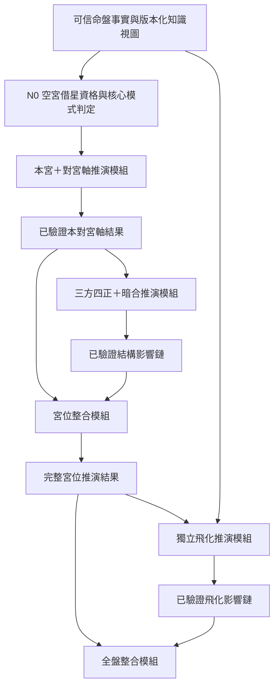

# D1 宮位推演模組交接 Contract v1

## 文件狀態

這是本命人格推演的權威概念 Contract，不是 Prompt 或正式 Runtime 接線。

目前工程切片已建立：

- `src/lib/ai-chart/d1PalaceFacetRegistry.ts`：老師已確認的 63 個十二宮分面 Registry。
- `src/lib/ai-chart/d1PalaceActorBindingRegistry.ts`：固定 Actor、角色規則來源、分面適用範圍及雙星具體互動對象。
- `src/lib/ai-chart/d1PalaceAxisContracts.ts`：本宮＋對宮方向性結果 TypeScript Contract、Strict JSON Schema、Runtime parser 及結構來源驗證。
- `src/lib/ai-chart/d1StructuralInfluenceContracts.ts`：其餘兩個三方宮位＋暗合的固定關係視圖、結構影響 TypeScript Contract、Strict JSON Schema、Runtime parser 及來源驗證。
- `src/lib/ai-chart/d1PalaceIntegrationContracts.ts`：以程式建立宮位分面索引及來源圖的 deterministic builder、Strict JSON Schema、Runtime parser 及上游來源驗證。
- `src/lib/ai-chart/d1PalaceReasoningContracts.test.ts`：三種核心模式、分面與 Actor 歸屬、結構關係、正負觸發、來源引用、宮位整合、coverage 與 immutable contract 測試。

此切片尚未接入既有 P1 Prompt、OpenAI request 或付費報告。

本文件的目的，是固定各推演模組的最小介面，避免：

- 本宮、對宮、三方、暗合及飛化在同一段模型文字裡互相污染。
- 後一層重新解讀前一層命盤。
- 摘要取代原始結論。
- 下游直接依賴模型原文。
- 為節省呼叫而犧牲來源追蹤及必要覆蓋。

## 核心原則

1. 每一項邏輯主張只屬於一個目標宮位及一個宮位分面。
2. 本宮直接或借入核心、對宮表達、結構影響及飛化影響分層保存。
3. 下一個模組只能收到上一個模組已驗證的結果。
4. 模型原文、未驗證候選及隱藏推理不能跨越模組介面。
5. 後續影響只能新增關係，不能改寫本宮核心。
6. 實體 OpenAI 呼叫可以安全批次化，但不能改變邏輯分析單位或省略 coverage。

## 高階資料流



## 共同封套

所有模組輸入與結果都要綁定同一份報告配方：

| 欄位 | 用途 |
|---|---|
| `reportRecipeRef` | 固定命盤 Snapshot、知識、Prompt、Schema 及模型政策版本。 |
| `chartSnapshotRef` | 不可變命盤事實版本。 |
| `facetRegistryRef` | 十二宮分面 Registry 版本。 |
| `actorBindingRegistryRef` | 主體、關係對象、具體互動及角色規則來源版本。 |
| `knowledgeManifestRef` | 本次允許使用的星曜、四化、輔煞、特殊落點及示範卡版本。 |
| `targetPalaceId` | 本次推演的唯一目標宮位。 |
| `sourceFactRefs` | 程式已驗證的命盤事實 ID。 |
| `sourceRuleRefs` | 實際使用的固定規則卡 ID。 |

模組不能接受客戶自由輸入的星曜、宮位、四化、Actor、paid、owner 或模型政策。

## N0 前置判定｜空宮借星與核心模式

這一步由程式完成，不是 OpenAI 呼叫，也不接受模型補判。它在模組一之前產生一份不可變 `EmptyPalaceResolution`：

| 欄位 | 內容 |
|---|---|
| `targetCoreMode` | `DIRECT_MAIN_STARS`、`BORROWED_MAIN_STARS` 或 `NO_MAIN_STAR`。 |
| `blockingFactRefs` | 空宮不能借星時，實際命中的阻擋星事實。 |
| `borrowedMainStarRefs` | 通過資格時，從對宮借入的十四主星事實。 |
| `borrowedNatalTransformationRefs` | 只跟著借入主星的生年四化事實。 |
| `retainedTargetStarRefs` | 本宮原有輔星、煞星、祿存及其他在地星曜事實。 |

固定判定：

1. 本宮有十四主星時為 `DIRECT_MAIN_STARS`，不執行借星。
2. 空宮只要有擎羊、陀羅、火星、鈴星、文昌或文曲任一顆，就是 `NO_MAIN_STAR`，不能借對宮主星。
3. 其他空宮為 `BORROWED_MAIN_STARS`；只借對宮十四主星及實際附著其上的生年四化。
4. 不借文昌、文曲、四煞、左輔、右弼、天魁、天鉞、祿存或其他小星。
5. 空宮只有祿存時仍可借星；祿存留在本宮作借入主星的在地助力，不被列為借入星。
6. 借入主星不是較弱、隱藏或次要核心；它在目標宮代表表裡如一。

## 模組一｜本宮＋對宮軸推演

### 最小輸入

| 欄位 | 內容 |
|---|---|
| `targetPalaceFactView` | 本宮星曜、Actor、生年四化、輔煞及必要特殊規則。 |
| `oppositePalaceFactView` | 對宮中足以完成借星判定或表達通道推演的必要命盤事實。 |
| `emptyPalaceResolution` | N0 已固定的核心模式、阻擋來源、借入主星及保留在地星曜。 |
| `actorBindingView` | 該宮允許的關係人物、命主態度、雙方互動及抽象制度主體規則。 |
| `axisRelationFact` | 程式確認的本宮與對宮關係。 |
| `allowedFacetView` | 目標宮位可使用的 Registry 分面與邊界。 |
| `selectedKnowledgeView` | 本次適用的固定核心、特殊落點及少量 A2 示範卡。 |

不提供其他三方、暗合及飛化資料，避免第一個模組提前推演後續層。

### 最小輸出

一份 `ValidatedPalaceAxisResult`，內容包含：

| 欄位 | 內容 |
|---|---|
| `axisResultId` | 不可變結果 ID。 |
| `targetPalaceId` | 結論歸屬的目標宮位。 |
| `oppositePalaceId` | 本次借星或表達關係所連到的對宮。 |
| `actorBindingRegistryVersion` | 本次主張使用的固定 Actor Binding Registry 版本。 |
| `targetCoreMode` | 沿用 N0 的三種固定核心模式。 |
| `axisExpressionMode` | `OPPOSITE_CHANNEL`、`MIRRORED_SAME_CORE` 或 `OPPOSITE_NOT_BORROWED`。 |
| `claims` | 一項以上已驗證的本對宮主張。 |
| `coverage` | 由程式依實際主張與來源重算的覆蓋結果。 |
| `validationStatus` | 通過或固定問題碼。 |

每項 `claims` 至少保存：

| 欄位 | 內容 |
|---|---|
| `claimId` | 原子主張 ID。 |
| `facetId` | 唯一合法宮位分面。 |
| `actor` | 本項主張的固定主體。 |
| `actorBindingRefs` | 本項主體及必要雙星前後角色的程式規則來源。 |
| `doubleStarCoreRef` | 可選；雙主星主張實際使用的完整合法組合。 |
| `interactionRoleBindings` | 可選；只有具體雙方互動時，保存前星對方、後星命主。 |
| `palaceMeaningRefs` | 本宮分面及必要的宮位特殊含義。 |
| `targetCoreRefs` | 直接主星或已驗證借入主星；`NO_MAIN_STAR` 時可以為空。 |
| `targetLocalModifierRefs` | 本宮原有且已建模的輔星、煞星、祿存及特殊落點；純觀察星不進入 D1 claim。 |
| `oppositeExpressionRefs` | 實際用作表達通道的對宮核心片段。 |
| `natalModifierRefs` | 跟著本宮或對宮星曜的生年四化修飾。 |
| `mechanismLink` | 本宮核心如何透過對宮方式呈現。 |
| `possibleExpressions` | 一項以上可追溯的生活可能。 |
| `constraints` | 可能性、Actor、事件及來源邊界。 |

### 不變條件

1. `targetCoreMode`、借星來源及阻擋原因必須與 N0 完全相同。
2. 地空、地劫只保留在結構輸入的 `observationOnlyStars`，不得進入 D1 claim 的 `targetLocalModifierRefs`、機制或生活結論；兩顆都不屬於空宮借星阻擋星。它們主要留給 D2 事件結果層，依老師最新確認只採同宮與對宮完整作用。
3. 其他未建模小星不進入本合約；底層同名小星只要 placement ID 不同就可以並存，不能阻擋宮位推演。
4. `DIRECT_MAIN_STARS` 的 `targetCoreRefs` 只能引用本宮主星；對宮只提供表達方式，不能被列成本宮第二組核心。
5. `BORROWED_MAIN_STARS` 的 `targetCoreRefs` 只能引用 N0 借入主星；`axisExpressionMode` 必須是 `MIRRORED_SAME_CORE`，同一借入星不能再重複列入 `oppositeExpressionRefs`。
6. `NO_MAIN_STAR` 的 `targetCoreRefs` 可以為空，主張由合法宮位分面及 `targetLocalModifierRefs` 建立；對宮不能被提升成本宮核心。
7. 分析相反方向時必須重新執行 N0，並另建新的 `ValidatedPalaceAxisResult`。
8. 生年四化跟著實際被四化星曜及 Actor；借入時只允許隨借入主星帶入的生年四化。
9. 沒有固定對拱、四化或煞忌證據時，不引入對宮其他優缺點。
10. `coverage` 由輸出引用反推，不讓模型自行聲稱考慮過哪些星曜。
11. 雙主星描述關係人物本身或命主整體關係態度時，必須使用完整雙星組合；不能縮成前星或後星。
12. `interactionRoleBindings` 只用於具體雙方互動，且必須是前星對方、後星命主；角色切分不能取代完整雙星主張。
13. 政府、制度及抽象權威不能放入前星對方角色；只有具體官員、承辦人或其他互動者可使用角色切分。

## 模組二｜三方四正＋暗合結構影響

### 最小輸入

| 欄位 | 內容 |
|---|---|
| `validatedAxisResult` | 模組一已驗證的完整本對宮軸結果。 |
| `trineQuadrantFactViews` | 除已處理對宮外，程式確認的三方四正來源。 |
| `hiddenCombinationFactViews` | 程式確認的暗合來源及關係。 |
| `selectedInfluenceKnowledgeView` | 適用的祿權科、煞忌、輔星及結構規則。 |

### 最小輸出

一組 `ValidatedStructuralInfluence`：

| 欄位 | 內容 |
|---|---|
| `influenceId` | 獨立影響鏈 ID。 |
| `relationKind` | `TRINE_QUADRANT` 或 `HIDDEN_COMBINATION`。 |
| `visibility` | `EXPLICIT` 或 `LATENT`。 |
| `sourcePalaceId` | 影響來源宮。 |
| `sourceFactRefs` | 實際祿權科、煞忌、輔星及關係事實。 |
| `targetPalaceId` | 接受影響的本宮。 |
| `targetFacetId` | 受到影響的合法宮位分面。 |
| `targetClaimRefs` | 可選；本宮已有相應主張時連到原始 claim。 |
| `influenceMode` | `SUPPORT`、`AMPLIFY`、`PRESSURE` 或 `INTERFERE`。 |
| `mechanismLink` | 來源宮如何幫助或干擾本宮的決定及狀況。 |
| `possibleEffects` | 可觀察但不斷定已發生的影響。 |
| `constraints` | 來源、可見度及不改寫本宮的邊界。 |

`targetClaimRefs` 可以是空陣列。這表示結構來源影響到一個 Registry 合法分面，但本對宮軸沒有在該分面產生原始人格主張；此時只能建立「影響」，不能冒充新的本宮核心。

### 不變條件

1. 每條影響都必須有程式確認的正式關係。
2. 對宮已在模組一處理，不能再次成為三方資料。
3. `HIDDEN_COMBINATION` 必須是 `LATENT`，不能寫成明顯直接原因。
4. 正向與負向影響分開保存，不抵銷、不加總。
5. 結構影響不能刪除、改字或替換任何本對宮主張。
6. 煞忌可以讓某主題感受較深，但不能把該宮變成比較重要。
7. 主星本身只提供來源脈絡；必須實際引用生年祿權科、祿存、已建模輔星、生年化忌或四煞，才能建立正向或負向結構影響。
8. 同一條影響不能同時混入正向與負向觸發；同一來源若兩者並存，必須拆成可追溯的獨立影響鏈。
9. 地空、地劫在 D1 仍是 `observationOnlyStars`，不能觸發本模組的結構影響。
10. `coverage` 必須由實際影響鏈重算；模型不能自行宣稱已覆蓋來源、關係或 Axis claim。

## 模組三｜宮位整合

### 最小輸入

- 一份 `ValidatedPalaceAxisResult`。
- 零至多條 `ValidatedStructuralInfluence`。

### 最小輸出

一份 `ValidatedPalaceReasoningResult`：

| 欄位 | 內容 |
|---|---|
| `palaceResultId` | 完整宮位結果 ID。 |
| `axisResultRef` | 原始本對宮軸結果。 |
| `structuralInfluenceResultRef` | 原始結構影響結果封套。 |
| `structuralInfluenceRefs` | 全部結構影響鏈。 |
| `facetIndex` | 各合法分面下的主張與影響索引。 |
| `sourceGraph` | 主張、影響、事實與規則之間的來源關係。 |
| `coverage` | 依全部實際結果重算的宮位覆蓋。 |
| `validationStatus` | 通過或固定問題碼。 |

`facetIndex` 只保存 `facetId`、`axisClaimRefs` 及
`structuralInfluenceRefs`。若某合法分面只有結構影響，仍可保留空的
`axisClaimRefs`，但不能因此捏造新的本宮 claim。

`sourceGraph` 只建立兩種節點：

- `AXIS_CLAIM`：連回 Actor、雙星、宮位分面、核心星曜、對宮表達與本命四化等原始來源參照。
- `STRUCTURAL_INFLUENCE`：連回正式關係及觸發星曜／訊號，並在有對應主張時連到 `targetClaimRefs`。

整合結果不複製 `mechanismLink`、生活例子或其他模型文字。需要讀取完整
主張或影響時，下游必須依 ID 回到原始已驗證結果，不能把來源圖當成摘要。

整合模組只建立索引及來源圖。它不能：

- 重新呼叫模型產生綜合人格。
- 用摘要替換原始主張。
- 把兩個相似句子合併後刪除來源。
- 將正負作用算成一個吉凶分數。

### 不變條件

1. 整合由程式 deterministic 建立，不是 OpenAI 階段。
2. `axisResultRef`、`structuralInfluenceResultRef`、chart、run、call 及目標宮位必須與已驗證上游完全一致。
3. 每個 Axis claim 與 Structural Influence 必須各自在 `sourceGraph` 出現一次，也必須各自在唯一合法分面被索引一次。
4. `coverage` 由分面索引及來源圖重算，不能由模型或 Client 自行聲稱。
5. 只有結構影響的分面可以存在，但不能被升格為 Axis 核心。
6. 正向與負向影響逐條保留，不抵銷、不排序成吉凶，也不刪除其中任一條。
7. 整合層不接受飛化、摘要、分數、生成文章或任何未列入 Contract 的欄位。
8. 解析後結果、所有陣列、索引、來源圖及 coverage 都必須 immutable。

## 模組四｜獨立飛化推演

### 邏輯分析單位

一條程式已確認的飛化命盤事實：

```text
出發宮宮干
→ 落入宮原本存在的指定星曜
→ 祿／權／科／忌
```

### 最小輸入

| 欄位 | 內容 |
|---|---|
| `flyingFact` | 出發宮、宮干、落入宮、被飛化星曜及四化類型。 |
| `sourcePalaceResult` | 出發宮已驗證宮位結果。 |
| `targetPalaceResult` | 落入宮已驗證宮位結果。 |
| `sourcePalaceMeanings` | 出發宮在固定講義中的完整宮位含義。 |
| `targetPalaceMeanings` | 落入宮在固定講義中的完整宮位含義。 |
| `transformationCommonRule` | 祿權科忌的共通固定動作。 |
| `transformationSpecificRule` | 本次星曜承受該四化時的專屬規則。 |
| `transformedStarCoreRule` | 落入宮被飛化星曜的固定核心。 |
| `sourceActorBindings` | Fact 已確認的全部合法來源角色候選。 |
| `formulaPolicy` | 先宮位因果、再星曜方式、最後生活橋接的固定推演順序。 |
| `optionalOppositeCauseView` | 只有直接宮位因果無法成立時才提供。 |

工程上由 `buildAiChartD1FlyingModelInputs(...)` 一次建立固定 48 筆交接資料。每筆只配對一條權威 Fact、正確的出發宮結果、正確的落入宮結果，以及落入宮 Registry 的完整合法分面；組裝層本身 `openAiCallable=false`，不生成文字。

單宮結果的 `coverage` 只記錄前一階段實際形成的內容，不是飛化的合法範圍清單。來源 Actor 以 Fact 為準、被飛化星曜以 N0 驗證後的 Fact 為準、目標分面以 Palace Facet Registry 為準；三者不必先被單宮結果的某條主張採用，但模型也不能超出這些固定邊界。

`buildAiChartD1FlyingKnowledgeViews(...)` 依每筆 Model Input 從同一份鎖定 K0 Catalog 選出上述知識，形成 48 份 immutable Knowledge View。它不接受模型自填內容；`validateAiChartD1FlyingKnowledgeViewSetAgainstSources(...)` 會用 Model Input 與 Catalog 完整重算，任何漏卡、換卡、內容竄改或星名與核心規則不一致都會 fail closed。這一層仍不組 Prompt、不產生生活文字、不呼叫 OpenAI。

### 最小輸出

一份 `ValidatedFlyingInfluence`：

| 欄位 | 內容 |
|---|---|
| `flyingInfluenceId` | 權威飛化影響鏈 ID。 |
| `flyingFactRef` | 唯一飛化事實。 |
| `sourcePalaceId` | 來源宮。 |
| `sourceActorCandidates` | 命盤支持但尚未由客戶背景確認的合法來源人物或經驗。 |
| `targetPalaceId` | 受影響宮。 |
| `targetFacetId` | 受影響的 Registry 分面。 |
| `transformationKind` | `LU`、`QUAN`、`KE` 或 `JI`。 |
| `transformationActionRef` | 固定四化動作。 |
| `transformedStarId` | 落入宮原本存在、實際承受四化的星曜。 |
| `directPalaceCause` | 不先看星曜時，兩宮為何能形成影響。 |
| `oppositeCauseRef` | 可選；只有直接因果不足時存在。 |
| `natalBackgroundRelation` | `NONE`、`TRIGGER`、`AMPLIFY` 或其他核准底色關係。 |
| `starSpecificMechanism` | 被飛化星曜使影響如何發生。 |
| `lifeBridge` | 來源 → 感受／價值 → 反覆行為 → 可能結果。 |
| `constraints` | 主體、可能性及事件邊界。 |

### 不變條件

1. 飛化不能新增或搬動星曜。
2. 先完成宮位因果，再使用被飛化星曜修飾發生方式。
3. 合法雙星只有被指定星曜承受本次四化。
4. 落入宮已有同類生年四化時，只能描述觸發、加重、引動或帶出。
5. 未確認客戶背景時，`sourceActorCandidates` 不得被模型縮成唯一真人。
6. 每條飛化只產生一份權威影響鏈。
7. 客戶文章主要放在落入宮；出發宮如需提示，只放來源索引。

### 已落地工程 Contract

`src/lib/ai-chart/d1FlyingInfluenceContracts.ts` 現在提供：

- `parseAiChartD1FlyingFact(value)`：只解析程式已確認的飛化來源封套；不計算宮干飛化。
- `parseAiChartD1FlyingInfluenceResult(value)`：嚴格解析單一有向影響鏈。
- `validateAiChartD1FlyingInfluenceResultAgainstSources(...)`：把結果綁回唯一 Flying Fact、出發宮結果與落入宮結果。
- `AI_CHART_D1_FLYING_FACT_JSON_SCHEMA` 與 `AI_CHART_D1_FLYING_INFLUENCE_RESULT_JSON_SCHEMA`：可序列化、所有 object 都是 `additionalProperties: false` 的 Strict JSON Schema。
- `buildAiChartD1FlyingModelInputs(...)`：把 48 條權威 Fact 與固定十二份宮位結果逐條配對。
- `validateAiChartD1FlyingModelInputSetAgainstSources(...)`：重新組裝並拒絕缺漏、換位、錯配或竄改。
- `buildAiChartD1FlyingKnowledgeViews(...)`：為每條輸入選出鎖定的星曜、四化、宮位、Actor 與公式知識。
- `validateAiChartD1FlyingKnowledgeViewSetAgainstSources(...)`：重算全部 48 份 Knowledge View，拒絕缺卡、換卡、竄改及星曜核心錯綁。
- `buildAiChartD1FlyingPromptPackages(...)`：建立 48 個固定 Instructions、Canonical Input、Strict Output Schema 身分、來源索引及內容指紋的邏輯封套。
- `validateAiChartD1FlyingPromptPackageSetAgainstSources(...)`：從 Model Input、Knowledge View 與 K0 Catalog 重建封套，拒絕 Prompt、輸入、來源或指紋被竄改。
- `validateAiChartD1FlyingInfluenceResultAgainstKnowledgeSources(...)`：將 Result 的星曜核心、共通四化及星曜專屬四化綁回同一份 Knowledge View。
- `buildAiChartD1FlyingPalaceIntegration(...)`：把完整 48 條 source-bound Result 依落入宮放進十二個固定宮位槽位；空槽也保留。
- `parseAiChartD1FlyingPalaceIntegration(...)`：拒絕缺少、重複、額外、來源錯綁、非固定順序、分數、摘要及客戶文章欄位。
- `AI_CHART_D1_FLYING_PALACE_INTEGRATION_JSON_SCHEMA`：十二宮 Flying 索引的可序列化 Strict JSON Schema。
- `buildAiChartD1PalaceWritingSourceSet(...)`：把十二份 Palace Result 與 Flying Palace Integration 建立成十二宮未合併來源格；每格只綁一筆 Axis、Structural 或 Flying Ref。
- `parseAiChartD1PalaceWritingSourceSet(...)`：拒絕宮位缺漏、跨 chart／run、Flying 綁錯 Palace Result、coverage 不一致、客戶文章及未授權合併欄位。
- `AI_CHART_D1_PALACE_WRITING_SOURCE_JSON_SCHEMA`：未合併寫作來源格的可序列化 Strict JSON Schema；它不是 OpenAI Structured Output 或客戶文章 Schema。

Flying Fact 額外由程式預先配置：

| 欄位 | 用途 |
|---|---|
| `authoritativeInfluenceId` | 一條事實只能形成這一個權威結果 ID。 |
| `sourceActorBindingRefs` | 全部合法來源人物／經驗候選；模型不能自行縮減。 |
| `sourcePalaceStemRef` | 權威宮干事實參照。 |
| `transformedStarRef` | 落入宮原本存在、實際承受四化的星曜。 |
| `transformedStarCoreRuleRef` | 被飛化星曜固定核心規則。 |
| `transformationActionRef` | 由 `LU／QUAN／KE／JI` deterministic 對應的固定動作。 |
| `natalBackgroundKind` | `NONE` 或已有同類生年四化的 `SAME_TRANSFORMATION`。 |
| `optionalOppositeCauseRef` | 只有程式預先提供時，模型才能在直接因果不足時引用。 |

Result 的 `lifeBridge` 固定拆成：

```text
sourceExperience
→ innerEffect
→ repeatedBehavior
→ possibleOutcome（可為 null）
```

`coverage` 由程式依 Flying Fact、兩份 Palace Result 與 Knowledge View 重算，不能由模型自行宣稱。`knowledgeRuleRefs` 必須依序包含星曜核心、共通四化與該星專屬四化；來源宮 Actor 由 Fact Source 決定、落入合法分面由 Palace Facet Registry 決定、被飛化星曜則必須是 N0 落入宮內的既有唯一星曜。前一階段沒有產生某個 Actor 或分面的文字，不能縮減飛化階段的合法範圍。

### 多來源落入宮整合

完整 48 條 Result 通過 source binding 後，由程式依落入宮建立十二個固定槽位。這一步不是 OpenAI 階段，也不是報告摘要；它只提供後續內容格所需的完整來源集合。

固定政策為：

1. 每一條有向飛化都保留，不能因同宮同分面而刪除。
2. 正向與困難作用可以同時存在，不計算淨分數。
3. 不選唯一主導影響，也不建立 `mergedConclusion`。
4. 沒有飛化落入的宮位仍以空陣列存在。
5. 48 條 Result 必須各自綁回唯一 Fact、Model Input 與 Knowledge View。
6. 客戶寫作只能在下一層使用這份索引，不能覆蓋原始 Result。

第一組脫敏金標確認財帛宮可同時保留八條不同來源作用，其中包含父母宮天機化祿的找方法機會，以及財帛宮天機化忌的反覆研究與難以定案；兩條語意與來源都保留，不互相抵銷。

### 全盤整合前的未合併寫作來源格

Flying 落入宮索引完成後，程式可以先建立 deterministic 的來源交接層，但此時尚未擁有全盤關係，也不能可靠判斷不同引擎是否真的指向同一項可觀察行為。因此目前只建立「未合併寫作來源格」，不直接建立客戶段落。

固定政策為：

1. 十二份 Palace Result 與 Flying Palace Integration 必須屬於同一 `chartId` 及 `runId`。
2. Axis claim、Structural influence 與 Flying influence 每筆來源各自建立一格，不把多筆 Ref 預先合成一格。
3. 每格只保存目標宮位、合法分面、來源種類及來源 Ref，不保存摘要、文章或模型自填 coverage。
4. 不建立沒有來源的空格；沒有 Flying 的宮位仍可由其 Axis 或 Structural 來源形成合法來源格。
5. 父母宮天機化祿與財帛宮天機化忌等共存來源保持分開，不做正負抵銷或主導來源選擇。
6. `semanticMerging` 固定為 `NOT_PERFORMED`，全盤關係固定為 `REQUIRED_BEFORE_WRITING`。
7. `customerWriting` 固定為 `BLOCKED`，`openAiCallable` 固定為 `false`。

後續全盤關係模組可以在保留全部來源的前提下，判斷哪些來源具有相同宮位、Actor、分面及可觀察機制，再建立真正的寫作內容格來源圖。不同機制與矛盾面向仍不得合併。

### 全盤關係來源綁定

`d1WholeChartRelationContracts.ts` 定義四種全盤關係：

1. `OVERALL_DIRECTION`：至少引用一個命宮 `AXIS_CLAIM` 來源格。
2. `REPEATED_PATTERN`：至少引用兩個不同宮位。
3. `INNER_TENSION`：至少引用兩個不同宮位；同宮雙星拉扯不在此重複建立。
4. `DEEP_FEELING_THEME`：引用一個焦點宮位、該宮相關 N0 scan signal，以及能沿 Palace Result Axis source graph 回到該訊號星曜 placement 的來源格。

程式會從十二份 Palace Result 與 Flying Integration 重建可信來源格，再核對結果的 chart、run、來源版本及全部 Ref；coverage 只由 relations 反向計算，不能由模型隱藏、補寫或重排來源。未知來源、跨 identity、重複 Ref、偽造 scan signal 或缺少必填整體方向都 fail closed。

`mechanismLink`、`possibleExpressions` 與 `constraints` 是未來全盤語意階段的內部候選，不是客戶文章。這個 Contract 只證明候選有合法來源和基數，不能證明語意本身正確；因此固定為：

```text
sourceBindingStatus = validated
semanticReviewStatus = required
customerWritingStatus = blocked
```

它不計算吉凶或權重、不選唯一主導關係、不刪除來源，也不包含 OpenAI Runtime、模型政策或客戶報告生成。

### 全盤關係語意審查交接

`d1WholeChartSemanticReviewContracts.ts` 只審核上一層已完成 source binding 的 relations。每一項 relation 必須依來源結果的固定順序得到一筆 review：

```text
APPROVED
  issueCodes = []
  repairScope = NONE

REPAIR_REQUIRED
  issueCodes = 一個以上固定問題碼
  repairScope = RELATION_ONLY
```

固定問題碼覆蓋：

```text
關係種類不符
整體方向不受來源支持
重複模式並非相同機制
內在拉扯不真正成立
深刻感受被過度放大
來源語境讀錯
不同機制被錯誤合併
矛盾被刪除
可能表現不受支持
超出 D1 邊界
```

審查不能回傳自由文字理由、分數、改寫後關係或客戶摘要。程式會重新驗證 Whole-Chart Relation 的完整上游來源鏈，確認 review 與 relation 一對一、順序一致、專屬問題碼沒有錯掛，並依 review decisions 重算核准、修復及問題 coverage。

任一關係需要修復時，已核准的其他關係保持不可變，但 `contentGridHandoffStatus=blocked`。只有全部核准才會變成 `ready`；這只表示可以建立內容格，`customerWritingStatus` 仍固定 `blocked`。

### 逐宮寫作內容格交接

`d1PalaceContentGridContracts.ts` 只接受完整通過上述語意審查的來源鏈。程式先重驗未合併來源格、Whole-Chart Relation、Semantic Review、十二份 Palace Result、Flying Palace Integration 與 N0，再依固定十二宮順序建立內容格：

```text
Palace
  → Registry 中實際有來源的 Facet
    → 一筆來源一個 Content Cell
      → 該來源被引用的全部已核准 Relation Ref
```

第一版固定：

```text
sourceGrouping = ONE_SOURCE_PER_CELL
semanticMerging = NOT_PERFORMED
emptyFacetCreation = FORBIDDEN
relationContext = APPROVED_ONLY
customerWriting = BLOCKED
openAiCallable = false
```

分面順序只由 `d1PalaceFacetRegistry.ts` 決定，不按 Axis、Structural、Flying 等內部引擎分章。每筆來源恰好出現一次；關係只作已核准上下文，不建立第二份命理來源，也不能刪除原來源或矛盾。

目前來源格沒有足夠的固定 Actor 與 Mechanism 等價資料，不能可靠判定兩筆來源可否合併。因此本切片不以文字相似度或 relation kind 自動合格；先保留一來源一格，後續 Palace Writing Prompt Package 才取得完整且不漏失的 source-bound 輸入。`writingPackageHandoffStatus=ready` 只代表可建下一層 Prompt Package，不代表客戶文章或 OpenAI Runtime 已開放。

### 逐宮寫作 Prompt Package

`d1PalaceWritingPromptPackageContracts.ts` 只接受已驗證 Content Grid 及其完整來源鏈，並另外取得 Server-owned 的主要生活地區與報告語言。程式依固定十二宮順序建立十二個 Package；每個 Package 只包含：

```text
一個 targetPalaceId
該宮完整 Content Grid
每一格解析後的實際 Axis／Structural／Flying 來源內容
該宮內容格引用的已核准 Whole-Chart Relation
primaryLifeRegion
reportLanguage
固定 Instructions、來源 trace、SHA-256、UTF-8 預算與指紋
```

Content Grid 的 Ref 不能直接當成模型可理解的素材，因此 builder 必須在 Server 端把 Ref 解回已驗證來源內容；不能讓模型自行查找或猜測。其他宮位的 Grid、Palace Result 與完整 N0 不會複製進單宮輸入。`primaryLifeRegion` 只可影響社會脈絡、生活用語及例子；`reportLanguage` 只決定輸出語言。

本層固定：

```text
onePalacePerPackage = true
sourceMaterialResolution = SERVER_BOUND
relationContext = APPROVED_REFS_ONLY
preserveContradictions = true
writingOutputContractStatus = available
adapterStatus = bridge_required
customerWritingStatus = not_generated
openAiCallable = false
```

因此「Prompt Package 已完成」不等於「可呼叫 OpenAI」。Palace Writing Result Contract、source-bound 忠實度審查及兩個純資料 Adapter bridge 雖已建立，真正的 Server Runtime gate 仍未解除。

### 單宮寫作 Result 與忠實度審查

`d1PalaceWritingResultContracts.ts` 固定每個 Content Cell 只回傳一段 `customerText`，並把 chart、run、call、宮位、Package fingerprint、Content Cell 順序與 facet 綁回同一 Prompt Package。覆蓋由實際 sections 重算，不接受模型另外自填星曜或來源清單。Result 完成後仍固定 `customerDeliveryStatus=blocked`。

`d1PalaceWritingFidelityReviewContracts.ts` 再逐格回傳固定 decision、allowlisted issue code 與修補範圍。Review 不能回傳自由文字理由或改寫後文章；只有全部格子核准且 Writing Result SHA-256、Package fingerprint 與 identity 完全相符時，單宮交付狀態才可成為 `ready`。任一格失敗只允許 `CONTENT_CELL_ONLY` 定點修補，不重寫其他格。

`d1PalaceWritingAdapterBridgeContracts.ts` 提供兩個不同的純資料交接：

- Writing Adapter 將已驗證單宮 Prompt Package 綁到 Writing Result Strict JSON Schema 與 source-bound parser。
- Fidelity Review Adapter 將 Fidelity Prompt Package 綁到 Review Strict JSON Schema，parser 同時持有原 Writing Prompt Package 與 Writing Result。

`d1PalaceWritingFidelityPromptPackageContracts.ts` 會把原 Prompt Input 與已驗證 Writing Result 一起封裝，並固定 Package fingerprint、Result SHA-256、review-only policy、budget 及來源 trace。兩個 Adapter descriptor 都維持 `openAiCallable=false` 與 `runtimeStatus=runtime_wiring_required`；它們可產生經既有 OpenAI Contract validator 驗證的純資料 request，但不包含 Server、fetch 或正式執行能力。

### 脫敏單宮金標與 Benchmark Plan

`d1PalaceWritingGoldenCaseContracts.ts` 固定一份可重算的紫微命宮 synthetic 金標，範圍只包含：

```text
兩個已綁來源的命宮內容格
臺灣繁體中文生活語境
老師討論後核准的 Writing Result
全格 APPROVED 的 Fidelity Review
Writing／Fidelity 兩個 Adapter fingerprint
尚未執行的兩階段 Benchmark Plan
```

金標不含姓名、生日、user ID、完整命盤、Prompt 外的 request body、秘密或模型原始輸出。`approved_reference` 是人工參考答案，不是模型品質成績；離線 evaluator 只會重算 Contract、來源綁定、Review 與交付狀態。

Benchmark 固定循序執行 Writing 與 Fidelity Review，最多兩個請求且不重試。品質面向固定為來源忠實度、內容格覆蓋、白話表達、可能性邊界、臺灣語境與禁止內部 metadata。尚未受控執行前，`openAiCallable=false`、`executionStatus=not_executed`、`measurementStatus=not_measured`，duration 與 safe token usage 必須保持 `null`，不得用人工金標冒充實測結果。

### 受控 Preview 與安全 Evidence

`d1PalaceWritingPreviewContracts.ts` 將 Golden Case 綁成另一份帶 fingerprint 的 Preview Plan。它固定 Writing 與 Fidelity Review 循序執行、最多兩次 request／fetch、不重試，並保持 `authorizationStatus=not_authorized`、`runtimeStatus=runtime_not_implemented` 及 `openAiCallable=false`。

未來 Evidence Summary 只能由 trusted Server Runner 在既有 source-bound validators 通過後建立，內容只包含：

- Case／Plan／Bridge fingerprint。
- 每階段的 `SUCCEEDED`、`FAILED` 或 `NOT_STARTED`。
- duration 與非負整數 safe usage。
- request／fetch／成功執行計數。
- 結果 SHA-256。
- 四個固定 Writing／Fidelity request 或 output failure code。

模型輸出、provider message、Prompt、request body、API Key、Authorization、命盤與出生資料不得放入摘要。供人工判讀白話、可能性與臺灣語境的模型結果必須是分開的受限 artifact。

成功 Evidence 仍固定 `humanReviewStatus=NOT_REVIEWED` 與 `customerDeliveryStatus=BLOCKED_PENDING_HUMAN_REVIEW`。Evidence parser 只驗證安全形狀、fingerprint 綁定、usage 算術及狀態一致性，不能單獨證明模型品質。

### Pre-request Gate 與一次性原子 Claim

`d1PalaceWritingPreviewGateContracts.ts` 已把 Preview Plan 綁成不可呼叫的 Gate Plan，並提供 exact、fingerprint-bound 的一次性授權 parser。授權本身不消耗執行權，也不開放 fetch；只有未來 server-only atomic storage adapter 成功以 exclusive create 建立 `request-started.json` 時，授權才視為已消耗。

Claim observation 為 `ABSENT` 時，決策只會到達 `READY_FOR_ATOMIC_CLAIM`，下一步是 `CREATE_ATOMIC_CLAIM_EXCLUSIVELY`；`fetchAllowed` 與 `openAiCallable` 仍固定為 `false`。Observation 為 `PRESENT` 時，決策固定為 `BLOCKED_ALREADY_CONSUMED`，不提供 retry 或重新執行。

Contract 內的 `TRUSTED_ATOMIC_STORAGE_ADAPTER` 是封閉資料值，不是安全信任根。真正的 observation 與 exclusive create 必須由未來 module-private、server-only adapter 提供，production consumer 不得接受 Client 或一般呼叫者自行建構的 observation。本切片沒有建立 adapter、沒有檔案讀寫、沒有環境變數、沒有 Server Runtime，也沒有 OpenAI request。

`d1PalaceWritingPreviewAtomicClaim.server.ts` 現已提供該 server-only 信任根。儲存位置固定在系統 temporary root，呼叫者不能選其他 root；Gate fingerprint 目錄與 storage root 都必須是目前程序使用者擁有的 `0700` regular directory。Sentinel 以 `open("wx", 0600)` exclusive create，兩個並行 claimant 只會有一個成功。既有 private sentinel 回報已消耗；symlink、非 regular file 或權限異常則回報固定 storage failure。Adapter 沒有覆寫或刪除 claim 的路徑。

Claim sentinel 只保存 Gate fingerprint、固定狀態及零 request 計數，不保存授權文字、Prompt、模型內容、命盤或出生資料。成功 claim 仍回傳 `STOP_BEFORE_REQUEST_RUNTIME`、`fetchAllowed=false` 與 `openAiCallable=false`；它不是 request permit。

`d1PalaceWritingPreviewPreRequestCoordinator.server.ts` 已把上述步驟收斂為單一受信任入口。它先驗證 Gate Plan 與一次性授權，再從 atomic adapter 取得 observation、執行純 Gate decision，只有 `READY_FOR_ATOMIC_CLAIM` 才嘗試 exclusive claim。既有 claim 直接回傳 `BLOCKED_ALREADY_CONSUMED`；兩個 coordinator 的競態落敗者只在確認 trusted observation 已變為 `PRESENT` 後收斂成相同阻擋結果。成功與阻擋結果都不可變、只含固定安全欄位，且 request／fetch／OpenAI 計數皆為零。

`d1PalaceWritingPreviewRuntimeHandoff.server.ts` 再把成功 claim 包成同程序、單次消耗的不可仿造 handoff。Handoff 的安全權限不來自可複製欄位，而來自 module-private `WeakMap` 對原始物件 identity 的登記；shallow copy、structured clone、JSON 往返或跨程序重建都會被拒絕。合法物件一經消耗便從 active registry 移除，並記為已消耗；兩個 consumer 最多只有一個成功。這層不取代 persistent Atomic Claim，程序重啟後沒有 handoff 可恢復，但既有 claim 仍永久阻擋重入。

消耗結果仍固定停在 `STOP_BEFORE_PRODUCTION_RUNTIME_ADAPTER`，`runtimeAdapterStatus=not_implemented`、`fetchAllowed=false`、`openAiCallable=false`，所有 request／fetch／OpenAI 計數為零。因此這份 handoff 不是 request permit，也不能序列化後交給背景程序。

`d1PalaceWritingPreviewMockRuntimeContracts.ts` 再以一個 mock-only 深模組固定 Writing→Fidelity Review 的實際依賴順序。第一階段輸出先經 Writing bridge 的 source-bound parser；通過後才依實際 Writing Result 建立 Fidelity Prompt Package、動態 bridge fingerprint 與 Review parser。Plan 的 Writing stage 維持 exact fingerprint，Fidelity stage 改為 `DERIVED_FROM_VALIDATED_WRITING_RESULT`，原 Golden Case fingerprint 只作 reference。Mock executor 只取得安全 stage command，不取得 Prompt 或 request；回傳 Evidence 也只含 safe usage、duration、result SHA 與固定失敗碼。所有路徑零 request、零 fetch、零 OpenAI 且不重試。

`d1PalaceWritingPreviewExecutionLedgerContracts.ts` 另將未來正式執行的計數語意固定為一個純資料狀態機。`REQUEST_ATTEMPTED`、`FETCH_DISPATCHED` 與 `STAGE_SUCCEEDED` 分別增加 attempted、fetch 與 executed；失敗明確區分 `PRE_FETCH`／`POST_FETCH`。Writing 成功後才把動態 Fidelity bridge 寫入第二階段，所有 terminal 狀態固定 `STOP` 與零 retry。Ledger 只保存固定 failure code、四欄安全 usage、duration 與 SHA-256；不保存 Prompt、request、命盤或模型文字，也不建立檔案。Final Evidence parser 現已接受 Writing `1/0/0` 與 Fidelity `2/1/1` 的 pre-fetch failure，並拒絕在這兩種狀態使用 output failure code 或 token usage。

`d1PalaceWritingPreviewEvidenceProjectionContracts.ts` 再提供 terminal Ledger 到 final Evidence 的唯一純資料 seam。它只接受 Writing／Fidelity 各自的 pre-fetch、post-fetch failure 與完整成功，先重放既有 Ledger 狀態機並逐位比對，再交由既有 Evidence parser 完成最終驗證及 freeze。任何 non-terminal、額外欄位、計數／bridge／stage 竄改或任意錯誤文字都 fail closed。Ledger 控制欄位不進 Evidence；Writing 尚未成功時，Review 的 `NOT_STARTED` Evidence 只使用 Plan reference fingerprint，不代表動態 bridge 已建立。這一層仍不保存檔案或 restricted artifact。

`d1PalaceWritingPreviewEvidencePersistenceContracts.ts` 再固定 Evidence writer 之前的純資料交接。它要求 Preview Plan、Gate Plan 與 terminal Ledger 的 Gate binding 一致，依 Evidence status 選擇固定成功／失敗檔名，並保存 Evidence canonical SHA-256、Gate-scoped storage、private mode、exclusive create、禁止 overwrite／retry 及 restricted artifact 分離政策。封套本身不可變且仍標示 `NOT_PERSISTED`；呼叫者不能提供 storage root，也沒有檔案操作。

`d1PalaceWritingPreviewEvidenceWriter.server.ts` 再實作 safe Evidence 的 server-only 信任根。它在任何 I/O 前重驗 Preview Plan、Gate Plan、Envelope exact fields、Evidence parser、固定檔名與 canonical SHA；storage root 固定在系統 temporary root，Gate 目錄以單一 `mkdir` claim 排除成功／失敗雙寫，artifact 以 `open("wx", 0600)` 建立。Root／Gate 必須是目前使用者擁有的 `0700` regular directory；symlink、寬鬆權限、既有終態、額外欄位或 caller-selected root 一律拒絕。回傳不含路徑，restricted result artifact 仍未保存。

`d1PalaceWritingPreviewEvidencePersistenceCoordinator.server.ts` 是 terminal Ledger 的唯一保存入口。它不讓 caller 自行建立 Evidence／Envelope 或指定 storage root，而是固定依序執行既有 projection／persistence builder 與 write-once writer，只回傳安全 frozen receipt。Non-terminal、Gate drift、額外或敏感欄位在 I/O 前 fail closed；同一 Gate 重複呼叫保留第一份 artifact 並拒絕第二次保存。這個 seam 沒有 Runtime、fetch、OpenAI 或 restricted result artifact 權限。

`d1PalaceWritingPreviewEvidenceReadback.server.ts` 是保存後的唯一 safe Evidence 讀回入口。它只接受 Preview Plan、Gate Plan 與 trusted writer receipt，並以固定 root、單一 artifact、私有目錄／檔案權限、`O_NOFOLLOW`、128 KiB 上限、canonical JSON、Evidence parser 與 SHA-256 重驗磁碟內容。任何缺檔、雙檔、未知 entry、symlink、權限漂移或內容竄改都固定拒絕；成功結果不含路徑，restricted model output 仍是 `NOT_READ`，技術成功也不解除人工審查。

`d1PalaceWritingPreviewRestrictedArtifactContracts.server.ts` 是 safe Evidence 之後、受限模型正文儲存之前的純資料邊界。它只接受 readback 已驗證的成功 Evidence，並以原 Prompt Package 重驗 Writing Result、由實際 Writing Result 衍生 Fidelity bridge、重驗 Fidelity Review，再要求兩階段 bridge／result fingerprint 與 Evidence 逐一一致。只有 `approved / ready` Review 能建立 artifact；失敗 Evidence、repair-required、SHA 漂移或 caller 提供的 storage control 一律拒絕。Artifact 明確包含模型輸出，但不含 Prompt、request body、秘密、命盤 snapshot 或出生資料，且固定為 `NOT_PERSISTED`、`NOT_REVIEWED`、`BLOCKED_PENDING_HUMAN_REVIEW`。這一層沒有 I/O、OpenAI 或交付權限。

`d1PalaceWritingPreviewRestrictedArtifactPersistenceContracts.server.ts` 接著固定未來 restricted writer 的純資料輸入。它以同一批 Plan、Gate、verified Evidence 與 Prompt Packages 重驗 nested artifact，並綁定固定 `restricted-result.json`、完整 canonical payload SHA、Gate storage scope、私有 `0700`／`0600`、exclusive create、禁止 overwrite／retry 及 safe Evidence 分離政策。Envelope 本身仍未持久化、未人工審查且不可交付；caller 不能提供 storage root 或 persist flag，本層也沒有任何檔案、資料庫或 OpenAI 能力。

`d1PalaceWritingPreviewRestrictedArtifactWriter.server.ts` 再將 restricted envelope 落到獨立的 server-only private storage。Writer 在 I/O 前重新解析 envelope 與來源，固定 Gate-scoped 路徑及 `restricted-result.json`，以 `mkdir` claim 加上 `open("wx", 0600)` 保證同 Gate 只能保存一次。Root／Gate 必須是目前使用者擁有的 `0700` regular directory；symlink、權限過寬、既有 Gate、額外 storage root 與任何 payload 漂移全部 fail closed。回傳 receipt 不含實體路徑或模型正文，且持續標示未人工審查、不可交付。

`d1PalaceWritingPreviewRestrictedArtifactReadback.server.ts` 接著固定 restricted artifact 的人工審查前 readback。它只從 module-owned private root 讀取 Gate 目錄內唯一固定檔案，使用 `O_RDONLY | O_NOFOLLOW` 與 256 KiB 上限，並重驗 ownership、mode、realpath、canonical bytes、完整 payload SHA、artifact fingerprint 及 source-bound result。呼叫端不能指定 storage root，verified readback 不回傳路徑，也不能把未審查狀態轉為通過。

`d1PalaceWritingPreviewHumanReviewDecisionContracts.server.ts` 接著固定人工 review 的純資料輸入。它以原始來源重驗 verified restricted readback，只接受 `APPROVED`／`REPAIR_REQUIRED`／`REJECTED` 與 module-owned issue codes，並把 issue code 排成 canonical 順序。Proposal 不含 artifact 正文、reviewer ID、notes 或權限，且固定尚未授權、未驗證 reviewer、未保存；任何決策都仍阻擋客戶交付，等待 trusted human-review adapter。

`d1PalaceWritingPreviewHumanReviewAuthorizationHandoff.server.ts` 接著固定 reviewer authorization adapter 的離線交接。Injected fake 只取得安全 decision metadata、四個 source fingerprints 與唯一固定 permission；結果必須綁回同一 proposal，不能帶 reviewer ID、自由文字或其他權限。通過後只建立 module-private、exact-object identity、單次消耗的 synthetic handoff；copy／clone／並行第二個 consumer 都無法取得能力。此 handoff 固定不可 Production、不可建立正式 review record、不可解除 delivery gate，也沒有真實 session、資料庫或 OpenAI。

`d1PalaceWritingPreviewHumanReviewRecordPersistenceProbe.server.ts` 接著消耗 exact handoff，建立人工審查紀錄的離線 persistence template。Template 固定 `human-review-record.json`、Gate scope、canonical serialization、exclusive create、private modes、不可 overwrite／retry，以及 proposal／artifact／payload binding；caller 不能提供 storage root、reviewer ID、時間或 writer authority。由於來源仍是 synthetic，輸出只可為 `TEMPLATE_NOT_FORMAL_RECORD`／`NOT_PERSISTED`，並明確等待 production authorization、reviewer identity、Server clock 與真正 write-once writer，客戶交付持續阻擋。

`d1PalaceWritingPreviewHumanReviewProductionPortContracts.server.ts` 接著只宣告正式 human-review adapter／writer 的三個 Production port。第一個 port 必須從 request-bound Server session 驗證 reviewer identity 與固定 permission；第二個 port 只能從 trusted Server clock 取得 RFC 3339 UTC timestamp；第三個 port 只能接收 module-owned canonical record 並在 Gate scope exclusive-create。Contract 以 exact template identity 單次交接，固定十個 failure code 與全部 storage policy，但不接收或執行任何 adapter。輸出保持 `PORTS_DECLARED_NOT_IMPLEMENTED`、零 invocation／write／OpenAI request、無正式 record、無 customer delivery。

`d1PalaceWritingPreviewReportArtifactBindingContracts.server.ts` 再用原始 Production Port Contract 的 module-private 單次能力，固定未來正式 Report lookup adapter 的最小輸入與輸出。Adapter command 只有 Gate、artifact、payload 與 proposal fingerprints；Report UUID、paid、owner binding、canonical Snapshot SHA 及 source match 必須由 adapter 驗證後回傳。Probe 只產生 synthetic、不可持久化的 frozen binding，且不含 owner、出生資料、命盤 Snapshot、Report content 或模型正文；copy／clone、未付款、Report 不存在、source drift 或額外欄位全部拒絕。真正 Supabase lookup 與永久 review record 仍未實作。

`d1PalaceWritingHumanReviewRequestAuthorization.server.ts` 現實作第一個 request-bound Production port。它只接受原始 Request，沿用專案既有 `requireAdminUser` 的 Supabase Auth `getUser()` 與 Server-only admin allowlist，回傳 reviewer UUID、唯一固定 permission、固定 policy 與 fingerprint。Email、Bearer token、Session、Supabase client 及底層錯誤文字都不進入輸出；原始 capability 只能在同一程序消耗一次，copy／clone 不能取得權限。這不會自動建立 Report binding、時間戳或正式 review record，客戶交付仍阻擋。

`d1PalaceWritingHumanReviewReportSubject.server.ts` 現實作 Server 驗證 Report 主體的 read seam。它透過既有 Supabase admin repository 精確讀取 Report ID、owner、付款狀態與 canonical Snapshot，依序驗證 UUID、`paid` 與 N0 Snapshot contract，然後只留下 Report UUID 與 Snapshot SHA-256。查詢錯誤、ID 漂移、owner 缺失、未付款、Snapshot 畸形或測試替換越界全部使用固定錯誤碼 fail closed，不保存 owner、完整命盤或 provider message。這個 exact-object capability 只能消耗一次；Report subject 單獨存在時仍固定為 `PENDING_ARTIFACT_SNAPSHOT_PROOF`，不能取代下一層的正式 Report／Artifact 精確比對。

`normalizeAiChartD1N0()` 現在是 canonical Snapshot digest 的唯一來源：它在完整 Snapshot 通過 Strict Contract 後，以共用 canonical JSON 計算 `sourceSnapshotSha256`，caller 不能傳入或覆寫。相同 digest 只沿已驗證的 Content Grid、Writing Prompt Package／source trace 與 Restricted Artifact 傳遞，並納入 package 與 artifact fingerprint。`d1PalaceWritingHumanReviewSourceBinding.server.ts` 會再單次消耗原始 paid Report subject 與原始 Restricted Artifact，逐位比對兩端 SHA；只有完全相等才建立 `SERVER_VERIFIED_EXACT_SNAPSHOT_MATCH` capability。這項能力仍不建立正式人工審查紀錄、不解除客戶交付，也不含 owner、完整 Snapshot 或模型正文。

`d1PalaceWritingHumanReviewCommand.server.ts` 再把原始 request-bound reviewer authorization、原始 Report／Artifact source binding 與既有 decision proposal 組成一次性 command。Proposal 的 Gate、Artifact fingerprint 與 canonical payload SHA 必須全部等於 source binding；通過後 command 才保存 reviewer UUID、Report UUID、固定 permission、決策、issue codes 與安全 fingerprints。狀態固定為 `AUTHORIZED_SOURCE_BOUND_AWAITING_SERVER_CLOCK_AND_WRITE_ONCE_RECORD`，仍沒有正式 record、資料庫寫入或 customer delivery。

`d1PalaceWritingHumanReviewRecordEnvelope.server.ts` 現在接著以 module-owned Server clock 產生 RFC 3339 UTC 時間，並把原始一次性 command 組成 canonical、frozen 的 `human-review-record.json` 封套。測試只能在 `NODE_ENV=test` 注入固定 clock；Production caller 不能提供時間。時鐘會在 command 消耗前完成驗證，因此 clock throw、非 `Date` 或 invalid date 不會浪費合法 command。Record 綁定 Report、reviewer、decision、Snapshot、Artifact、payload、Gate、proposal、authorization、source binding 與 command fingerprints；Envelope 再固定 canonical payload SHA、Gate scope、exclusive create、`0700`／`0600`、禁止 overwrite／retry。它只到 `CANONICAL_RECORD_READY_NOT_PERSISTED`，沒有 filesystem／Supabase writer、沒有正式紀錄或交付權；封套本身也只能由未來 writer 以 exact identity 消耗一次。

`d1PalaceWritingHumanReviewRecordWriter.server.ts` 現在只接受上述 module 親自建立且尚未消耗的原始封套。Writer 不接受 storage root、路徑或覆寫選項；它只在 system temporary root 下的固定私有 namespace，以 Gate fingerprint 取得單次 `mkdir` claim，再以 `open("wx", 0600)` 寫入 canonical record bytes 並同步。Root／Gate 必須是目前程序擁有的 `0700` regular directory，檔案必須是 `0600` regular file；symlink、權限漂移、同 Gate 並行或重複寫入都 fail closed。Receipt frozen 且不含實體路徑、Report／reviewer ID 或正文，狀態只到 `PERSISTED_AWAITING_VERIFIED_READBACK`／`PERSISTED_NOT_VERIFIED`；customer delivery、Supabase durable record、API route 與 OpenAI 仍未開放。

`d1PalaceWritingHumanReviewRecordReadback.server.ts` 現在把 receipt 收斂成同程序單次能力，再從固定 private root 讀回唯一 `human-review-record.json`。讀回會檢查 root／Gate／file 的 ownership、`0700`／`0600`、realpath、symlink、32 KiB 上限及額外檔案，然後以 Strict record parser 重建 frozen record，要求 payload 等於 canonical bytes，且 payload SHA、record fingerprint、Gate fingerprint 與原始 receipt 完全一致。Copy／clone receipt、重複使用、內容加料、權限漂移或超量都回同一固定安全錯誤。成功的 `APPROVED` 也只到 `VERIFIED_APPROVAL_AWAITING_DELIVERY_COORDINATOR`；`REPAIR_REQUIRED` 與 `REJECTED` 保持各自阻擋，三者都不能直接交付客戶。

`d1PalaceWritingCustomerDeliveryCoordinator.server.ts` 接著把 verified approval 與「Report 最新狀態」拆成另一個信任邊界。它只消耗 readback module 建立的原始 `APPROVED` capability；修正、拒絕、copy／clone 或重複使用不會呼叫 probe。離線 probe command 只有 Report UUID、canonical Snapshot SHA、Gate 與 record fingerprint；outcome 必須逐一綁回同一身分，且 owner=`SERVER_VERIFIED`、payment=`PAID`、report=`PENDING`、content=`ABSENT`。不一致、owner 缺失、未付款、失敗／已完成狀態、已有正文、額外欄位或 adapter error 都使用固定安全錯誤碼拒絕，原能力不可重試。通過後只回傳 frozen、exact-object、單次 `READY_STOPPED` coordination capability；它沒有 Report mutation、storage write、Supabase adapter、route、Production 或客戶交付能力。

`d1PalaceWritingTrustedDeliveryAdapterContracts.server.ts` 接著把上述 coordination 收斂成單次、不可複製的交付 Adapter Contract。Idempotency key 由同一 Report、Snapshot、Gate、record payload／envelope 與 coordination fingerprint 產生，不接受 caller 值。Contract 依序要求 `ENSURE_DURABLE_REVIEW_LEDGER`、`COMPARE_AND_SET_REPORT_DELIVERY_CLAIM`、`PUBLISH_SOURCE_BOUND_REPORT_CONTENT`；前一步未完成不得進入下一步，完全相同的 replay 才能回傳既有 receipt，其他衝突一律 fail closed。Report claim 必須同時核對 Server owner、paid、pending、content absent 與 exact Snapshot，正文只能來自 verified restricted artifact；既有 read-then-write `report_content` gate 明確不合格。這一層沒有執行任何 port，狀態仍為 `PORTS_DECLARED_NOT_IMPLEMENTED`／`BLOCKED_PENDING_DURABLE_DELIVERY_ADAPTER`，所有 write、mutation 與 OpenAI 計數為零。

`d1PalaceWritingTrustedDeliveryRepositoryAdapter.server.ts` 再把該抽象 Contract 收斂成單一 atomic RPC 的離線 repository command。Input 精確只有原始 capability、canonical approved review record 與 restricted artifact；review payload SHA、Artifact 完整 SHA／fingerprint、Writing／Fidelity 結果及 Report／Snapshot／Gate bindings 都會重新驗證。Owner 只能由 injected Server lookup 取得，正文只能由已核准 Writing sections deterministic 產生，caller 不能傳 `ownerUserId` 或 `reportContent`。成功時 owner lookup 與 atomic RPC fake 各呼叫一次，RPC 參數精確等於 Migration 的 17 欄，exact replay 只接受逐位相同 receipt；任何 provider 自由文字都收斂為固定錯誤 code。這仍是 test-only mock contract，禁止 Production，沒有 Supabase connection、route、資料庫寫入或客戶交付。

`d1PalaceWritingTrustedDeliverySupabaseRepository.server.ts` 接著固定 Supabase `.rpc()` 的 source contract。Factory 只接受單一 injected `rpc` function，且只在 canonical test environment 可建立。Invoker 會在 call 前重驗 frozen exact 17 欄 command，再只呼叫一次固定 `deliver_ai_chart_report_after_review`；`returns table` 回應必須是單列五欄，下一層仍會重驗 receipt binding。PostgREST 的 details、hint、status 與任意 message 都不保存，只有 Migration 固定 failure message allowlist 可穿過作安全分類；transport／空列／多列／加料 row 都收斂成固定錯誤且不重試。這不是正式 admin client binding，沒有 Supabase connection、Migration、Report mutation、route 或 customer delivery。

`d1PalaceWritingTrustedDeliveryAdapterProbe.server.ts` 再以 canonical test-only injected fake 實際走完上述三 Port 順序。每段 outcome 必須逐欄綁回同一 Contract、idempotency key 與前段 receipt；全新交付、三段 exact replay、ledger-only partial recovery 及 ledger+claim partial recovery 會得到不同固定結果。Idempotency 漂移、不可能的 created／existing 組合、extra field、malformed receipt 或 Port exception 都 fail closed，且不會呼叫尚未到達的 Port；一旦開始 probe，原 Contract 也不能再使用。這仍只是 `BLOCKED_OFFLINE_ADAPTER_PROBE_ONLY`：fake outcome 不代表正式寫入，實際 ledger write、Report mutation、Artifact read、客戶交付與 OpenAI request 全部為零。

`d1FlyingFactSource.ts` 現在會把經 N0 驗證的十二宮宮干、module-owned 固定十干四化表與唯一星曜落點合併成權威 Fact Set。宮干欄位本身仍標示 `not_authoritative_flying_transform_source`，只有通過這個 composite source validator 後才可升格成 Flying Fact。Fact source 已可用，但本切片沒有接 OpenAI、沒有修改 P1 Prompt，也沒有解除現有 P1/F1 Runtime gate。

一張完整 N0 固定產生 48 條事實：

```text
12 個出發宮 × 每宮 LU／QUAN／KE／JI = 48
```

每條事實的落入宮都由被飛化星曜在原盤的唯一 placement 決定。星曜不存在或同名落點不唯一時整批拒絕，不允許補星、搬星或只交付部分結果。Fact Set 必須可以由 N0 完整重算；缺少、增加、重排或改寫任一條都視為來源不一致。

`d1PalaceWritingTrustedDeliverySupabaseAdminClientFactory.server.ts` 再將最小 owner lookup 與 atomic RPC invoker 綁到同一個 test-only admin client。Factory 精確取得一次 client，bundle 只輸出兩個 frozen Port。Owner path 固定使用 `from('ai_chart_reports').select('id,user_id').eq('id', reportId).retry(false).maybeSingle()`，明確關閉 PostgREST GET transport retry，並只接受精確五欄 response 與 `id,user_id` row；成功結果仍符合上一層三欄 owner outcome。Owner provider error、not found、加料 row、ID drift 與 transport exception 都在 RPC 前停止；偽造 owner command 也不能觸發 table query。Production 在 client factory 前拒絕，所以本層仍不會讀環境變數、建立正式 client、連線 Supabase 或交付客戶。

`d1PalaceWritingTrustedDeliveryProductionBindingReadiness.server.ts` 再固定 Migration readiness、Runtime activation 與 existing `getSupabaseAdmin` binding 的唯一前後順序。Migration identity 綁定 version、Repository path、tracked SHA 與固定 RPC；activation 綁定該 readiness fingerprint。任一 outcome 不完整、未就緒、未啟用或帶額外 provider payload，都不能進入 client factory。這仍是 `NODE_ENV=test` 的 injected ordering contract，existing admin 只有 type-only 參照，`productionCallable=false`、`customerDeliveryAllowed=false`，沒有正式憑證、connection、query、mutation、route 或 OpenAI request。

`d1PalaceWritingTrustedDeliveryProductionReadinessAdapters.server.ts` 再固定 readiness 的來源邊界。Migration verifier 只接受受控 exact-file runner 的單次 attestation：commit SHA、Migration version／path／SHA、RPC、source validation、preflight、apply、postflight、Schema contract 及 service-role-only grant 必須全部符合 exact contract。Runtime verifier 不接受 caller boolean 或環境變數，module-owned policy 目前固定 blocked；它只能在 attestation 之後、以同一 readiness fingerprint 回傳 inactive。既有 readiness 因此固定停在 `RUNTIME_NOT_ACTIVE` 且不建立 admin client。Adapter／policy／error 都 frozen，不保存 provider 診斷，也沒有 Secret、Supabase connection、Migration execution、Report mutation、route 或 OpenAI request。

`d1PalaceWritingTrustedDeliveryRuntimeActivationAuthorizationHandoff.server.ts` 再固定 release-scoped authorization 的離線公開 seam。Target 只允許精確 lowercase Release commit SHA 與 Migration readiness fingerprint；其餘 feature、Migration SHA、policy version 與 scope 由模組擁有。Injected verifier 必須 exact 回綁且每次最多一次，拒絕 denied、Release drift、provider payload 與 exception。Handoff 的能力只來自 module-private 原物件 identity；copy、clone、重複或並行第二個 consumer 都不能通過。成功消耗也只到 `CONSUMED_STOPPED`，仍禁止 Runtime activation、Production、customer delivery、database connection、Report mutation 與 OpenAI request。

`d1PalaceWritingTrustedDeliveryProductionReadinessAdapters.server.ts` 現再要求上述原始 handoff 與 controlled deployment attestation 同時存在。Migration verifier 先保存 exact attested Release commit 並建立 canonical readiness fingerprint；Runtime verifier 再消耗 handoff，重驗同一 Release、fingerprint、feature、Migration identity 與 blocked policy version。Copy、已消耗 handoff、Release drift 或 fingerprint drift 都在 admin binding 前 fail closed；前段 Migration failure 或 sequence error 不會提早消耗 handoff。即使所有離線綁定成功，response 仍為 `INACTIVE`，所以不存在 Production activation、Supabase client、Report mutation、route 或 OpenAI request。

`d1PalaceWritingTrustedDeliveryRuntimeActivationAuthorizationPortContracts.server.ts` 接著只宣告未來正式授權 Adapter 的 Port interface，不提供 implementation。Command 只能由 module 擁有並綁定 exact Release commit、Migration readiness fingerprint、feature、Migration identity、policy version 與唯一 scope；outcome 只能回傳相同 bindings 及 `AUTHORIZED`／`DENIED`。Authorizer 身分、proof、provider payload、自由文字、caller boolean、可重用 token 與 environment override 全部禁止，failure 也只可使用五個固定 code。Contract deep-frozen 且有 canonical fingerprint，但正式 authorization source 仍是 `NOT_SELECTED`，所以 Environment／Secret read、Adapter call、Runtime activation、database、Report mutation 與 OpenAI request 都是零。下一步必須先另行決定並授權受控來源，不能從這份 declaration 自動前進。

`d1PalaceWritingTrustedDeliveryRuntimeActivationGitHubEnvironmentSourceContracts.server.ts` 再把已確認的正式來源收斂為一份 Server-only、declaration-only Contract。來源只允許固定 Repository 的專用 `ai-chart-production-runtime` GitHub Environment required-reviewer 人工核准；required checks 精確包含 main branch／ref、Release commit、Migration identity／readiness fingerprint、Runtime policy 與 authorization Port fingerprint。Automatic／caller-declared／environment-variable approval、unprotected branch、跨 Release／readiness 重用及 reviewer／proof／provider／Secret 輸出全部禁止。Contract 明確是 `NONE_DECLARATION_ONLY`，Port Adapter、Workflow、attestation transport 與 durable activation state 都是 `NOT_IMPLEMENTED`，因此沒有 GitHub API、Environment／Secret read、Runtime、database、Report mutation、customer delivery 或 OpenAI request。下一步只能設計可信任 attestation transport，不能讓這份 metadata 自己成為權限。

`d1PalaceWritingTrustedDeliveryRuntimeActivationGitHubOidcAttestationTransportContracts.server.ts` 接著把可信任 transport 收斂成一份短效 signed identity ＋ exact command ＋ atomic replay guard 的 declaration-only Contract。GitHub protected Environment 必須 prevent self-review、禁止 administrator bypass 並只允許 main；未來 job 以固定 audience 取得 OIDC token，Server 逐項驗證 issuer、signature、有效期間、`jti`、Repository name／ID、owner ID、Environment、ref、Release SHA、Workflow identity／source SHA，以及 source／Port fingerprints 與 exact Migration／readiness／policy command。Raw token 只允許進 Authorization header，不能持久化、記錄或輸出；reviewer、proof、provider claims／message、自由文字與長期 Secret 都不進 Interface。Replay key 必須 durable atomic exact-once，不能以記憶體或先讀後寫取代。Transport、endpoint、verifier、replay store、authorization receipt、Runtime、database、Report mutation 與 OpenAI request 仍未實作；下一步先設計 durable atomic authorization receipt。

`d1PalaceWritingTrustedDeliveryRuntimeActivationDurableAuthorizationReceiptContracts.server.ts` 現再把授權狀態收斂成一個 append-only receipt Repository Interface。OIDC verifier 通過後只能以 `createOrReadExact` 在同一原子操作處理 `replayKeyFingerprint` 與 `authorizationCommandFingerprint` 雙唯一鍵；兩鍵都不存在才建立，兩鍵指向同一份逐欄完全相同 receipt 才回傳 existing，單鍵存在、兩鍵分岔或 binding drift 都 fail closed。寫入結果不確定時只能用兩鍵 reconciliation，不能盲目 retry。Receipt 只保存 exact command、三層 Contract version／fingerprint 與兩個 derived fingerprints，不保存 raw claims、token、reviewer、proof、provider message 或自由文字。Runtime `readExact` 還要重驗目前 Release、Migration readiness、policy 與所有 fingerprints；Release／policy drift 只會停止，不修改舊 receipt。正式 Repository、Schema、Runtime reader、database、Report mutation 與 OpenAI request 都尚未實作。

`d1PalaceWritingTrustedDeliveryRuntimeActivationDurableAuthorizationReceiptAdapterProbe.server.ts` 已以 test-only public Repository seam 驗證上述行為。兩個同時 caller 只會得到一個 fresh receipt 與一個 exact-existing；command key、replay key 或兩鍵交叉衝突都 fail closed。Probe 還會在 commit 完成後模擬一次未知寫入結果，要求 caller 只用 `readExact` reconciliation，不自動 retry；新 Release 或目前 Contract fingerprint 漂移不能讀取舊授權。Result、receipt 與 fixed error 都 frozen，caller 加料不會觸發 accessor，也沒有 database、GitHub、Secret、Runtime、客戶交付或 OpenAI action。這只證明 Interface 語意，不是 durable storage；Storage／Adapter Mapping 已由下一層 Contract 固定，正式 Runtime 仍不可接通。

`d1PalaceWritingTrustedDeliveryRuntimeActivationDurableAuthorizationReceiptStorageContracts.server.ts` 接著把正式 storage 的最小形狀與 Adapter 邊界鎖定。未來 private table 只保存 21 個 non-null scalar receipt／command bindings，不用 JSONB，也不新增時間或任意 metadata 作為 authority；command fingerprint primary key 與 replay fingerprint unique 必須同時成立。對外仍維持兩個 Repository methods，但 Adapter 內部把原子 create、未知寫入後的雙鍵只讀 reconciliation，以及 Runtime exact read 分成三個固定 RPC。第一個 write 最多一次；只有 transport outcome unknown 才能再做一次 reconciliation read，不能重送 write。Table direct DML 全部撤銷，private schema、forced RLS、non-login function owner、空 search path 與 service-role-only execute 都是未來 Migration 的必要條件。這一層只宣告 frozen mapping，沒有 SQL、Migration、Supabase、Secret、Runtime 或 OpenAI；下一步先做 offline RPC Probe。

`d1PalaceWritingTrustedDeliveryRuntimeActivationDurableAuthorizationReceiptRpcAdapterProbe.server.ts` 再把三個 internal RPC operations 放進 test-only injected Port。Public Interface 仍只有 `createOrReadExact` 與 `readExact`；21 欄 create mapping、單欄 Runtime read、unknown-write 的一次雙鍵 reconciliation、四個 success codes、七個 fixed failure mappings 及 strict response reconstruction 都由實際 Interface 測試鎖定。Probe 會重算 command／receipt fingerprints、重驗 current bindings，並拒絕加料 outcome、任意 provider 文字與 caller-selected RPC。這仍不是 Production Adapter，database／Secret／Runtime／Report mutation／OpenAI request 全部為零。

## 邏輯單位與 OpenAI 實體呼叫

### 不可改變的邏輯單位

- 本對宮：一個目標宮位、一個方向性的軸結果。
- 結構影響：一條正式三方或暗合關係。
- 飛化：一條已驗證飛化命盤事實。
- 客戶寫作：一個宮位的一組已核准內容格。

### 可在實測後調整的實體呼叫

| 階段 | 準確度優先基準 | 未來可測的安全批次 |
|---|---|---|
| 本對宮軸 | 每個目標宮位一個呼叫，共 12 個方向性結果 | 暫不合併雙向；避免主軸角色混淆 |
| 三方暗合 | 每個目標宮位一個呼叫，回傳多條影響鏈 | 保持相同目標宮位批次 |
| 飛化 | 每條飛化一個邏輯結果 | 可按相同落入宮批次呼叫，但 Schema 必須逐條回傳且程式驗證零遺漏 |
| 客戶寫作 | 每宮一個呼叫 | 可受控平行，不合併成一次全盤重寫 |

批次化只能減少 HTTP 呼叫，不能把多條邏輯結果壓成一段綜合文字。是否批次必須等脫敏基準測試取得品質、遺漏率、時間及成本後再決定。

## 固定驗證問題碼

概念 Contract 至少要能用固定、不可由模型注入的問題碼拒絕：

| 問題碼 | 意義 |
|---|---|
| `FACT_REFERENCE_INVALID` | 引用不存在或不屬本次 Snapshot 的命盤事實。 |
| `RULE_REFERENCE_INVALID` | 引用本次知識視圖以外的規則。 |
| `FACET_NOT_ALLOWED` | 使用目標宮 Registry 未允許的分面。 |
| `ACTOR_SCOPE_INVALID` | 人物、命主或制度主體綁定錯誤。 |
| `DOUBLE_STAR_ACTOR_BINDING_INVALID` | 完整雙星、前後互動角色或抽象制度邊界使用錯誤。 |
| `EMPTY_PALACE_RESOLUTION_INVALID` | 模型輸出與程式判定的空宮核心模式或阻擋來源不一致。 |
| `BORROWED_STAR_SCOPE_INVALID` | 借入非主星、漏接借入主星四化，或把未核准對宮星曜列為本宮核心。 |
| `OPPOSITE_SCOPE_OVERREACH` | 無依據搬入對宮完整人格或其他優缺點。 |
| `NATAL_TRANSFORMATION_BINDING_INVALID` | 生年四化沒有跟著實際星曜及 Actor。 |
| `STRUCTURAL_RELATION_UNVERIFIED` | 三方或暗合不是程式確認的正式關係。 |
| `STRUCTURAL_CORE_REWRITE` | 結構影響改寫或取代本宮核心。 |
| `FLYING_DIRECTION_INVALID` | 飛化出發、落入或影響方向錯誤。 |
| `FLYING_STAR_BINDING_INVALID` | 被飛化星曜不存在於落入宮或綁錯星曜。 |
| `POSSIBILITY_BOUNDARY_INVALID` | 將可能表現寫成客戶事實或事件預測。 |
| `SOURCE_TRACE_INCOMPLETE` | 主張或生活例子無法回到完整證據鏈。 |
| `COVERAGE_MISMATCH` | 程式重算覆蓋與實際結果不一致。 |
| `DUPLICATE_OR_CONFLICT_UNRESOLVED` | 不同來源被錯誤合併，或衝突未保留。 |

問題碼只指出失敗種類，不能保存模型原文、命盤原始資料或客戶敏感內容。

## 本版完成標準

- 模組一輸出不包含三方、暗合及飛化結論。
- 空宮資格與借入來源由 N0 固定，模型不能自行借星或取消借星。
- 模組二不重新推演本宮及對宮。
- 宮位整合不重新生成命理。
- 飛化只讀已驗證宮位結果及固定飛化事實。
- 每項生活可能都有完整來源鏈。
- 每層結果都能獨立做金標、回歸及定點修復測試。
- 呼叫最佳化不改變邏輯單位、輸出 Schema 與 coverage。

## 工程進度與下一個切片

目前已完成：

- 十二宮分面 ID 的程式 Registry。
- Actor Binding 與固定角色規則來源的程式 Registry。
- 63 個分面逐一綁定命主、既存人物、關係對象可能及可用的具體互動對象。
- 抽象制度不作獨立 Actor；制度分面以命主態度為主，具體官員或承辦人才可進入前星對方／後星命主的互動切分。
- `DIRECT_MAIN_STARS`、`BORROWED_MAIN_STARS`、`NO_MAIN_STAR` 三種模式。
- `OPPOSITE_CHANNEL`、`MIRRORED_SAME_CORE`、`OPPOSITE_NOT_BORROWED` 的固定對應。
- claim 自算 coverage、分面歸屬、Actor Registry、雙星互動角色、方向 identity 及結構星曜引用驗證。
- 阻止地空、地劫成為 D1 claim modifier。
- 其餘兩個三方宮位及一個暗合宮位的程式固定關係視圖；對宮不會被重複納入。
- `TRINE_QUADRANT` 固定為 `EXPLICIT`，`HIDDEN_COMBINATION` 固定為 `LATENT`。
- Structural Influence 的正負來源、合法分面、可選 Axis claim、coverage、identity 及 immutable source-bound 驗證。
- 阻止地空、地劫、不存在的星曜、未驗證關係、飛化資料及正負混合來源進入 D1 Structural Influence。
- 宮位整合的 deterministic builder、Strict JSON Schema、分面索引、來源圖、coverage、identity 及 immutable source-bound 驗證。
- 只有 Structural Influence 的合法分面可被索引，但不會冒充 Axis claim；正負影響完整保留，不抵銷。
- 獨立 Flying Fact／Flying Influence 的 Strict parser、Strict JSON Schema、唯一權威結果 ID、Actor 候選完整性、方向、星曜、四化、本命底色、對宮補因、生活橋接及 deterministic source validation。
- `d1FlyingFactSource.ts` 的固定十干四化表、十二宮 × 四化共 48 條完整性、星曜唯一落點、K0 星曜核心、Actor Registry、本命同化背景及 Fact Set 重算驗證。
- `d1FlyingModelInputContracts.ts` 的 48 條 Fact 與十二份已驗證 Palace Result 配對、完整 Actor 與分面邊界。
- `d1FlyingKnowledgeContracts.ts` 的 K0 source-bound 星曜核心、共通／專屬四化、出發／落入宮義、固定公式與完整重算驗證。
- `d1FlyingPromptPackageContracts.ts` 的 48 個 Canonical Prompt Package、固定 Instructions、來源 trace、內容指紋與預算驗證。
- `d1FlyingResultBindings.ts` 的星曜核心、共通四化、星曜專屬四化、Actor 與分面回綁驗證。
- `d1FlyingPalaceIntegrationContracts.ts` 的十二宮固定索引、48 條零遺漏 coverage、空宮槽位、正負並存及禁止抵銷政策。
- `d1PalaceWritingSourceContracts.ts` 的十二宮未合併來源格、Axis／Structural／Flying 零遺漏 coverage、跨 identity binding、禁止空格與寫作阻擋政策。
- `d1WholeChartRelationContracts.ts` 的四類全盤關係、命宮／跨宮 cardinality、N0 深刻感受訊號、Palace Axis evidence chain、coverage、identity 及 immutable source-bound 驗證。
- `d1WholeChartSemanticReviewContracts.ts` 的逐關係核准／定點修復、固定問題碼、關係種類綁定、完整 coverage 與內容格交接阻擋。
- `d1PalaceContentGridContracts.ts` 的 canonical 十二宮／分面順序、一來源一格、核准 relation context、零遺漏 coverage、完整來源鏈重驗與 Prompt Package 交接阻擋。
- `d1PalaceWritingPromptPackageContracts.ts` 的十二個單宮 canonical Package、實際來源內容解析、核准 relation 投影、生活地區／報告語言分離、來源 trace、雜湊、預算、指紋及 Output Contract 阻擋。
- `d1PalaceWritingGoldenCaseContracts.ts` 的 synthetic privacy、紫微命宮兩格參考答案、Writing／Review 完整 source binding、Adapter fingerprint、離線品質面向及未量測 Benchmark 狀態。
- Flying Fact、Model Input、Knowledge View、Prompt Package、Result source binding、落入宮整合、全盤整合前來源交接、全盤關係來源綁定、語意審查、逐宮內容格及逐宮寫作輸入封裝已可用；正式 OpenAI Adapter 與 Runtime 阻擋仍保持不變。

Palace Writing Result、source-bound Fidelity Review、兩個純資料 Adapter、第一份脫敏單宮金標、受控 Preview／安全 Evidence、pre-request Gate／一次性授權／claim observation Contract、trusted server-only atomic claim adapter、只到 claim 後停止的 pre-request coordinator、同程序單次 Runtime handoff、兩階段 mock-only Runtime、server-only Runtime port probe、離線 production-adapter binding probe、handoff-bound offline Runtime binding、純資料 execution ledger、terminal Ledger 到 final Evidence 的純投影、write-once Evidence persistence envelope、server-only safe Evidence writer、terminal Ledger 的單一 persistence coordinator、保存後的 bounded readback verifier、verified result 到 restricted model-output artifact 的純資料 Contract、restricted artifact 的私有 write-once persistence envelope、server-only restricted artifact writer、restricted artifact bounded readback verifier、human-review decision proposal Contract、synthetic human-review authorization handoff，以及 write-once human-review record template probe 都已完成。Mock Runtime 已證明實際 Writing Result 可動態衍生 Fidelity bridge，並固定循序、Evidence 與零重試語意；Runtime handoff 也已證明 copy／clone 不具權限且最多只能有一個 consumer；port probe 則證明未來 adapter 只取得 bridge 已驗證的當階段 request，而且不取得 Key、Authorization、model override 或 transport 設定。Adapter probe 再證明同一 exact request 可委派給既有 OpenAI server adapter 型別，且 malformed result、缺少 safe usage 或 exception 均 fail closed；真正 requester 仍被 probe 明確拒絕。Runtime binding 現已把輸入預驗證、精確 handoff 單次消耗及離線 Adapter 委派固定成同一順序；錯誤輸入不消耗，開始 probe 後失敗也不可重用。Execution ledger 把 attempted、fetch、executed 與 pre/post-fetch failure 的真實計數固定下來；投影器只讓五種可重建 terminal 狀態進入 final Evidence；safe Evidence persistence envelope 固定檔名、claim binding 與不可覆寫政策，writer 再以 Gate 目錄 claim 與 `open("wx")` 實際保存 safe Evidence；coordinator 固定 projection、envelope 與 writer 的唯一順序；safe Evidence readback 在人工審查前重驗私有儲存、唯一檔案、canonical bytes 與 SHA；restricted artifact Contract 將同一成功 Evidence 綁回 validated Writing／Fidelity 結果，persistence envelope 固定私有檔名、完整 payload SHA 與 write-once 政策，restricted writer 再用獨立 Gate claim 與 exclusive create 實際保存 synthetic canonical artifact，restricted readback 則重驗 private storage、bounded bytes、雙 SHA 與 source binding；human-review proposal 最後把三種人工選擇收斂成固定 metadata，authorization handoff 再離線驗證未來 adapter 的固定 permission、完整 proposal binding 與單次能力，record template probe 則固定未來不可覆寫紀錄的形狀，但三者都不冒充真實 reviewer。受限正文仍未取得正式人工授權且不可交付。這些層仍不具 OpenAI 執行能力。所有實際 request／fetch 計數仍為零，Production Runtime、production human-review adapter、正式審查紀錄 writer 與正式請求仍未開放。實際模型品質、時間及 safe usage 仍未量測，OpenAI 批次與十二宮併發也仍未決定。
