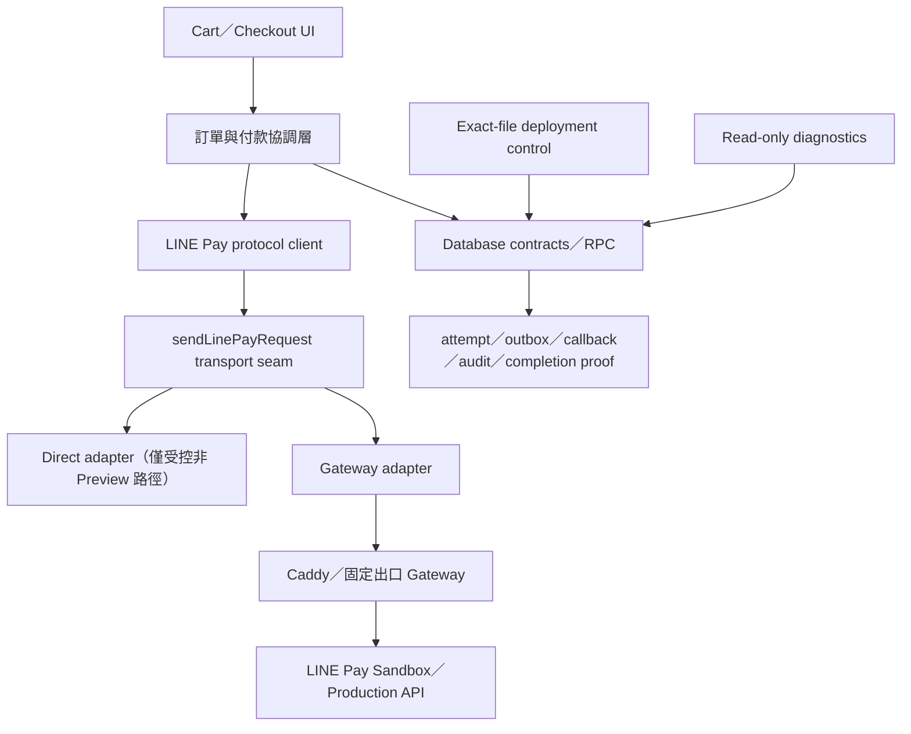

# LINE Pay 下一階段 Skill 路由與施作計畫

SOL 模式：高

Codex 任務等級：高

> 本文件是架構與執行計畫，不是 Production Migration、Secret、付款、Runtime
> 啟用、PR 合併或正式部署授權。

## 1. 文件目的

本計畫把目前 LINE Pay 工作拆成可獨立驗證、可停止、可回復的工作包，避免把下列
高風險操作綁成一次上線：

- LINE Pay API 契約與 timeout 修正；
- Production Database Migration；
- Gateway 固定出口與 HMAC 驗證；
- Sandbox Channel 憑證；
- Sandbox E2E；
- Production 憑證與小額驗證；
- 網站 LINE Pay Runtime 啟用。

目前規劃基準為：

- Repository：`tsaititsu/tsu-waterbottle-site`
- `origin/main`：`4b939b1db0f8058bc14edfc05f67ceefc6859550`
- PR #93：已由 merge commit
  `4b939b1db0f8058bc14edfc05f67ceefc6859550` 合併
- LINE Pay Migration：
  `supabase/migrations/20260719033404_line_pay_remediation_contracts.sql`
- LINE Pay Migration SHA-256：
  `370984c499d93f602b3dccf876becd030085e88ccd9a17106fee8b0009d84046`
- Bank Transfer Fence Migration SHA-256：
  `2f43979b1f4ff88243296f0a389c146b879652715d40d23bdb7ce1d6785407d7`
- LINE Pay Runtime：維持 disabled
- Production LINE Pay Migration：最後一次受控診斷判定為 `UNAPPLIED`；真正部署前
  必須在固定 main Head 重新執行唯讀 application-state preflight，不得沿用本文件
  的歷史敘述當作即時證據。

## 2. Matt Pocock Skill 使用方式

本階段由 `matt-pocock-router` 選出單一主要 Skill：`codebase-design`。原因是目前
需要先固定模組責任、介面、失敗語意與工作順序，不應直接進入程式修改。

| 工作階段 | 使用 Skill | 產出 | 使用條件 |
| --- | --- | --- | --- |
| 任務路由 | `matt-pocock-router` | 每個工作包只選一個主要 workflow | 每個新工作包開始時 |
| 官方契約稽核 | `research` | LINE Pay v3／v4、timeout、redirect 與錯誤碼來源紀錄 | 只使用 LINE Pay、Supabase 等官方一手文件 |
| 架構與邊界 | `codebase-design` | 本文件、模組介面、adapter seam、invariants | 本階段 |
| 領域狀態 | `domain-modeling` | claim、attempt、evidence、reconciliation、completion proof 的一致語言 | 只有狀態機或資料模型需要更動時 |
| 程式實作 | `tdd` | 先寫失敗測試，再做最小 production change | timeout、API 契約或 Runtime 修正 |
| 困難失敗 | `diagnosing-bugs` | 可重現步驟、根因、最小修正 | E2E、CI 或 PostgreSQL 出現非預期失敗時 |
| 合併前審查 | `code-review` | 固定 Head 的 findings 與風險判定 | 每個高風險 PR 完成後 |

以下上游流程保留給使用者明確呼叫，不在本計畫中假裝已自動執行：

- `$to-spec`：需要把某個工作包擴寫成正式規格時；
- `$to-tickets`：需要把核准規格拆成 issue tracker 任務時；
- `$implement`：使用者要依既定規格開始實作時；
- `$handoff`：工作需跨聊天室或交給另一位執行者時。

目前不執行 `setup-matt-pocock-skills`。本專案已具備既有 GitHub、PR、文件及安全
工作流，本次沒有要求新增整套 issue labels、domain docs 或 triage 流程。

## 3. 目標架構與穩定邊界



### 3.1 模組責任

1. **訂單與付款協調層**
   - 接收 server-side 已驗證的訂單與使用者身分。
   - 建立或 claim request state。
   - 不直接把 LINE Pay HTTP 成功等同於訂單已付款。

2. **LINE Pay protocol client**
   - 保留官方 Channel 簽章、payload、response parser 與 `transactionId` 字串語意。
   - 對外只暴露 `request`、`confirm`、`status`、`paymentDetails`。
   - 不把任意 URL、hostname、protocol、port 或 method 暴露成 public API。

3. **Transport seam**
   - `direct` 與 `gateway` 是內部 adapters，不讓呼叫端各自實作 `fetch`。
   - Preview 必須明確使用 `gateway`，缺少設定 fail closed。
   - 禁止 Gateway 失敗時自動 fallback 到 direct。

4. **Fixed IP Gateway**
   - 只驗證網站到 Gateway 的獨立 HMAC 與 reverse-proxy token。
   - operation 白名單固定為 `request`、`confirm`、`status`、`paymentDetails`。
   - 目前 Channel ID／Channel Secret 與 LINE Pay 官方簽章仍留在網站 server；
     將 Channel Secret 移入 Gateway 必須另開 ADR 與獨立高風險 PR。

5. **Database contracts**
   - 只有受控 functions／triggers／capabilities 可以完成付款狀態轉換。
   - attempt、outbox、callback evidence、audit、completion proof 分別保存不同事實。
   - Production schema 變更只能走核准的 exact-file pipeline。

6. **Deployment control**
   - 綁定 main 完整 SHA、Migration SHA-256、固定 project ref 與 GitHub Production
     Environment。
   - source validation、preflight、Migration、postflight、cleanup 分階段 fail closed。
   - marker 缺失只能判定 `NOT_OBSERVED` 或 `UNKNOWN`，不可反推 transaction rollback。

7. **Read-only diagnostics**
   - data drift、historical forensic、application state、deployment observability 各自回答
     不同問題。
   - 診斷輸出不得含 PII、完整付款 payload、Secret 或 connection string。

### 3.2 不可破壞的 invariants

- `product_orders` 的商業狀態不等於 LINE Pay provider 狀態。
- Request 成功只代表取得認證網址，不代表付款完成。
- `transactionId` 全程保持 string。
- Request、Confirm、Status、Payment Details 本階段都不自動 retry。
- 未取得可信 provider evidence，不得 finalize paid。
- 已完成的 transaction evidence、audit 與 completion proof 不得任意改寫。
- Gateway 模式缺設定或驗證失敗時 fail closed，不 fallback direct。
- Migration 套用與 Runtime 啟用是兩個獨立授權。
- Bank Transfer 是 frozen historical dataset，不因 LINE Pay 上線重新取得寫入權。
- 新 relation 的 Data API 可見性、`GRANT` 與 RLS 必須各自驗證，不假設建表後自動暴露。

## 4. 進入 Sandbox E2E 前的阻擋項

### 4.1 Operation-specific timeout

目前實作的兩段 timeout 都預設為 `5000 ms`，上限為 `30000 ms`：

- 網站到 Gateway：`LINE_PAY_GATEWAY_TIMEOUT_MS`
- Gateway 到 LINE Pay：`LINE_PAY_UPSTREAM_TIMEOUT_MS`

LINE Pay 官方 Online API v3 文件目前要求 Request read timeout 至少 10 秒、Confirm
至少 40 秒、Payment Details 至少 20 秒；其中 Confirm 下限高於現有 `30000 ms`
上限。因此不能只在環境變數填較大數字，必須先用 `research` 固定 Status 等剩餘
operation 的官方來源，再用 `tdd` 實作 operation-specific policy。

設計方向：

- Request：至少符合官方要求；
- Confirm：保留更長 timeout，不以 Request 的短上限截斷；
- Status／Payment Details：使用查詢類 operation 的獨立下限；
- 網站到 Gateway 的外層 timeout 必須大於 Gateway 到 LINE Pay 的內層 timeout，並保留
  固定 transport margin；
- timeout 不得導致自動 retry、direct fallback 或把不明結果標成失敗／成功。

### 4.2 Online API v3／v4 決策

現有 client 與 Gateway path 使用 Online API v3。LINE Pay 官方文件已另有 v4 與 EPI
相關說明。進入 Sandbox 前必須完成：

1. 列出本專案四個 operation 的 v3／v4 path、簽章與 response 差異；
2. 確認目前商店 Channel／市場是否要求 v4；
3. 若 v3 仍受支援，記錄維持 v3 的期限與升級觸發條件；
4. 若必須升級，另開獨立 protocol PR，不與 timeout、Migration 或 Runtime 啟用混做。

### 4.3 Preview 資料庫隔離

Sandbox E2E 會建立測試訂單、付款與 callback evidence，因此必須使用 Supabase Preview
Branch 或獨立測試專案。不得把 Vercel Preview 接到 Production Supabase 做測試。

PostgreSQL runner 維持 PostgreSQL 17。另依 Supabase 最新 Data API 行為，在測試中
精確驗證新 relation 是否真的需要 Data API 存取，以及 `GRANT` 與 RLS 是否同時符合
預期，不能只用 relation 存在作為成功證據。

### 4.4 Callback URL 與 Gateway readiness

- `LINE_PAY_CONFIRM_URL`、`LINE_PAY_CANCEL_URL` 必須是穩定、公開、HTTPS 的 Sandbox
  Preview URL，且精確指向既有 routes。
- 在放入 Channel 憑證前，先唯讀確認 Gateway health、TLS、Caddy、固定出口、operation
  allowlist 與 authenticated smoke。
- Gateway smoke 不得呼叫 LINE Pay upstream，也不得寫入 Supabase。
- 固定出口與 LINE Pay 後台白名單要在當次測試前重新核對，不沿用歷史 IP 假設。

## 5. 分階段工作包

每個工作包使用獨立 worktree、獨立 `codex/*` 分支、獨立 PR；高風險 PR 不
auto-merge。

### P0：本文件

- **主要 Skill**：`codebase-design`
- **修改**：只新增本計畫。
- **驗證**：`git diff --check`、Secret／敏感資料檢查。
- **完成條件**：計畫 PR 建立，無程式、Migration、環境或外部服務異動。

### P1：官方 API 版本與 timeout 契約

- **主要 Skill**：先 `research`，實作階段改用 `tdd`。
- **範圍**：
  - 以官方一手文件封存四個 operation 的版本、path 與 timeout 要求；
  - 新增 operation-specific timeout policy；
  - 外層 timeout 大於內層 timeout；
  - 保留 no retry、no fallback、受控錯誤與 string transaction ID。
- **不包含**：Secret、LINE Pay API 呼叫、Database Migration、Runtime 啟用。
- **測試**：
  - 邊界值、未知 operation、Request／Confirm timeout 差異；
  - Gateway timeout、網站 transport timeout；
  - timeout 後不 retry、不 direct fallback；
  - Gateway、LINE Pay client、route regression、typecheck、lint、build。
- **完成條件**：固定 Head 的 `code-review` 無 blocking finding。

### P2：Production LINE Pay Migration

- **主要 Skill**：`supabase`；失敗時才使用 `diagnosing-bugs`。
- **前置條件**：
  - 重新 fetch exact main；
  - 唯讀 application-state preflight 仍為 `UNAPPLIED`；
  - Migration SHA-256 精確符合本文件；
  - Production Environment gate 與 required reviewer 正常；
  - 使用者另行明確授權當次 Production Migration。
- **唯一執行方式**：已核准的 GitHub exact-file runner。
- **禁止**：任意 SQL、互動式 psql、`db push`、`migration up all`、retry、fallback。
- **完成條件**：postflight contract、manifest、Fence preservation、history 與 cleanup
  全部通過；Runtime 仍 disabled。

### P3：Gateway 與 Preview non-payment readiness

- **主要 Skill**：`diagnosing-bugs`（若 readiness 有失敗），否則一般受控驗證。
- **範圍**：
  - exact-head Preview；
  - Gateway health／TLS／固定出口唯讀驗證；
  - authenticated smoke；
  - HMAC、replay、rate limit 與 proxy boundary regression。
- **不包含**：Channel Secret、LINE Pay upstream、訂單或付款寫入。
- **完成條件**：smoke 只到 Gateway 的受控 `invalid_operation`，LINE Pay API calls = 0。

### P4：Sandbox Preview E2E

- **主要 Skill**：`tdd`；非預期失敗切換為 `diagnosing-bugs`。
- **人工閘門**：
  - 使用者已建立 LINE Pay Sandbox Channel；
  - 使用者已明確授權 Vercel Preview 環境變數操作；
  - 使用者透過 Vercel UI 或核准的秘密通道放入 Sandbox credentials；
  - 使用者已明確授權建立 Sandbox 測試訂單／付款資料；
  - Preview 已確認連到隔離的 Supabase 測試環境。
- **案例**：
  - Request 取得 redirect；
  - 使用者取消；
  - Sandbox 成功認證與 Confirm；
  - 重複 redirect／Confirm；
  - Confirm timeout 或結果不明後，以 Status／Payment Details reconciliation；
  - order、payment、attempt、outbox、callback、audit、proof 一致性；
  - 非本人、過期 capability、重播與金額不符 fail closed。
- **完成條件**：測試資料可識別、可稽核；沒有 Production API／DB／付款。

### P5：Sandbox findings 修正

- **主要 Skill**：`diagnosing-bugs` 找根因，接著 `tdd` 修正。
- **原則**：一個 finding 一個小型 PR；不混入正式憑證或 Runtime 啟用。
- **完成條件**：完整 Sandbox regression 與固定 Head `code-review` 通過。

### P6：Production sign-off 與受控小額驗證

- **主要 Skill**：`code-review`。
- **人工閘門**：
  - Production Channel／IP allowlist／Vercel Production Secret 各自明確授權；
  - 使用者另行明確授權一次正式付款與金額；
  - rollback、監控、人工對帳與 incident owner 已確認。
- **原則**：先保持公開入口關閉，以受控帳號與小額單次驗證。
- **退款／void**：目前 operation 白名單不包含退款或請款取消；不得為了測試臨時開放，
  必須另做完整 protocol、DB contract 與安全審查。

### P7：Runtime 啟用

- **主要 Skill**：`code-review`。
- **獨立授權**：Production Migration、Production Secret 與測試付款授權都不等於
  Runtime 啟用授權。
- **變更**：只在所有 sign-off 通過後，受控調整正式環境與 feature flag。
- **驗收**：入口、Request、redirect、Confirm、cancel、reconciliation、監控與 rollback。
- **回復**：先關閉入口，保留資料與 audit；不得直接刪除財務歷史。

## 6. Secret 與環境放置

只記錄名稱與責任，不記錄真值、長度、prefix、suffix 或 hash。

| 設定 | 放置位置 | 注意事項 |
| --- | --- | --- |
| `LINE_PAY_CHANNEL_ID` | Vercel server-side Preview／Production 各自 scope | Sandbox 與 Production 不可混用 |
| `LINE_PAY_CHANNEL_SECRET` | Vercel server-side Secret | 禁止 `NEXT_PUBLIC`，不得貼聊天室 |
| `LINE_PAY_GATEWAY_KEY_ID` | Vercel 與 Gateway 對應 scope | 識別值不等於 Channel ID |
| `LINE_PAY_GATEWAY_SECRET` | Vercel 與 Gateway Secret store | 與 Channel Secret、Proxy Token 分離 |
| `LINE_PAY_GATEWAY_PROXY_TOKEN` | Droplet／Caddy 專用 secret file | 禁止放入 Vercel |
| `SUPABASE_PRODUCTION_DB_URL` | GitHub `supabase-production` Environment | 只供核准 exact-file workflow 注入 |

Sandbox credentials 的安全交付方式：

1. 使用者從 LINE Pay Sandbox 取得 Channel 資料；
2. 使用者直接在 Vercel Preview scope 輸入，或於 Codex 執行當下使用已核准的安全
   stdin／秘密通道；
3. Codex 只驗證欄位「已設定」的 metadata，不讀取、下載或輸出真值；
4. 使用者只需回報「Sandbox key 已設定、scope 是 Preview、環境是 sandbox」；
5. 測試結束後依保留政策輪替或移除，不把 Secret 複製到文件、Log、PR 或本機檔案。

## 7. 測試矩陣

| 層次 | 必要驗證 |
| --- | --- |
| Protocol | 官方簽章、payload、response parser、return code、string transaction ID |
| Transport | direct regression、gateway canonical HMAC、timeout、no fallback、no retry |
| Gateway | operation allowlist、host/path、HMAC、replay、rate limit、body limit、safe logs |
| Routes | request、confirm、cancel、status／details reconciliation、錯誤遮蔽 |
| Database | clean／upgrade、conflicts、mutations、concurrency、audit、completion proof |
| Historical fence | Bank Transfer ACL／policy／rows 不變 |
| Project | `npm test`、typecheck、lint、build、`git diff --check` |
| Delivery | fixed Head CI、Preview SHA、Secret scan、changed-file allowlist |
| Live Sandbox | request、cancel、success、duplicate、timeout／unknown、reconciliation |

Production Database 或付款測試不得由一般 local test 指令意外觸發。所有 test runners
必須使用 synthetic fixtures、mock fetch 或 disposable PostgreSQL，live E2E 必須有
獨立命令與人工閘門。

## 8. 停止條件

遇到以下任一情況，停止目前工作包，不擴大修正：

- branch、Head、Migration hash 或 changed-file allowlist 漂移；
- Preview 無法證明使用隔離測試資料庫；
- 需要讀取或輸出 Secret 真值；
- Gateway 固定出口、TLS、DNS 或 allowlist 不一致；
- Production application state 不是精確 `UNAPPLIED` 或預期 `FULL`；
- Migration 出現 partial application、lock risk 或 postflight drift；
- LINE Pay v3／v4 官方契約無法確認；
- timeout 不明結果被錯誤分類成成功或確定失敗；
- 任一流程會 fallback direct、retry Request／Confirm 或改寫 paid evidence；
- 未取得目前工作包所需的明確 Production／Secret／付款／Runtime 授權。

## 9. 建議下一步

先執行 **P1：官方 API 版本與 operation-specific timeout 契約**。這一步不需要
LINE Pay key、不呼叫 LINE Pay API、不修改 Database，也不啟用入口；它能先解除
目前最明確的 Sandbox E2E 技術阻擋。

可直接交付給 Codex 的下一個任務：

```text
請執行 LINE Pay API v3／v4 與 operation-specific timeout 安全修正。
先用 research Skill 只讀比對 LINE Pay 官方文件，再用 tdd Skill 實作。
不得使用任何 Channel key、不得呼叫 LINE Pay API、不得修改 Production、
不得套用 Migration、不得啟用 LINE Pay Runtime。
```

P1 完成並通過獨立審查後，再依序處理 P2、P3、P4。需要 Sandbox key 時，Codex
必須先提供確切 Preview scope 與安全放置步驟；使用者不需也不應把 key 貼到聊天。

## 10. 官方來源

- LINE Pay Sandbox：
  <https://developers-pay.line.me/zh/sandbox>
- LINE Pay Online prerequisites：
  <https://developers-pay.line.me/online/prerequisites>
- LINE Pay Online API v3：
  <https://developers-pay.line.me/online-api-v3>
- LINE Pay Request：
  <https://developers-pay.line.me/online-api-v3/request-payment>
- LINE Pay Confirm：
  <https://developers-pay.line.me/online-api-v3/confirm-payment>
- LINE Pay Payment Details：
  <https://developers-pay.line.me/online-api-v3/retrieve-payment-details>
- Supabase Data API breaking change：
  <https://supabase.com/changelog/45329-breaking-change-tables-not-exposed-to-data-and-graphql-api-automatically>
- Supabase PostgreSQL 17 change：
  <https://supabase.com/changelog/46080-self-hosted-supabase-upgrading-from-pg-15-to-17-breaking-change>
